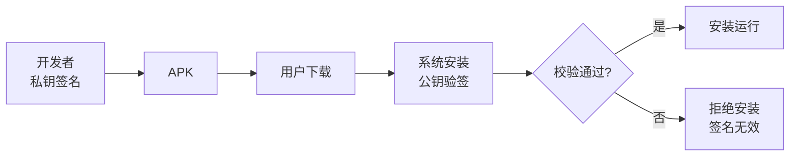
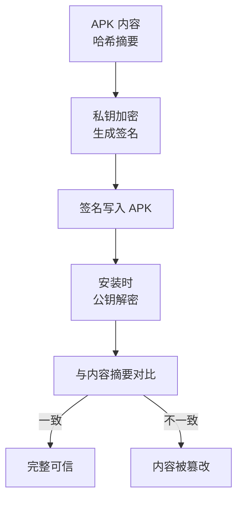
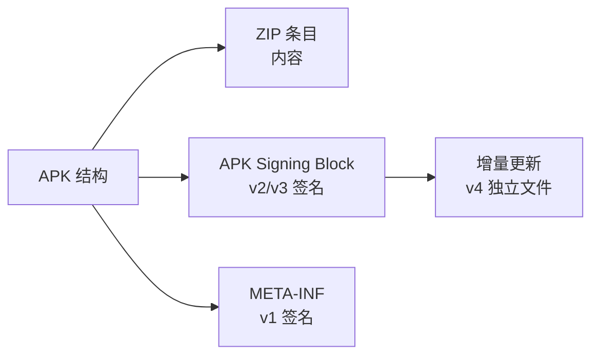
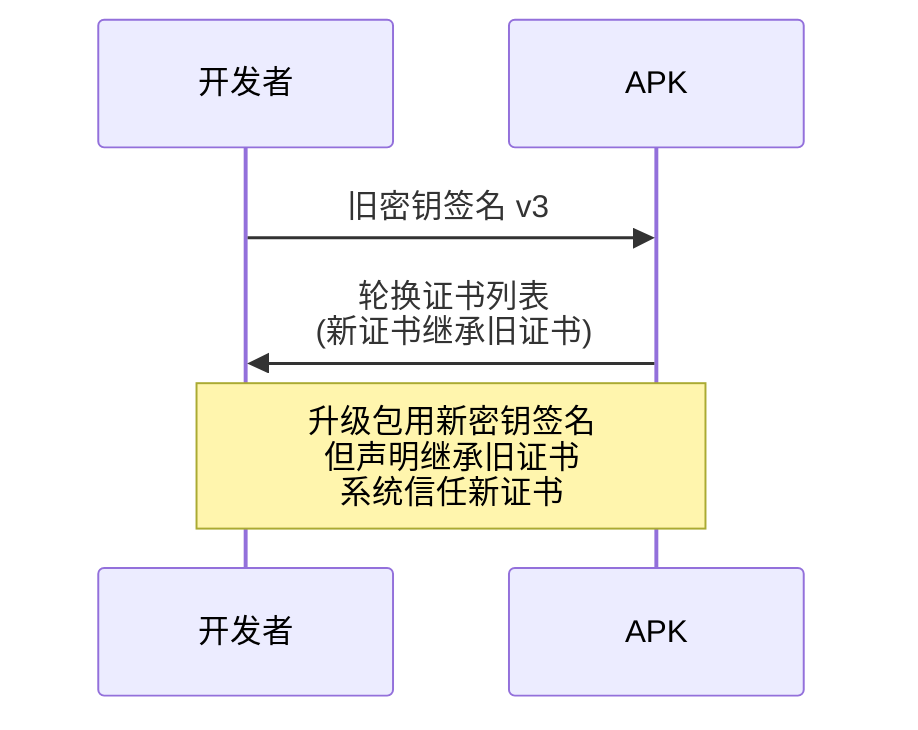

# APK 签名与校验机制

> APK 签名保证**来源可信 + 内容完整**:安装时系统校验签名,防篡改、防替换、防中间人。从 v1 到 v4,签名方案随新需求不断演进。

## 一、为什么要签名

| 目的 | 说明 |
|------|------|
| 来源认证 | 确认 APK 来自可信开发者 |
| 完整性 | 校验内容未被篡改 |
| 更新校验 | 升级包签名必须一致 |
| 权限保护 | signature 权限同签名授予 |
| 沙箱标识 | 同签名共享 UID 与数据 |



## 二、签名原理(非对称加密)



> **核心概念**:开发者持有私钥(签名),任何人都可以用公钥验证。私钥签名 = 唯一身份标识,丢失私钥 = 无法更新应用(只能换包名)。

## 三、签名方案演进

### 3.1 方案对比

| 方案 | 版本 | 位置 | 特点 | 问题 |
|------|------|------|------|------|
| v1 | 老版本 | META-INF/*.SF | 只校验未修改文件 | 可被利用、慢 |
| v2 | Android 7.0+ | APK Signing Block | 全文件校验、快 | 兼容性需 v1 兜底 |
| v3 | Android 9+ | 同 v2 块 | 支持密钥轮换 | — |
| v4 | Android 11+ | 独立 .idsig 文件 | 增量更新支持 | 单独文件 |



### 3.2 v2 校验流程

```text
1. 找到 APK Signing Block(位于 ZIP 条目区与中央目录之间)
2. 取出 v2 签名块(含证书与签名)
3. 用公钥验证签名
4. 校验整个 APK 的字节摘要(除签名块自身)
5. 通过 → 安装;失败 → 拒绝
```

## 四、v3 密钥轮换



> **v3 的意义**:解决"私钥丢失/更换签名证书"无法更新的痛点。密钥轮换后,新证书在 APK 中声明"继承自旧证书",系统验证链路后信任,更新无缝衔接。

## 五、常见签名问题

| 问题 | 原因 | 解决 |
|------|------|------|
| 更新失败(签名不一致) | 换 keystore 签名 | 必须保留原 keystore |
| INSTALL_PARSE_FAILED_NO_CERTIFICATES | 未签名/签名损坏 | 重新签名 |
| 多渠道重打包后签名失效 | 修改了 v2 保护区域 | 用官方多渠道方案(如 v2 兼容方案) |
| 华为/小米市场校验失败 | 二次签名冲突 | 加固后重新签名 |

>  **经典坑**:重打包/多渠道修改 APK 内部内容会破坏 v2 签名,需要重新签名。多渠道方案(如腾讯 VasDolly)会保留 v2 签名,在 Signing Block 中追加渠道信息,避免重签。

## 六、高频面试题

### Q1：为什么 APK 要签名?v1 和 v2 有什么区别?
::: details 查看答案
签名目的:来源认证(确认开发者)、完整性(防篡改)、更新一致性(升级签名一致)、权限绑定(signature 权限)。v1(JAR 签名):在 META-INF 中生成 .SF/.RSA,只校验"被修改的文件",慢且可通过 ZIP 技巧绕过部分校验;v2(APK Signing Block):对整个 APK 字节做摘要,校验范围完整、速度快,Android 7.0+ 优先使用。建议:新应用直接用 v2(或 v2+v3),兼容老系统时保留 v1。
:::

### Q2：签名是怎么工作的?为什么公钥能验证私钥签名?
::: details 查看答案
流程:① 开发者用**私钥**对 APK 内容摘要加密生成签名;② 安装时系统用 APK 内置的**证书(公钥)**解密签名;③ 得到原始摘要,与 APK 实际内容摘要对比;④ 一致则内容未被篡改且来源可信。原理:非对称加密——私钥加密的内容只有对应公钥能解,私钥只有开发者持有。所以:私钥泄露 = 任何人都能伪造该应用的更新;私钥丢失 = 开发者自己也无法发布更新。
:::

### Q3：什么是 v3 密钥轮换?解决什么问题?
::: details 查看答案
v3(Android 9+)支持密钥轮换:开发者可用新私钥签名升级包,同时在 APK 中声明"新证书继承自旧证书"(轮换证书列表,含签名证明)。系统验证:旧证书可信 + 新证书被旧证书授权 → 接受新证书。解决的痛点:传统方案中更换签名证书会导致更新失败(签名不一致),用户只能卸载重装;有了轮换机制,企业并购、私钥更换、安全升级都可以无缝过渡。注意:轮换需旧私钥签名授权,仍需保管旧密钥。
:::

### Q4：多渠道打包为什么会破坏签名?怎么解决?
::: details 查看答案
原理:多渠道需要在 APK 中写入渠道号。传统方式解压重打包会修改 ZIP 内容,而 v2 签名校验整个 APK 字节摘要,任何改动都导致验签失败,必须重新签名。解决:① 腾讯 VasDolly 等方案:利用 v2/v3 Signing Block 的**保留字段**写入渠道信息,不修改受保护区域,无需重签;② 美团方案:在 ZIP 注释区写渠道(兼容 v1);③ 构建时多 APK 分别签名(慢)。推荐 VasDolly 类方案,支持 v2 校验同时保留签名。
:::

### Q5：应用加固/热修复与签名有什么关系?
::: details 查看答案
① **加固**:加固会修改 APK(DEX 加密、加壳),所以必须在**加固后重新签名**,否则安装校验失败;部分厂商有"免重签"方案(保留原签名),但需注意安全权衡。② **热修复**:补丁机制如 Tinker/RePlugin 在运行时加载补丁,不改 APK 签名,但补丁包本身要校验完整性,防止被篡改注入;同时热修复框架要验证补丁来源(防中间人)。核心原则:任何修改 APK 内容的流程都要重新签名;运行时代码也要做完整性校验。
:::

## 小结

- 签名 = 来源认证 + 内容完整 + 更新一致
- 非对称加密:私钥签名,公钥验证,私钥必须妥善保管
- v1(JAR)→ v2(整包校验)→ v3(密钥轮换)→ v4(增量更新)
- 修改 APK 必须重签,多渠道要选兼容 v2 的方案
- 加固/热修复都要注意签名与完整性校验

> 进阶阅读：[APK 打包流程](/system/apk/apk-build-process.md) | [多渠道打包方案](/system/apk/multi-channel.md) | [APK 文件结构](/system/apk/apk-build-process.md)
