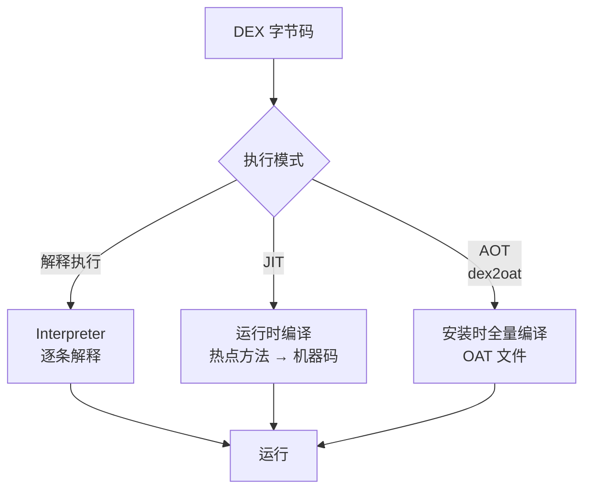
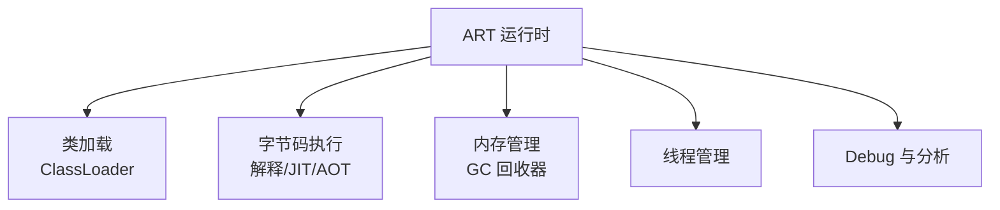

# ART 编译优化深入

> Android 5.0 起 ART 取代 Dalvik,核心是**编译策略的演进**:AOT 全量预编译 → JIT 运行时编译 + Profile 引导。理解编译模式才能理解启动速度与包体积的权衡。

## 一、编译演进史


| 时代 | 方案 | 优点 | 缺点 |
|------|------|------|------|
| Dalvik | 解释执行 + JIT | 安装快 | 运行慢 |
| ART 5.0 | 安装时全量 AOT | 运行快 | 安装慢、包大 |
| ART 7.0+ | JIT + 云端 Profile | 均衡 | 首用稍慢 |
| ART 8.0+ | JIT Cache + 基线 | 更快 | — |

## 二、三种执行模式

### 2.1 模式对比

| 模式 | 时机 | 特点 |
|------|------|------|
| 解释执行 | 运行时时 | 最慢,内存占用小 |
| JIT | 运行时热点代码 | 边跑边编译,快 |
| AOT | 安装时/后台编译 | 最快,但包大 |



### 2.2 为何 7.0 放弃全量 AOT?

> 全量 AOT 的三个痛点:① **安装慢**——大 APK 编译耗时数分钟;② **包体积**——OAT 文件占空间(可能翻倍);③ **磁盘 IO**——更新频繁的应用反复编译。JIT + Profile 方案只在运行中编译**热点代码**,其余解释执行。

## 三、Profile 引导编译


```java
// Profile 机制要点:
// 1. JIT 运行中统计:哪些方法被频繁调用(热点)
// 2. 记录到 profile 文件(方法 + 调用次数)
// 3. 空闲/充电时:dex2oat 依据 profile 编译热点方法
// 4. 下次启动:热点方法直接执行机器码,启动更快
// 5. 云端 profile:Google Play 收集流行 profile 下发
```

| Profile 类型 | 来源 | 用途 |
|-------------|------|------|
| 本地 Profile | 本机 JIT 统计 | 本机优化 |
| 云端 Profile | 大量用户统计 | 新安装用户加速 |
| 基线 Profile | 开发者构建时 | 出厂优化(启动路径) |

> **开发者可用的基线 Profile**:通过 `Baseline Profile`(androidx.profileinstaller)在构建时生成启动热点方法列表,新用户安装后立即优化启动路径——这是现代 Android 启动优化的利器。

## 四、dex2oat 编译流程


```bash
# dex2oat 编译策略(install-time / bg-dexopt)
# speed:全量编译(应用安装)
# speed-profile:按 profile 编译热点
# verify:仅验证不编译
# 通过 ART 的 "编译过滤器" 控制
```

| 触发时机 | 策略 |
|---------|------|
| 安装时 | speed(全量)或按策略 |
| 空闲充电 | bg-dexopt(profile 编译) |
| 系统升级 | 全量重编译 |
| 应用更新 | 增量重编译 |

## 五、ART 运行时结构



| 组件 | 职责 |
|------|------|
| ClassLinker | 类加载与链接 |
| JIT 编译器 | 运行时热点编译 |
| GC | 内存回收(见 ART GC 篇) |
| MethodVerifier | 字节码验证 |
| 线程 | 应用线程与 GC 线程 |

## 六、高频面试题

### Q1：ART 和 Dalvik 有什么区别?
::: details 查看答案
① **编译策略**:Dalvik 以解释执行+JIT(即时编译),ART 引入 AOT(安装时预编译)+ 后续版本 JIT+Profile 混合;② **性能**:ART 运行更快(机器码直接执行,消除解释开销);③ **内存**:ART 引入更优的 GC(如并发标记清除);④ **启动**:Dalvik 安装快运行慢,ART 早期安装慢运行快,7.0 后通过 JIT+Profile 兼顾;⑤ **兼容**:ART 仍执行 DEX 字节码,兼容性无影响。整体 ART 是 Dalvik 的全面进化。
:::

### Q2：什么是 AOT、JIT、解释执行?为什么用混合模式?
::: details 查看答案
解释执行:运行时逐条解释字节码,慢;JIT:运行时编译热点方法为机器码,边跑边优化,快但编译有开销;AOT:安装时/后台把字节码全量编译为机器码,运行最快但安装慢、占空间。混合模式(7.0+):启动/低负载用解释+JIT,运行中统计热点生成 Profile,空闲时 dex2oat 按 Profile 编译热点方法——兼顾启动速度、包体积与运行性能,避免全量 AOT 的安装慢和空间占用。
:::

### Q3：Profile 引导编译是怎么工作的?
::: details 查看答案
三步闭环:① JIT 运行中记录调用频率,识别热点方法写入 profile;② 空闲+充电时 dex2oat 根据 profile 只编译热点方法;③ 下次启动热点直接执行机器码,非热点解释执行。同时支持云端 profile(海量用户统计)与基线 profile(开发者构建时标注启动路径),新用户安装后即可享受优化。收益:启动速度提升 20%-30%(Google 数据),运行内存与包体积优于全量 AOT。
:::

### Q4：dex2oat 是什么?何时触发?
::: details 查看答案
dex2oat 是 ART 的离线编译器:把 DEX 字节码编译成 OAT(机器码 + 元数据)。触发时机:① APK 安装时(speed 全量或按策略);② 空闲+充电时后台 dexopt(按 profile 编译热点);③ 系统升级后重编译;④ 应用更新后增量编译。它也可作为命令行工具单独执行。OAT 文件默认在 /data/dalvik-cache/。它直接影响安装耗时与磁盘占用,所以系统会错峰调度(bg-dexopt 只在空闲充电时跑)。
:::

### Q5：Baseline Profile 是什么?开发中怎么用?
::: details 查看答案
Baseline Profile 是开发者在构建时提供的关键路径(如启动)热点方法清单,打包进 APK(baseline-prof)。安装后系统立即按它编译,新用户无需等待本地 Profile 积累就能获得优化(首次启动更快)。用法:① 用 androidx.profileinstaller;② 通过基准测试(Macrobenchmark)收集启动热点生成 profile;③ 或手动维护启动路径方法列表;④ 构建时自动嵌入,配合云端 profile 效果更佳。它是现代 Android 启动优化的官方推荐方案。
:::

## 小结

- 编译演进:Dalvik 解释 → ART 全量 AOT → JIT+Profile 混合
- 三种模式:解释(慢省内存)/ JIT(热点运行时编译)/ AOT(安装时预编译)
- Profile 引导:热点统计 + 空闲编译 + 下次直执行
- 云端 Profile / 基线 Profile:新用户也能快速启动
- dex2oat:离线编译器,安装/空闲时触发
- 权衡三角:启动速度、包体积、磁盘占用

> 进阶阅读：[ART 运行时与 GC](/system/art/art-runtime.md) | [ART 垃圾回收机制](/system/art/art-gc.md) | [类加载器与双亲委托](/system/art/classloader.md)
