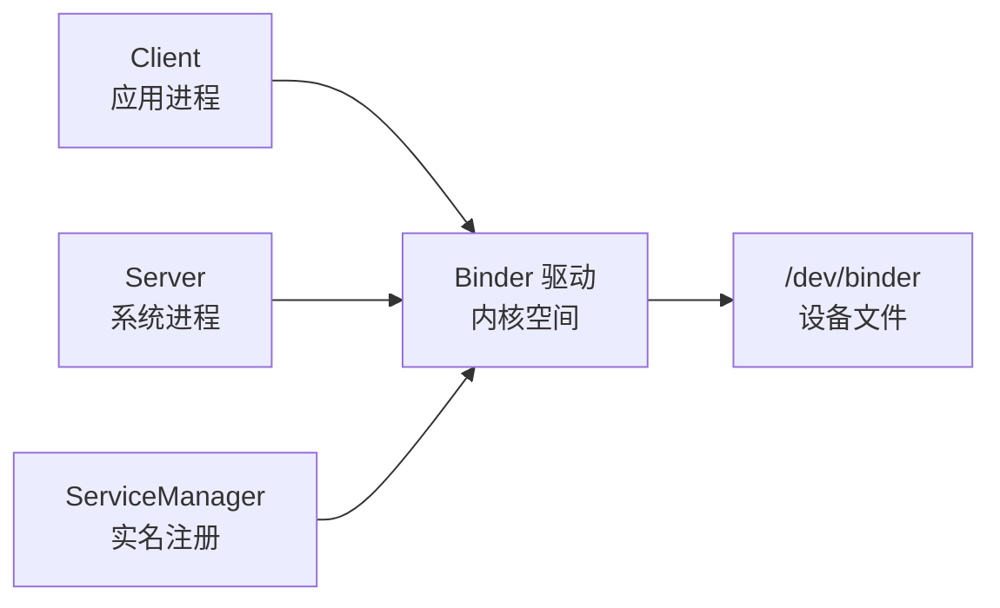
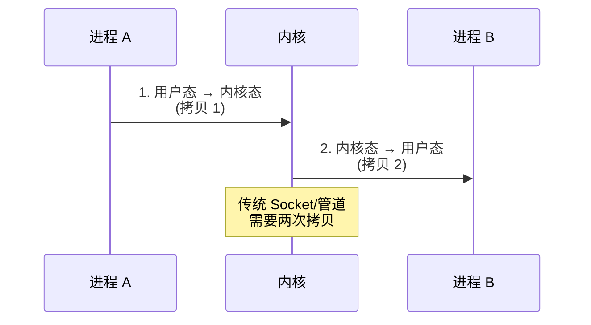
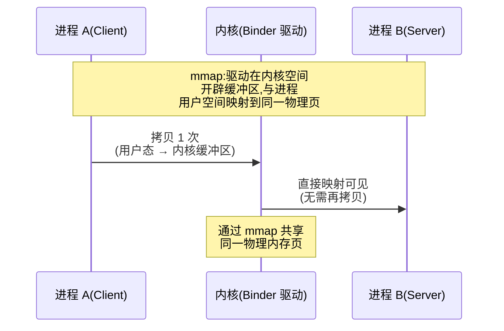
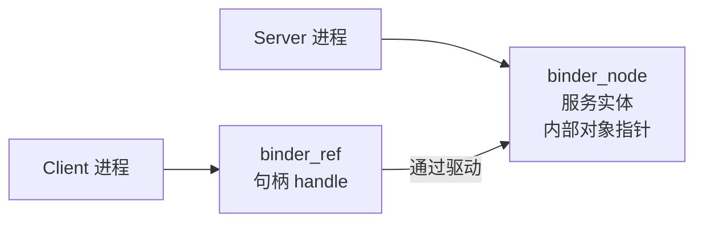
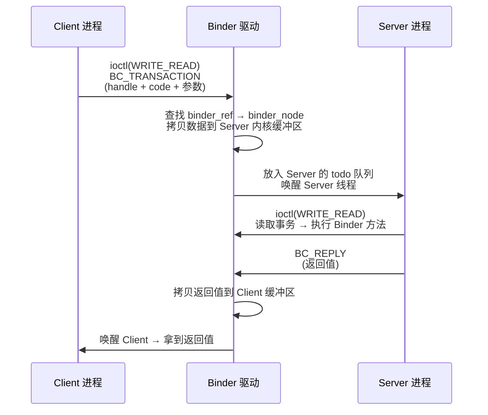

# Binder 驱动层深入

> 前面理解了 Binder 的应用层(AIDL/代理),本文深入**内核驱动层**:binder_proc、mmap 内存映射、一次拷贝、binder_thread 与驱动工作流程,搞懂 Binder 为什么快。

## 一、Binder 整体架构

Binder 的整体架构关系如下：



各层级的组件与职责说明如下：

| 层级 | 组件 | 职责 |
|------|------|------|
| 应用层 | Binder/BinderProxy | 客户端与服务端代理 |
| Framework 层 | BpBinder/BnBinder | 收发协议封装 |
| 内核驱动 | binder.c | 数据传输、线程管理 |
| 硬件 | /dev/binder | 字符设备 |

## 二、mmap 内存映射:一次拷贝

### 2.1 传统 IPC:两次拷贝

传统 IPC 的两次拷贝流程如下：



### 2.2 Binder:一次拷贝

Binder 的一次拷贝流程如下：



> **核心原理**:Server 进程通过 mmap 把内核缓冲区映射到自己的用户空间,驱动把 Client 数据拷贝到该内核缓冲区,Server 用户空间直接可见——**只需一次拷贝**。

```c
// 驱动中 mmap 的核心逻辑(简化)
// binder_mmap:分配内核缓冲区 + 映射到用户空间
static int binder_mmap(struct file *filp, struct vm_area_struct *vma) {
    // 1. 分配物理页(默认 4 页起步,按需增长)
    // 2. 建立"内核虚拟地址 ↔ 物理页"映射
    // 3. 建立"用户虚拟地址 ↔ 同一物理页"映射
    // 结果:内核和用户空间共享同一块物理内存
}
```

## 三、核心数据结构

### 3.1 binder_proc:每个进程一个

```c
struct binder_proc {
    struct hlist_node proc_node;      // 挂入全局 proc 链表
    struct rb_root threads;           // 该进程的 binder 线程树
    struct rb_root nodes;             // 该进程持有的 binder_node(BBinder)
    struct rb_root refs;              // 该进程持有的 binder_ref(BPinder)
    struct list_head todo;            // 待处理事务队列
    struct binder_buffer *buffer;     // 内核缓冲区(来自 mmap)
    // ...
};
```

各字段的含义说明如下：

| 字段 | 含义 |
|------|------|
| threads | 线程:每个 binder_thread 处理一个事务 |
| nodes | 服务节点:Server 端的实体对象 |
| refs | 引用:Client 端的句柄(handle) |
| todo | 待处理任务队列 |

### 3.2 binder_thread:线程

```c
struct binder_thread {
    struct binder_proc *proc;      // 所属进程
    struct list_head todo;         // 该线程的事务队列
    int pid;                       // 线程 id
    // binder_thread_read() 从 todo 取事务处理
    // 无事务时:进入等待队列休眠(blocking read)
};
```

### 3.3 binder_node / binder_ref:服务与引用

服务与引用对象的关联关系如下：



各对象的持有者与含义说明如下：

| 对象 | 持有者 | 含义 |
|------|--------|------|
| binder_node | Server 进程 | 每个 BBinder 对应一个 |
| binder_ref | Client 进程 | 每个 BpBinder 对应一个 |
| handle | Client 侧 | 引用句柄(类似文件描述符) |

## 四、Binder 通信协议

```c
// binder_transaction_data:事务数据(一次调用)
struct binder_transaction_data {
    union {
        __u32 handle;        // 目标:Client 传入的句柄
        void *ptr;           // 目标:Server 的 binder_node 指针
    } target;
    void *cookie;            // 服务对象
    __u32 code;              // 方法码(如 TRANSACTION_...)
    __u32 flags;
    // 数据区(TRANSACTION 时是参数,REPLY 时是返回值)
    struct binder_io_data data;
};
```

```c
// 驱动主流程(简化)
static long binder_ioctl(struct file *filp, unsigned int cmd, unsigned long arg) {
    switch (cmd) {
        case BINDER_WRITE_READ:   // 主要命令:读写事务
            binder_thread_write(thread, ...);  // 发送事务
            binder_thread_read(thread, ...);   // 读取结果
            break;
        case BINDER_SET_MAX_THREADS:
            proc->max_threads = arg;
            break;
    }
}
```

各命令的用途说明如下：

| 命令 | 说明 |
|------|------|
| BINDER_WRITE_READ | 核心:写事务 + 读结果 |
| BINDER_SET_MAX_THREADS | 设置最大线程数 |
| BINDER_SET_CONTEXT_MGR | 设置 ServiceManager |

## 五、一次事务完整流程

一次事务的完整调用链路如下：



## 六、为什么 Binder 只有一次拷贝?

Binder 与传统 IPC 的对比说明如下：

| 对比项 | Binder | 传统 IPC(Socket/管道) |
|--------|--------|----------------------|
| 拷贝次数 | 1 次 | 2 次 |
| 实现 | mmap 共享物理页 | 用户态-内核态搬运 |
| 性能 | 高 | 低 |
| 安全性 | 内核校验 UID/PID | 无身份校验 |

> Binder 的三大优势:**① 一次拷贝性能高;② 内核校验安全(UUID/PID 附带);③ 支持双向调用(引用传递)**。

## 七、高频面试题

### Q1：Binder 为什么比 Socket/管道快?
::: details 查看答案
传统 IPC(Socket/管道)需要两次拷贝:发送方用户态→内核态,接收方内核态→用户态。Binder 利用 mmap:驱动为每个进程在内核空间分配缓冲区,并通过 mmap 与进程用户空间映射到同一物理页,Client 数据只需拷贝一次到内核缓冲区,Server 用户空间直接可见,省去第二次拷贝。同时 Binder 是共享内存思想 + 内核校验,兼具性能与安全。所以 Binder 是 Android 进程通信首选。
:::

### Q2：Binder 驱动中 binder_proc 和 binder_thread 是什么?
::: details 查看答案
binder_proc:每个使用 Binder 的进程一个,包含该进程的线程树(threads)、服务节点树(nodes,Server 持有的 BBinder)、引用树(refs,Client 持有的句柄)、待处理事务队列(todo)、内核缓冲区(buffer)。binder_thread:进程内的一个线程,持有自己的事务队列 todo;binder_thread_read 从队列取事务执行,无事务时休眠等待。驱动通过这两个结构管理跨进程事务的路由与调度。
:::

### Q3：一次 Binder 调用的完整流程?
::: details 查看答案
① Client 调 BpBinder::transact → 打包 binder_transaction_data(目标 handle、方法 code、参数);② ioctl(BINDER_WRITE_READ) 进入驱动;③ 驱动根据 handle 找到 binder_ref → binder_node(目标服务),把数据从 Client 用户空间拷贝到 Server 的内核缓冲区(mmap 共享);④ 事务放入 Server 进程 todo 队列,唤醒其 binder_thread;⑤ Server 线程读取事务,调用对应 BnBinder 方法,执行业务逻辑;⑥ Server 构造 REPLY 事务,驱动把返回值拷到 Client 缓冲区并唤醒 Client;⑦ Client 拿到返回值,调用完成。整个调用同步阻塞,语义如同本地方法调用。
:::

### Q4：Binder 如何保证安全性?
::: details 查看答案
① **内核校验**:所有 Binder 通信必须经过驱动,驱动在每次事务中附带发送方的 UID/PID,接收方(系统服务)可校验调用者身份;② **权限模型**:系统服务(SMS/定位等)根据 UID 检查权限,防止普通应用伪装;③ **句柄隔离**:Client 只持有句柄(handle),无法直接访问 Server 内部对象;④ **内存保护**:通过 mmap 的内核缓冲区,用户无法越界访问。相比传统 IPC(无身份概念),Binder 天然具备身份与权限管理能力。
:::

### Q5：ServiceManager 在 Binder 中扮演什么角色?
::: details 查看答案
ServiceManager 是 Binder 的"DNS":① 系统服务启动时向 ServiceManager 注册(BINDER_SET_CONTEXT_MGR,handle=0 特殊句柄);② 服务注册后,ServiceManager 保存服务名 → binder_node 的映射;③ Client 通过 getService(name) 向 ServiceManager 查询,拿到服务句柄(handle),之后直接与服务通信(不经过 ServiceManager);④ 查询有缓存机制(部分版本)。相当于"先找门牌号,再直接上门"。驱动的 handle 0 就是 ServiceManager 的固定入口。
:::

## 小结

- Binder = 驱动 + mmap 共享内存,一次拷贝
- binder_proc(进程)/binder_thread(线程)/binder_node(服务)/binder_ref(引用)
- 事务:BC_TRANSACTION 发送、REPLY 返回,同步阻塞
- 优势:性能高(一次拷贝)、安全(UID/PID 校验)、双向
- ServiceManager 是服务注册与查询中心
- 应用层 AIDL 只是 Binder 的语法糖

> 进阶阅读：[Binder 跨进程通信机制详解](/system/binder/binder-mechanism.md) | [AIDL 深入解析](/system/binder/aidl-deep.md) | [IPC 方式对比](/system/binder/ipc-comparison.md)
