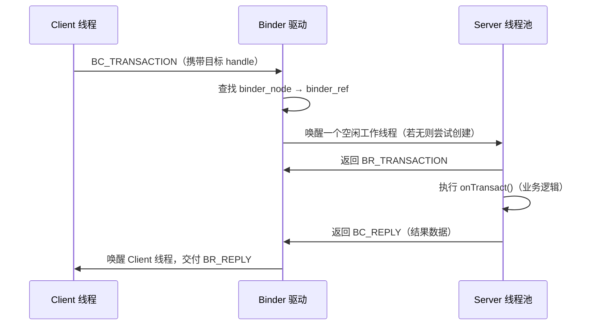

# Binder 线程池与并发模型

> 面试高频指数：高
> Binder 跨进程调用最终要落在某个线程上执行，理解 Binder 线程池是理解 AIDL 并发、卡顿与死锁的关键。

## 1. 为什么需要线程池

Binder 是面向调用的 IPC：每次跨进程调用（transaction）都需要一个**执行线程**。如果每次调用都新建线程，系统服务（如 AMS）会被高频调用打垮。因此 Binder 驱动维护了一套**线程池**：

```text
设计目标：
① 复用线程，降低创建/销毁开销
② 控制并发上限，防止服务被压垮
③ 支持阻塞等待（同步调用）
④ 支持异步回调（oneway）
```

## 2. 关键数据结构

### 2.1 binder_thread

每次 `open("/dev/binder")` 都会在内核创建 `binder_thread`，代表一个 Binder 调用线程：

| 字段 | 作用 |
|------|------|
| `proc` | 所属进程（binder_proc） |
| `todo` | 待处理事务队列（链表） |
| `transaction_stack` | 当前调用栈（嵌套事务） |
| `looper` | 线程状态标记（BINDER_LOOPER_STATE_*） |
| `pid` / `tid` | 线程标识 |

### 2.2 binder_proc

每个打开 Binder 的进程对应一个 `binder_proc`：

| 字段 | 作用 |
|------|------|
| `threads` | 该进程的所有 binder_thread |
| `nodes` | 本地 Binder 实体（binder_node） |
| `refs` | 对远程实体的引用（binder_ref） |
| `todo` | 进程级待处理队列 |
| `max_threads` | 线程池上限（默认 16） |

## 3. 线程池工作机制

### 3.1 线程数量上限

```text
默认上限：max_threads = 16（BINDER_MAX_THREADS）
每个进程可同时有 16 个 Binder 工作线程

进程通过 BC_REGISTER_LOOPER / BC_ENTER_LOOPER
通知驱动注册线程
```

**为什么是 16？**
- 够用：一般服务并发调用不会持续超过 16
- 可控：防止线程爆炸耗尽内存
- 可调：驱动层限制，应用层可通过 `Process.setThreadPoolSize()` 影响（系统服务会调大）

### 3.2 线程注册与复用

```text
AIDL 服务端进程初始化时：
main 线程 + Binder 线程池（默认 15 个候选）

线程池懒创建：有并发请求时由驱动唤醒/创建新线程，
空闲超过阈值后线程休眠（不销毁，复用）
```

### 3.3 调用执行流程



## 4. 同步调用与阻塞

### 4.1 同步调用（默认）

```java
// AIDL 默认方法为同步调用
IBinder binder = ServiceManager.getService("my_service");
IMyService proxy = IMyService.Stub.asInterface(binder);

// 该调用会阻塞当前线程，直到服务端返回
proxy.queryData("key");  // 当前线程阻塞等待
```

**阻塞模型**：

```text
Client 线程：
  transact() → 驱动 → 睡眠等待（wait_for_completion）
  ← 驱动唤醒（BR_REPLY）→ 返回结果

Server 线程：
  被驱动唤醒 → onTransact() → 写回结果 → 继续处理下一个请求
```

### 4.2 主线程注意事项

**关键风险：主线程调用 Binder 可能死锁/ANR**

```text
场景：主线程 A 调用服务端方法，服务端又回调主线程 B 的 Binder 方法
结果：主线程 A 阻塞等服务端；服务端回调主线程 B，但 B 就是 A，
      B 也在等 A 返回 —— 死锁 → ANR
```

**解决**：
- 主线程禁止调用耗时 Binder 方法
- 系统服务回调用 `oneway` 或切子线程
- AMS 等系统服务对主线程 Binder 调用有超时保护（输入、广播等）

## 5. oneway 异步事务

### 5.1 定义

```java
// AIDL 中声明 oneway，方法变为异步
interface IMyService {
    oneway void notifyChange(int type);  // 异步，不等返回
    String queryData(String key);        // 同步，阻塞等待
}
```

### 5.2 与同步的区别

| 对比项 | 同步调用 | oneway |
|--------|----------|--------|
| 返回结果 | 有（BR_REPLY） | 无（BR_TRANSACTION_COMPLETE） |
| 调用方线程 | 阻塞等待 | 立即返回，不阻塞 |
| 数据拷贝 | 需要 | 不需要（驱动不缓存结果） |
| 适用场景 | 查询、需要结果 | 通知、上报、回调 |
| 死锁风险 | 高 | 低 |

### 5.3 oneway 与事务队列

```text
oneway 请求进入目标线程的 todo 队列，
由驱动决定投递到哪个线程；调用方不等待结果。

注意：oneway 不保证顺序（多线程并发时），
但同一 Binder 连接上的 oneway 大体按序投递。
```

**典型应用**：
- `unlinkToDeath` 死亡通知
- 系统服务回调（如 `IProcessObserver.onProcessDied`）
- 广播派发（部分）

## 6. Binder 与进程线程模型

### 6.1 线程复用与 THREAD_POOL

```text
App 进程的 Binder 线程：
① 主线程（ActivityThread.main）
② Binder 线程池（BinderInternal.joinThreadPool）
③ 业务子线程

Binder 线程也是"普通线程"：会被 Handler/Looper 场景影响，
Binder 线程没有 Looper（除非自己创建）。
```

### 6.2 Binder 线程池大小调整

```java
// 应用层无法直接设置内核 max_threads，
// 但系统进程可调用：
// android.os.Binder#setThreadPoolSize（部分系统）
// 普通应用通常保持默认即可
```

## 7. 高频面试题

**Q1：Binder 线程池上限是多少？为什么？**
A：默认 16（BINDER_MAX_THREADS）。够用且可控，防止线程爆炸；系统服务可自行调大。超过上限后驱动不会继续创建线程，请求会排队等待空闲线程。

**Q2：主线程调用 Binder 为什么会卡？**
A：同步调用会阻塞调用线程等待服务端返回。服务端处理慢（IO、锁竞争）或回调形成循环依赖时，主线程长时间阻塞 → ANR。

**Q3：oneway 和同步调用的区别？**
A：oneway 异步不阻塞调用方、无返回结果、驱动不缓存 reply；同步调用阻塞等待结果。oneway 适合通知/上报类，减少死锁风险。

**Q4：Binder 线程是后台线程吗？**
A：Binder 工作线程是独立的执行线程，无 Looper。它在 onTransact 中执行业务逻辑，可做耗时操作，但不建议持有它做长任务（会占用线程池配额）。

**Q5：如何避免 Binder 死锁？**
A：① 主线程不做耗时/嵌套 Binder 调用；② 回调用 oneway；③ 避免两个进程互相同步调用形成环；④ 用线程池/协程隔离长任务。

## 8. 小结

- Binder 线程池：默认 16，懒创建、可复用，防止线程爆炸。
- 同步调用阻塞等待、oneway 异步无结果，各有适用场景。
- 主线程 Binder 调用是 ANR 与死锁的高发点，必须警惕。
- 理解 `binder_thread` / `binder_proc` 结构是深入 AIDL 源码的基础。
