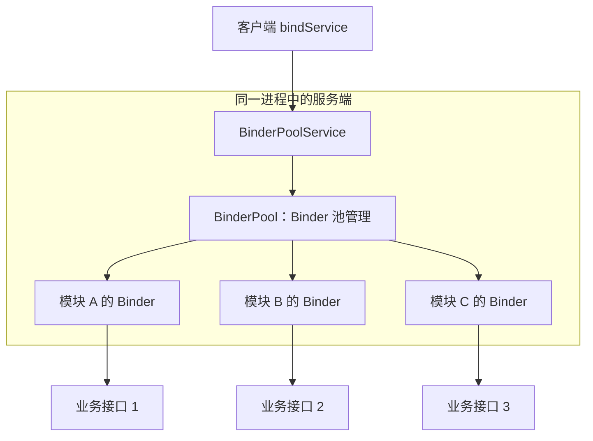

# Android IPC 方式对比

> IPC（Inter-Process Communication，进程间通信）。Android 基于 Linux，出于安全考虑，不同进程间不能直接操作对方的数据，这叫做"进程隔离"。

## 一、进程隔离原理

在 Linux 系统中，虚拟内存机制为每个进程分配了线性连续的内存空间，操作系统将这种虚拟内存空间映射到物理内存空间。每个进程有自己的虚拟内存空间，因此不能操作其他进程的内存空间，只有操作系统才有权限操作物理内存空间。进程隔离保证了每个进程的内存安全。

## 二、Android IPC 方式对比

各 IPC 方式的优缺点与适用场景对比说明如下：

| 方式 | 优点 | 缺点 | 适用场景 |
| --- | --- | --- | --- |
| Bundle | 简单易用 | 只能传输 Bundle 支持的数据类型 | 四大组件间的进程间通信 |
| 文件共享 | 简单易用 | 不适合高并发，无法做到即时通信 | 无并发访问、交换简单数据且实时性不高的场景 |
| AIDL | 功能强大，支持一对多并发通信、实时通信 | 使用稍复杂，需要处理好线程同步 | 一对多通信且有 RPC 需求 |
| Messenger | 支持一对多串行通信、实时通信 | 不能很好处理高并发，不支持 RPC，数据通过 Message 传输 | 低并发的一对多即时通信，无 RPC 需求 |
| ContentProvider | 数据源访问功能强大，支持一对多并发数据共享 | 可理解为受约束的 AIDL，主要提供 CRUD | 一对多的进程间数据共享 |
| Socket | 可通过网络传输字节流，支持一对多并发实时通信 | 实现细节繁琐，不支持直接 RPC | 网络数据交换 |

## 三、选择建议

- **简单数据传递（同进程/跨进程）**：Bundle / Intent；
- **低并发消息传递**：Messenger（基于 Handler，无需处理线程同步）；
- **复杂接口 + RPC + 并发**：AIDL；
- **数据共享**：ContentProvider；
- **网络通信**：Socket。

## 四、Binder 连接池

项目规模大时，若每个业务模块都创建一个绑定 Service，会消耗大量系统资源。**Binder 连接池（BinderPool）**将多个业务模块的 AIDL 统一交由**一个 Service** 管理：



BinderPool 的池管理实现如下：

::: code-tabs

@tab:active Java

```java
public class BinderPool extends Binder implements IBinderPool {

    public static final int BINDER_A = 1;
    public static final int BINDER_B = 2;

    @Override
    public IBinder queryBinder(int binderCode) {
        switch (binderCode) {
            case BINDER_A:
                return new ModuleAService();
            case BINDER_B:
                return new ModuleBService();
            default:
                return null;
        }
    }
}
```

@tab Kotlin

```kotlin
class BinderPool : Binder(), IBinderPool {

    companion object {
        const val BINDER_A = 1
        const val BINDER_B = 2
    }

    override fun queryBinder(binderCode: Int): IBinder? {
        return when (binderCode) {
            BINDER_A -> ModuleAService()
            BINDER_B -> ModuleBService()
            else -> null
        }
    }
}
```

:::

**收益**：

- 客户端只需与**一个 Service** 建立连接，通过 `queryBinder` 按标识获取对应 Binder
- 避免为每个业务模块重复创建 Service，降低资源消耗与连接建立开销
- 连接池单例化 + 服务端断开自动重连，保证连接可靠性

## 五、相关文章

- [Binder 跨进程通信机制详解](binder-mechanism.md) — Android IPC 核心
- [AIDL 深入解析](aidl-deep.md)
- [操作系统进程间通信](../../system/os/thread-sync-ipc.md) — Linux 8 种 IPC 方式
