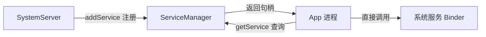

# ServiceManager 深入解析

> 面试高频指数：高
> ServiceManager 是所有 Binder 服务的"注册中心"，理解它是理解 Android 系统服务架构的钥匙。

## 1. ServiceManager 是什么

```text
ServiceManager（servicemanager 进程）
Binder 服务注册中心（Context Manager）

职责：
① 接收系统服务注册（addService）
② 提供服务查询（getService）
③ 管理服务句柄 → Binder 引用映射
```

**核心地位**：



## 2. 为什么需要 ServiceManager

- **解耦**：服务方与调用方不需要互相知道地址
- **统一入口**：所有系统服务通过名字查找
- **句柄管理**：Binder 驱动只认 handle，ServiceManager 维护名字 → handle 映射
- **启动顺序**：ServiceManager 是第一个启动的 Binder 服务

```text
启动顺序：
内核启动 → init → servicemanager（第一个 Binder 守护进程）
→ Zygote → SystemServer → 注册各种系统服务
```

## 3. 核心数据结构 svclist

### 3.1 服务列表

ServiceManager 内部维护一个服务链表：

```text
struct svcinfo {
    struct svcinfo *next;      // 链表指针
    uint32_t handle;           // Binder 句柄
    struct binder_death *death;// 死亡通知
    unsigned len;              // 名字长度
    char name[0];              // 服务名（如 "activity"）
};
```

**关键点**：
- 服务名是字符串（如 `activity`、`package`、`window`）
- handle 是 Binder 驱动分配的句柄
- 新增服务插到链表头部

### 3.2 常见系统服务名

| 服务名 | 对应 Binder 接口 | 作用 |
|--------|------------------|------|
| `activity` | IActivityManager | 四大组件管理 |
| `window` | IWindowManager | 窗口管理 |
| `package` | IPackageManager | 包管理 |
| `power` | IPowerManager | 电源管理 |
| `sensor` | ISensorManager | 传感器 |
| `connectivity` | IConnectivityManager | 网络连接 |

## 4. 服务注册流程 addService

### 4.1 调用链

```text
SystemServer 侧：
ServiceManager.addService("activity", ams)

→ BinderInternal.addService → BinderProxy.transact
→ Binder 驱动 → servicemanager 进程
→ svc_add_service：检查权限 → 插入 svclist → 注册死亡通知
```

### 4.2 关键代码

```java
// SystemServer 注册服务（Java 层）
ServiceManager.addService(Context.ACTIVITY_SERVICE, ams);

// App 侧获取服务
IBinder binder = ServiceManager.getService("activity");
```

```text
native 层核心：
int svc_add_service(const char *name, binder_uint64_t handle, ...) {
    // 1. 权限检查（SELinux）
    // 2. 查找是否已存在同名服务
    // 3. 插入 svclist 链表
    // 4. binder_link_to_death 注册死亡通知
}
```

## 5. 服务查询流程 getService

### 5.1 流程

```text
App 调用 ServiceManager.getService("activity")

① 进程内查找缓存（ServiceManager 会缓存已查询的 binder）
② 未命中 → Binder 驱动 → servicemanager 进程
③ svc_lookup：遍历 svclist 匹配名字
④ 找到 → 返回 handle → Binder 驱动建立引用
⑤ 调用方获得 BinderProxy，可发起调用
```

### 5.2 getService 的阻塞行为

```java
// 旧版：阻塞直到拿到（可能导致主线程卡顿）
IBinder b = ServiceManager.getService("activity");

// 推荐：checkService 非阻塞
IBinder b = ServiceManager.checkService("activity");
```

```text
getService 若服务未注册会阻塞（最多约 5 秒后超时）；
checkService 立即返回 null，适合判断服务是否可用。
```

## 6. 服务死亡与重建

### 6.1 死亡通知

```text
服务进程被杀 → Binder 驱动通知 servicemanager
→ svc_remove（从 svclist 移除）
→ 调用方收到 binderDied 回调

Android 11+ 支持 death recipient 管理，
App 可监听系统服务重启并重新获取。
```

### 6.2 服务重启场景

```text
SystemServer 崩溃重启（watchdog 触发）：
→ zygote 重启 SystemServer
→ 重新 addService 注册全部服务
→ 调用方 binderDied → 重新 getService
```

## 7. ServiceManager 与 Context Manager

```text
ServiceManager 本身是一个特殊 Binder 服务：
句柄为 0（handle 0 = Context Manager）

任何进程 open /dev/binder 后，handle 0 即 ServiceManager，
Binder 驱动的特殊处理：handle 0 固定指向 servicemanager。

对比：
ServiceManager 用 Binder 实现（服务注册/查找）；
Context Manager 是它在 Binder 驱动中的"身份"。
```

## 8. 高频面试题

**Q1：ServiceManager 的作用是什么？**
A：Binder 服务注册中心。系统服务启动时 addService 注册，调用方 getService 按名字查找，维护 服务名 → 句柄 的 svclist 映射。

**Q2：handle 0 是什么？**
A：Context Manager（ServiceManager 的 Binder 身份），固定句柄 0。Binder 驱动对 handle 0 特殊处理，任何进程都可直接访问。

**Q3：getService 和 checkService 区别？**
A：getService 服务未注册时阻塞等待（有超时）；checkService 立即返回（null 表示不存在）。主线程慎用 getService。

**Q4：服务进程被杀后 ServiceManager 怎么处理？**
A：Binder 驱动检测到服务端死亡，通知 servicemanager 从 svclist 移除该服务，并触发调用方的死亡回调（binderDied）。

**Q5：SystemServer 重启后服务会怎样？**
A：SystemServer 重新 addService 注册所有服务；调用方需监听 binderDied 并重新 getService（如 AMS、WMS 重启场景）。

## 9. 小结

- ServiceManager 是 Binder 服务的注册中心，handle 0（Context Manager）。
- 核心数据结构 svclist：名字 → handle 映射链表。
- addService 注册、getService/checkService 查询。
- 服务死亡有通知机制，调用方需处理重启场景。
