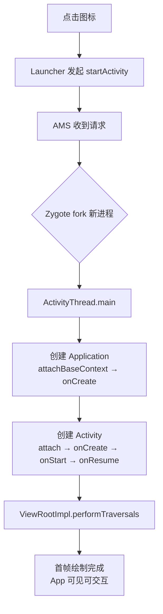

# 🚀 应用启动流程详解

> 面试高频指数：⭐⭐⭐⭐⭐
> 应用启动是性能优化的第一战场，理解完整链路才能精准优化。

## 1. 启动的三种情况

| 类型 | 定义 | 耗时 |
| --- | --- | --- |
| 冷启动 | 进程不存在，完整创建 | 最长（数百 ms） |
| 温启动 | 进程存活，Activity 被销毁重建 | 较快 |
| 热启动 | Activity 在后台，直接恢复 | 最快 |

## 2. 冷启动完整链路



### 2.1 各阶段耗时归属

```text
① Launcher → AMS（Binder 通信）：~10ms
② Zygote fork + 进程初始化：~50-100ms
   - 进程创建、主线程 Looper 初始化
③ Application 创建：业务可控
   - attachBaseContext → onCreate（Application）
   - 各种 SDK 初始化都在这里！
④ Activity 创建：业务可控
   - attach → onCreate → onStart → onResume
   - setContentView + 布局加载
⑤ 首帧渲染：业务可控
   - measure/layout/draw
   - 冷启动耗时 = 系统开销 + 业务开销
```

## 3. ActivityThread.main 详解

```kotlin
// 应用的入口方法（由系统调用）
fun main(args: Array<String>) {
    // ① 创建主线程 Looper
    Looper.prepareMainLooper()

    // ② 创建 ActivityThread
    val thread = ActivityThread()
    thread.attach(false)

    // ③ 消息循环开始
    Looper.loop()
}

// attach(false) 中：
// - 通过 Binder 向 AMS 注册（attachApplication）
// - AMS 回调 bindApplication → handleBindApplication
//   → 创建 Application（反射）
//   → attachBaseContext → onCreate
```

## 4. 首帧渲染链路

```text
Activity.onResume 后
→ WindowManager.addView（注册窗口）
→ ViewRootImpl.setView
→ requestLayout → scheduleTraversals
→ Choreographer 等待 Vsync
→ performTraversals：measure → layout → draw
→ RenderThread 提交渲染命令
→ SurfaceFlinger 合成显示
```

**首帧判定**：

```text
reportFullyDrawn()（AndroidX 提供）
- 标记"应用完全绘制完成"
- 用于测量首帧后业务准备完成的时间
```

## 5. 启动耗时统计

```kotlin
// ① adb 命令行统计
// adb shell am start -W com.example.app/.MainActivity
// 输出：
//   TotalTime: 350ms        （startActivity 到首帧）
//   WaitTime: 360ms         （含启动器等待）

// ② 代码埋点
class MyApp : Application() {
    override fun onCreate() {
        super.onCreate()
        val startTime = SystemClock.elapsedRealtime()
        // 业务初始化...
        Log.d("Launch", "App onCreate 耗时: ${SystemClock.elapsedRealtime() - startTime}ms")
    }
}

// ③ Macrobenchmark（官方推荐）
// 用 Jetpack Macrobenchmark 自动化测量冷/热/温启动
```

## 6. 启动优化清单

### 6.1 Application 轻量化

```kotlin
class MyApp : Application() {

    override fun onCreate() {
        super.onCreate()

        // ❌ 所有 SDK 同步初始化（阻塞启动）
        // ✅ 延迟/异步初始化
        Thread {
            sdkA.init()      // 非关键路径异步
            sdkB.init()
        }.start()

        // ✅ 关键路径精简：只初始化真正需要的
        CrashHandler.init(this)
        // 其他放到首帧后（IdleHandler）
        Looper.myLooper()?.setMessageLogging {
            // 首帧完成后执行
        }
    }
}
```

### 6.2 启动页占位（Window Background）

```xml
<!-- styles.xml -->
<style name="Theme.Launch" parent="Theme.AppCompat.Light.NoActionBar">
    <item name="android:windowBackground">@drawable/launch_bg</item>
    <!-- 启动瞬间显示图片，代替白屏 -->
</style>

<!-- AndroidManifest：启动页使用该主题 -->
```

### 6.3 其他优化

```text
① 布局精简（首屏层级 < 3 层）
② 避免主线程 IO（数据库、文件、网络）
③ 懒加载（ViewStub / 按需初始化）
④ 类加载优化（R8 混淆 + 裁剪，减少 dex 体积）
⑤ Baseline Profile 预编译关键路径
⑥ 线程池预热（避免首帧时创建线程）
⑦ 资源优化（首屏用到的资源合并）
```

## 7. 高频面试题

**Q1：冷启动耗时主要花在哪？**
A：进程创建（Zygote fork）+ Application 初始化 + Activity 创建 + 首帧渲染。
业务可控部分：Application.onCreate 的初始化、setContentView 布局加载、
首帧绘制复杂度。

**Q2：如何测量启动耗时？**
A：`adb shell am start -W`（TotalTime/WaitTime）；代码埋点（SystemClock）；
Macrobenchmark（官方自动化）；启动 Tracing（systrace 查看各阶段）。

**Q3：Application 中如何做初始化又不拖慢启动？**
A：只放关键初始化；非关键异步（线程/协程）；延迟到首帧后
（IdleHandler/onTrimMemory 后）；按需初始化（首次使用时）。

**Q4：windowBackground 占位原理？**
A：系统在创建窗口时先显示主题的 windowBackground（替代白屏），
首帧绘制完成后被真实内容覆盖。视觉上"秒开"，实际启动耗时不变。

**Q5：ActivityThread 是什么？**
A：应用的入口类（main 方法），管理主线程 Looper、Application/Activity
的创建与生命周期回调（handleLaunchActivity 等）。通过 Binder 与 AMS 通信。

## 8. 小结

- 冷启动 = 系统开销（fork）+ 业务开销（Application/Activity）。
- 优化三大方向：Application 轻量、首屏精简、占位体验。
- 测量：am start -W / 埋点 / Macrobenchmark。
- 面试重点：完整链路、耗时归属、优化手段。
