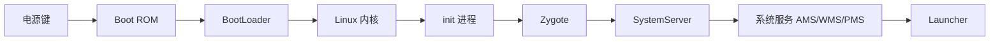

# Android 系统启动流程

> 面试高频指数：高
> 系统启动流程是理解 Android 架构的基石，也是源码面试的高频考点。

## 1. 启动总览

Android 系统启动的完整链路如下：



## 2. 各阶段详解

### 2.1 第一阶段：Boot ROM → BootLoader

```text
① 电源键按下 → Boot ROM（固化在芯片中）开始执行
② Boot ROM 加载 BootLoader 到 RAM
③ BootLoader（引导程序）初始化硬件
   → 加载 Linux 内核镜像
   → 启动内核

作用：硬件初始化 + 内核加载
```

### 2.2 第二阶段：Linux 内核

```text
① 内核初始化
   - 内存管理（MMU）
   - 进程调度器
   - 驱动加载（显示、输入、存储...）
② 挂载根文件系统
③ 启动第一个用户进程：init（PID 1）

作用：硬件抽象 + 基础服务 + 启动 init
```

### 2.3 第三阶段：init 进程

```text
init（PID 1，Android 的第一个用户进程）
职责：
① 解析 init.rc 配置文件
② 创建关键目录（/dev、/proc、/sys）
③ 启动守护进程：ueventd、logd、vold、adbd
④ 启动 Zygote 进程

init.rc 关键服务：
- zygote：应用进程孵化器
- servicemanager：Binder 服务注册中心
- surfaceflinger：画面合成
```

### 2.4 第四阶段：Zygote

```text
Zygote（孵化器进程）
作用：
① 预加载常用类与资源（简化 App 启动）
② 创建 SystemServer 进程
③ 监听 Socket，响应 AMS 的 fork 请求

启动流程：
init → app_process（zygote 可执行文件）
→ AndroidRuntime.start() → 启动 ART 虚拟机
→ ZygoteInit.main()
→ registerZygoteSocket()   // 注册等待 fork 的 Socket
→ preload()                // 预加载类与资源
→ startSystemServer()      // 启动 SystemServer
→ runSelectLoop()          // 循环等待 fork 请求
```

### 2.5 第五阶段：SystemServer

```text
SystemServer（系统服务进程）
Zygote fork 出 SystemServer 后：

main() → SystemServer.run()
→ 创建主线程 Looper
→ startBootstrapServices()   // 启动引导服务
→ startCoreServices()        // 启动核心服务
→ startOtherServices()       // 启动其他服务
→ Looper.loop()

关键服务：
- ActivityManagerService（AMS）
- WindowManagerService（WMS）
- PackageManagerService（PMS）
- PowerManagerService
- LocationManagerService
- NotificationManagerService
- SensorService、InputManagerService...
```

### 2.6 第六阶段：Launcher 启动

```text
SystemServer 启动完成后
→ AMS 启动系统首页（Launcher）
→ Launcher 显示桌面

用户点击应用图标 → 新一轮应用启动流程
```

## 3. 进程与服务的对应关系

```text
init（PID 1）
 └─ zygote（应用孵化器）
     ├─ system_server（AMS/WMS/PMS...）
     └─ app_process（普通应用）
         ├─ com.example.app1
         └─ com.example.app2
```

## 4. 高频面试题

**Q1：Android 系统启动的完整流程？**
A：电源 → Boot ROM → BootLoader → Linux 内核 → init 进程 → Zygote →
SystemServer → 系统服务（AMS/WMS 等）→ Launcher。Zygote 负责 fork 所有
应用进程。

**Q2：Zygote 的作用？为什么 App 启动快？**
A：预加载常用类/资源/虚拟机，fork 时子进程直接继承，无需重新加载；
fork 进程本身比新建进程快（复制地址空间）。

**Q3：SystemServer 和 Zygote 的关系？**
A：Zygote fork 出 SystemServer（系统服务进程），SystemServer 内部启动
AMS/WMS/PMS 等系统服务。普通应用也是 Zygote fork 出来的。

**Q4：AMS 是何时启动的？**
A：SystemServer.startBootstrapServices() 阶段启动（最早的核心服务之一），
负责管理组件、进程与任务栈。

**Q5：init.rc 是什么？**
A：init 进程的配置文件，声明系统服务与动作（on boot、service zygote 等），
init 解析后按配置启动守护进程与服务。

## 5. 小结

- 六阶段：Boot ROM → BootLoader → 内核 → init → Zygote → SystemServer → Launcher。
- Zygote 是应用进程的孵化器（fork + 预加载）。
- SystemServer 承载所有系统服务。
- 面试重点：各阶段职责、关键类名、Zygote 原理。
