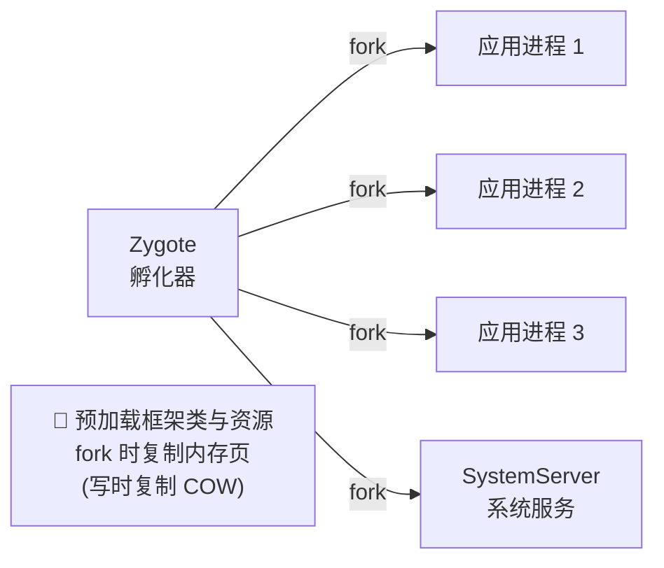
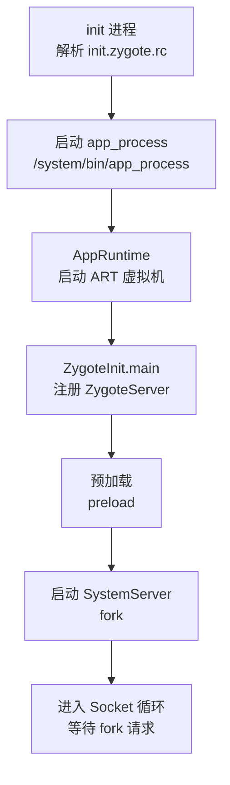
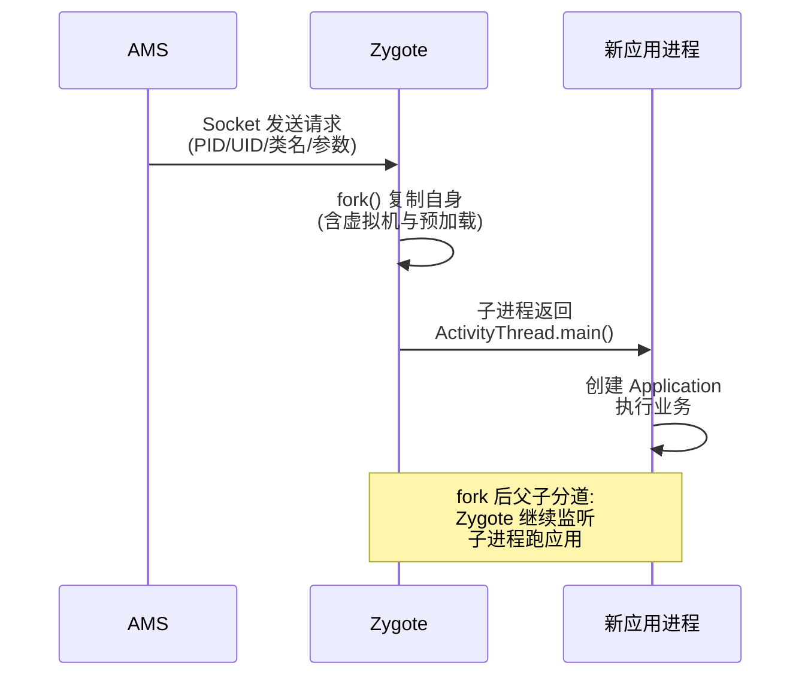
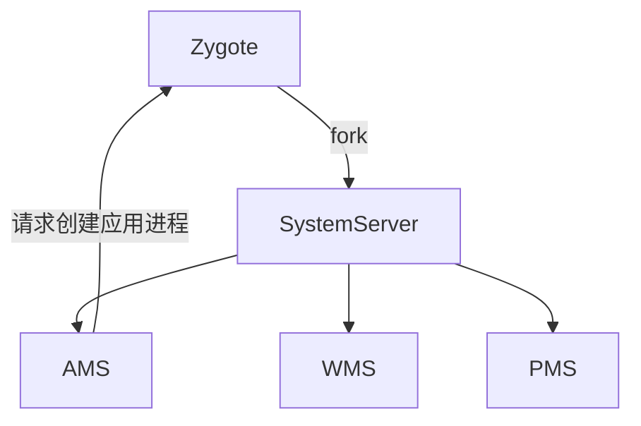

# Zygote 进程深入

> Zygote 是 Android 应用进程的"孵化器":所有应用进程都由它 fork 而来,共享预加载的类与资源,从而**快速启动 + 节省内存**。

## 一、Zygote 是什么



| 特点 | 说明 |
|------|------|
| 系统启动早期创建 | init 进程启动后立即启动 |
| 预加载 | 框架类、资源、主题、字体 |
| fork 孵化 | 新进程复制 Zygote 内存 |
| COW 共享 | 未修改的页与 Zygote 共享物理内存 |
| Socket 监听 | 等待 AMS 请求创建进程 |

## 二、Zygote 启动流程



::: code-tabs

@tab:active Java

```java
// ZygoteInit.main(核心逻辑)
public static void main(String[] argv) {
    // 1. 创建 ServerSocket:监听 666 端口(实际用抽象 socket)
    ZygoteServer zygoteServer = new ZygoteServer();
    // 2. 预加载:类/资源/主题/OpenGL 等
    preload(new ZygotePathClassLoader(...));
    // 3. fork 出 SystemServer(系统服务进程)
    Runnable r = forkSystemServer(abiList, zygoteSocketName, zygoteServer);
    // 4. 进入无限循环:处理 AMS 的进程创建请求
    zygoteServer.runSelectLoop(abiList);
}
```

@tab Kotlin

```kotlin
// ZygoteInit.main(核心逻辑)
fun main(argv: Array<String>) {
    // 1. 创建 ServerSocket:监听 666 端口(实际用抽象 socket)
    val zygoteServer = ZygoteServer()
    // 2. 预加载:类/资源/主题/OpenGL 等
    preload(ZygotePathClassLoader(...))
    // 3. fork 出 SystemServer(系统服务进程)
    val r = forkSystemServer(abiList, zygoteSocketName, zygoteServer)
    // 4. 进入无限循环:处理 AMS 的进程创建请求
    zygoteServer.runSelectLoop(abiList)
}
```

:::

## 三、预加载机制

::: code-tabs

@tab:active Java

```java
// preload:加快应用启动 + 共享内存
static void preload() {
    // 1. 预加载框架类(preload-classes 列表,数千个类)
    preloadClasses();
    // 2. 预加载共享资源:主题、drawable、string
    preloadResources();
    // 3. 预加载 OpenGL(硬件渲染)
    preloadOpenGL();
    // 4. 预加载字体/文本布局
    preloadSharedLibraries();
    preloadTextResources();
    preloadFonts();
}
```

@tab Kotlin

```kotlin
// preload:加快应用启动 + 共享内存
fun preload() {
    // 1. 预加载框架类(preload-classes 列表,数千个类)
    preloadClasses()
    // 2. 预加载共享资源:主题、drawable、string
    preloadResources()
    // 3. 预加载 OpenGL(硬件渲染)
    preloadOpenGL()
    // 4. 预加载字体/文本布局
    preloadSharedLibraries()
    preloadTextResources()
    preloadFonts()
}
```

:::

| 预加载内容 | 作用 |
|-----------|------|
| 框架类 | Activity/Service/View 等核心类 |
| 资源 | 系统主题、常用 drawable |
| OpenGL | 硬件加速相关库 |
| 字体 | 系统字体族 |
| ICU/文本 | 国际化文本布局 |

> **COW(写时复制)**:fork 后子进程与 Zygote 共享只读物理页,只有写入时才复制。所以预加载内容越多,内存共享越多(但启动时间略长)。**这就是为什么所有应用都带一套系统框架内存的底层原因**。

## 四、fork 创建应用进程



::: code-tabs

@tab:active Java

```java
// ZygoteConnection.processOneCommand:处理 fork 请求
Runnable processOneCommand(ZygoteServer zygoteServer) {
    // 1. 读取参数:uid/gid/应用类名(ActivityThread)等
    // 2. fork 子进程(核心)
    pid = Zygote.forkAndSpecialize(uid, gid, ...);
    if (pid == 0) {
        // 子进程:返回应用的 main 方法
        return handleChildProc(parsedArgs, ...);
    } else {
        // 父进程(Zygote):继续循环
        return null;
    }
}
```

@tab Kotlin

```kotlin
// ZygoteConnection.processOneCommand:处理 fork 请求
fun processOneCommand(zygoteServer: ZygoteServer): Runnable? {
    // 1. 读取参数:uid/gid/应用类名(ActivityThread)等
    // 2. fork 子进程(核心)
    pid = Zygote.forkAndSpecialize(uid, gid, ...)
    return if (pid == 0) {
        // 子进程:返回应用的 main 方法
        handleChildProc(parsedArgs, ...)
    } else {
        // 父进程(Zygote):继续循环
        null
    }
}
```

:::

### 为什么用 fork?

| 方案 | 问题 |
|------|------|
| 直接启动新进程 | 每次重新初始化虚拟机,慢 |
| fork 复制 | 继承已初始化的虚拟机与类,快 |
| fork + COW | 只读内存共享,启动快 + 省内存 |

## 五、SystemServer 与 Zygote 的关系



| 进程 | 关系 |
|------|------|
| Zygote | 孵化器,持有框架预加载 |
| SystemServer | Zygote fork 的第一个子进程 |
| 系统服务 | SystemServer 内启动(AMS/WMS/PMS) |
| 应用进程 | Zygote 按需 fork |

## 六、高频面试题

### Q1：Zygote 是什么?为什么要用它?
::: details 查看答案
Zygote 是 Android 应用进程的孵化器:系统启动早期由 init 启动,预加载框架类与资源,通过 fork 创建所有应用进程(以及 SystemServer)。为什么用它:① **启动快**——新进程直接复制已初始化的 ART 虚拟机和预加载类,无需重新初始化;② **省内存**——fork + 写时复制,未修改的内存页与 Zygote 共享同一物理页,所有应用共享系统框架内存。如果没有 Zygote,每个应用都要独立初始化,启动慢且内存翻倍。
:::

### Q2：Zygote 预加载了什么?为什么 COW 能省内存?
::: details 查看答案
预加载:框架类(Activity/View 等数千个)、系统资源(主题/drawable/字符串)、OpenGL、字体、ICU 文本数据。COW(写时复制):fork 出的子进程与 Zygote 共享只读物理内存页,子进程写入时该页才被复制。由于预加载内容基本只读,应用进程与 Zygote 共享大量物理页——100 个应用进程并不需要 100 份框架内存,而是共享 1 份。代价:Zygote 启动时会稍慢(预加载耗时),但换来所有应用启动快。
:::

### Q3：AMS 如何请求 Zygote 创建应用进程?
::: details 查看答案
AMS 启动应用(如 startActivity 时进程不存在)→ 通过 Socket 向 Zygote 发送创建请求(抽象 socket 地址,携带 uid/gid/应用入口类名 ActivityThread/参数等)→ Zygote 的 ZygoteServer 循环中收到请求 → ZygoteConnection.processOneCommand 解析参数 → Zygote.forkAndSpecialize fork 出子进程 → 子进程执行 handleChildProc,调用 ActivityThread.main() → 进入应用生命周期。Zygote 父进程继续监听下一个请求。整个过程:Socket 传参 + fork 孵化 + 子进程执行 main。
:::

### Q4：为什么应用进程创建后会自动执行 ActivityThread.main()?
::: details 查看答案
因为 Zygote 在 fork 子进程时,子进程的"执行入口"被设置为应用的主类 main:AMS 发送的 fork 请求参数中带有应用入口类名(默认 android.app.ActivityThread),fork 后子进程在 handleChildProc 中通过反射调用 ActivityThread.main()。main() 中:① 创建主线程 Looper 并 prepareMainLooper;② 创建 ActivityThread;③ 通过 Binder 绑定 AMS(attach,建立双向通信);④ 进入 Looper.loop() 消息循环。此后 Activity 的创建由 AMS 通过 Binder 通知 ActivityThread 完成。
:::

### Q5：多进程应用和 Zygote 有什么关系?
::: details 查看答案
每个进程(包括多进程应用的每个进程)都由 Zygote fork 创建:AndroidManifest 中 android:process 指定不同进程名,AMS 启动该组件时发现对应进程不存在,就通过 Zygote 创建。多个进程共享同一套框架预加载(COW),但各自独立内存与虚拟机实例。注意:多进程间不共享内存数据(需 IPC),Application 会执行多次(每进程一次),静态变量各进程独立——这是多进程的经典坑。
:::

## 小结

- Zygote = 应用进程孵化器,init 启动,预加载 + fork
- 预加载框架类/资源/字体,加速所有应用启动
- fork + COW:共享只读内存,省内存
- Socket 监听 AMS 请求,按需 fork 应用进程
- SystemServer 是 Zygote fork 的第一个进程
- 子进程执行 ActivityThread.main() 进入应用生命周期
- 多进程应用:每进程一次 Zygote fork

> 进阶阅读：[Android 系统启动流程](/system/boot/system-boot.md) | [应用启动流程详解](/system/boot/app-launch.md) | [AMS 与 Activity 启动](/system/ams-wms/ams-activity-launch.md)
