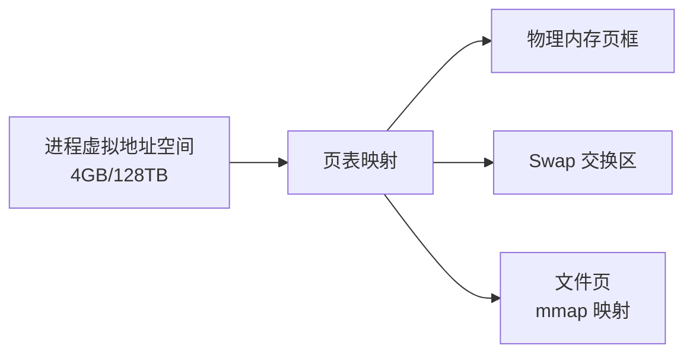
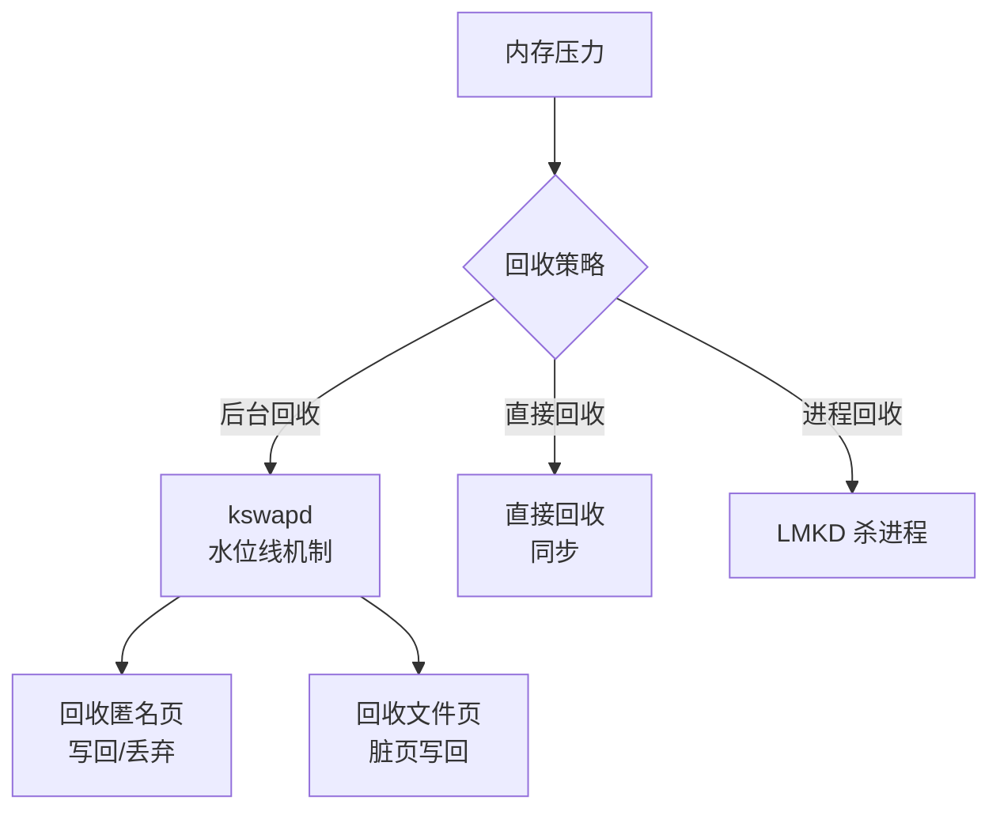
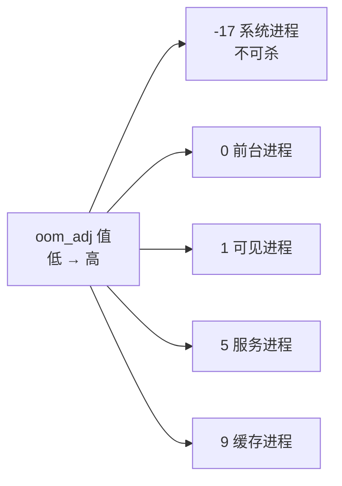
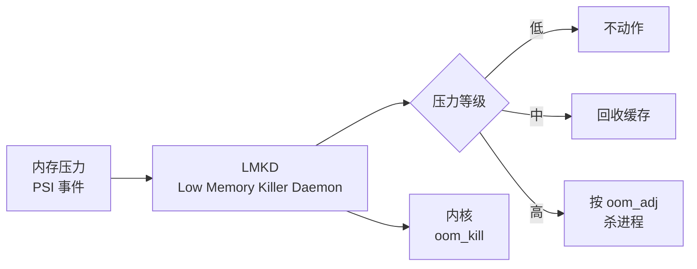

# Linux 内存管理深入

> Android 基于 Linux 内核,内存管理决定应用的生死:**虚拟内存隔离进程,分页按需加载,内存不足时按 oom_adj 优先级回收进程**。

## 一、虚拟内存与分页

虚拟内存与分页的完整映射关系如下：



各核心概念的说明如下：

| 概念 | 说明 |
|------|------|
| 虚拟内存 | 每个进程独立的地址空间,互不干扰 |
| 页表 | 虚拟地址 → 物理地址的映射表 |
| 分页 | 内存按 4KB 页管理 |
| 缺页中断 | 访问未映射页时内核加载 |
| COW | 写时复制:fork 共享只读页,写入才复制 |

```c
// 虚拟内存的意义
// 1. 进程隔离:地址空间独立,一个进程无法访问另一个
// 2. 内存共享:只读代码段/库可映射同一物理页
// 3. 按需加载:访问才缺页加载,启动时无需全部就绪
// 4. 简化管理:连续虚拟地址,物理可分散
```

## 二、Android 为何不 Swap

> Linux 桌面用 Swap(交换区)缓解内存不足;Android **默认无 Swap**,原因是:① 闪存寿命(频繁写坏);② 速度慢(比内存慢几个数量级);③ 应用可重启。所以 Android 的选择是:**内存不足直接杀进程(LMK/Kill)**,而不是换出。

## 三、内存回收机制

内存回收的整体流程如下：



各类回收对象的处理方式如下：

| 回收对象 | 处理 |
|---------|------|
| 文件页(干净) | 直接丢弃,可重新读 |
| 文件页(脏) | 写回磁盘后丢弃 |
| 匿名页 | 写 Swap 或杀进程(Android) |
| 内核缓存 | 收缩 slab/缓存 |

## 四、oom_adj 与进程优先级

### 4.1 OOM 优先级

各进程优先级的 oom_adj 分布如下：



各进程分类对应的 oom_adj 值如下：

| 进程分类 | oom_adj | 示例 |
|---------|---------|------|
| 系统/持久 | -17 ~ -12 | SystemServer、电话 |
| 前台 | 0 | 当前可见 Activity |
| 可见 | 1 | 被 Dialog 遮挡 |
| 服务 | 5 | startService |
| 缓存 | 9~15 | 后台 Activity |

### 4.2 AMS 动态调整

AMS 动态调整 oom_adj 的核心逻辑如下：

::: code-tabs

@tab:active Java

```java
// AMS 根据组件状态动态计算进程 oom_adj
// 前台 Activity → 0;后台 Activity → 9;空进程 → 15
// 每个 oom_adj 对应一个 lmkd 内存水位阈值
// 内存不足时:lmkd 从高 oom_adj(最不重要)开始杀
```

@tab Kotlin

```kotlin
// AMS 根据组件状态动态计算进程 oom_adj
// 前台 Activity → 0;后台 Activity → 9;空进程 → 15
// 每个 oom_adj 对应一个 lmkd 内存水位阈值
// 内存不足时:lmkd 从高 oom_adj(最不重要)开始杀
```

:::

> **为什么后台 Activity 比 Service 先被杀**:缓存进程(9+)先于服务进程(5)被杀,服务又先于前台。这就是"进程优先级"决定"被杀顺序"。

## 五、LMKD 内存压力管理

LMKD 处理内存压力的整体流程如下：



LMKD 各机制的说明如下：

| 机制 | 说明 |
|------|------|
| PSI | 内核内存压力信号(新版本) |
| LMKD | 用户态守护进程,监控内存 |
| 阈值分级 | 按内存余量分级处理 |
| 杀进程 | 从高 oom_adj 开始杀,直到内存恢复 |
| App 状态 | 杀进程前通知应用(生命周期回调) |

## 六、内存泄漏与监控

开发者排查内存泄漏的常用手段如下：

::: code-tabs

@tab:active Java

```java
// Android 开发者视角
// 1. 用 Memory Profiler 抓堆转储
// 2. 分析泄漏:Activity/Context 持有、静态集合、Handler 持有
// 3. LeakCanary 自动检测泄漏
// 4. 关注 PSS(按比例分摊的物理内存)
// 5. 避免大对象:Bitmap 复用、对象池
```

@tab Kotlin

```kotlin
// Android 开发者视角
// 1. 用 Memory Profiler 抓堆转储
// 2. 分析泄漏:Activity/Context 持有、静态集合、Handler 持有
// 3. LeakCanary 自动检测泄漏
// 4. 关注 PSS(按比例分摊的物理内存)
// 5. 避免大对象:Bitmap 复用、对象池
```

:::

## 七、高频面试题

### Q1：什么是虚拟内存?为什么 Android 进程间内存隔离?
::: details 查看答案
虚拟内存:每个进程拥有独立的虚拟地址空间(如 64 位系统 128TB),通过页表映射到物理内存,进程只能访问自己的地址空间。隔离的意义:① 一个进程崩溃/访问非法地址不会影响其他进程;② 地址空间独立,进程无法窃取或篡改其他进程数据;③ 简化编程:程序假设独占内存,物理内存可碎片化分配。映射是惰性的:访问未映射页触发缺页中断,由内核按需加载,这就是"按需分页"。
:::

### Q2：Android 为什么不用 Swap?内存不足怎么办?
::: details 查看答案
不用 Swap 的原因:① 闪存写入寿命有限,频繁换入换出会加速损坏;② 闪存 IO 速度远低于内存(数量级差距),Swap 性能差;③ Android 应用模型"可重启":被杀后重新拉起即可,不需要把状态换出。内存不足的处理:① 内核 kswapd 按水位线后台回收(文件页/缓存);② 压力大时 LMKD 根据 PSI 信号分级处理;③ 最终按 oom_adj 从高到低杀进程回收内存。这是"以杀进程换内存"的移动端设计。
:::

### Q3：oom_adj 是什么?进程优先级如何影响被杀顺序?
::: details 查看答案
oom_adj 是内核 OOM 评分调整值,范围约 -17~15:越低越重要。AMS 根据进程状态动态设置:前台 Activity(0) < 可见(1) < 服务(5) < 缓存(9~15),系统进程为负值不可杀。内存不足时,内核/LMKD 选择 oom_adj **最大**(最不重要)的进程先杀:先杀空进程/缓存进程,再杀服务,最后才影响前台。这也是为什么"后台应用先被清理,正在使用的应用不容易被杀"。
:::

### Q4：LMKD 是什么?和传统 OOM Killer 有何区别?
::: details 查看答案
LMKD(Low Memory Killer Daemon)是 Android 的内存压力守护进程:① 传统 OOM Killer 只在内存耗尽时才暴力杀进程;② LMKD 提前监控内存压力(新内核用 PSI 信号),分级处理:低压力不动作、中压力回收缓存、高压力按 oom_adj 杀进程,并支持杀前回调应用生命周期;③ LMKD 比内核 OOM 更"智能",能结合应用状态(如用户最近使用)决策,且触发更早,避免系统卡死。现代 Android 通过 LMKD + 内核 Watermark 配合管理内存。
:::

### Q5：内存泄漏如何产生与排查?
::: details 查看答案
常见泄漏:① Activity/Context 被静态引用持有(单例、静态集合);② Handler/内部类持有外部 Activity 引用(未及时 removeCallbacks);③ 未注销监听器(BroadcastReceiver、EventBus);④ 资源未关闭(IO、Cursor);⑤ Bitmap 未回收/大图未压缩。排查:① Memory Profiler 实时监控内存曲线;② 抓取 Heap Dump 用 MAT/Analyzer 分析;③ LeakCanary 自动定位泄漏引用链;④ 关注 PSS 与 Java/Native 内存。修复思路:及时释放引用、用弱引用、Lifecycle 感知、资源统一管理。
:::

## 小结

- 虚拟内存 + 分页:进程隔离与按需加载
- Android 无 Swap:杀进程代替换出,保护闪存
- 回收三层:kswapd 后台回收 → LMKD 分级 → 内核 OOM
- oom_adj 决定杀进程顺序:缓存 < 服务 < 可见 < 前台
- LMKD + PSI:提前感知内存压力,智能回收
- 开发者要防内存泄漏,监控 PSS 与堆内存

> 进阶阅读：[操作系统核心知识](/system/os/os-core.md) | [线程同步与进程间通信](/system/os/thread-sync-ipc.md) | [ART 运行时与 GC](/system/art/art-gc.md)
