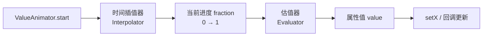
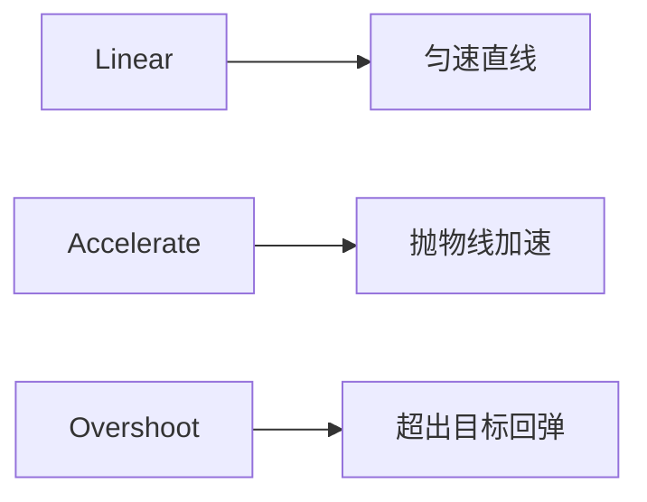
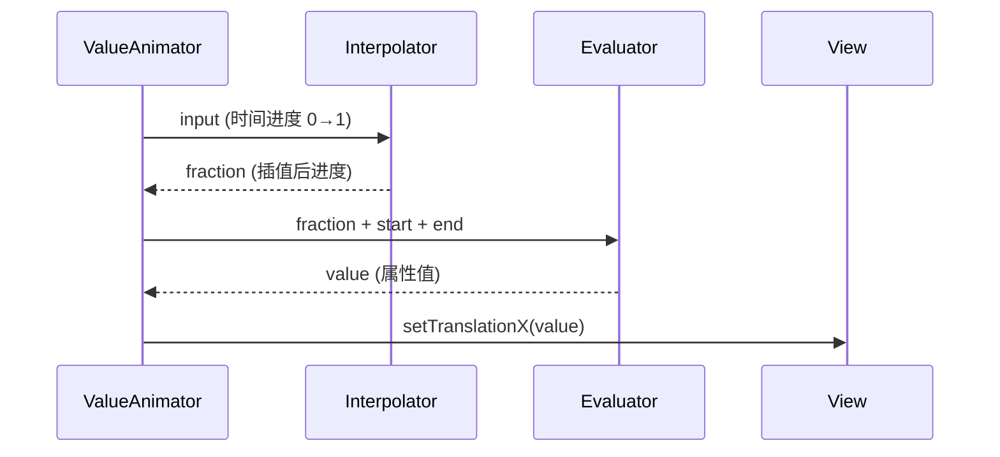

# 插值器与估值器原理

> 面试高频指数：高 — "插值器（Interpolator）和估值器（Evaluator）的区别"是动画高频题，源码级的动画执行流程是高级面试常考点。

## 一、动画的三要素

### 1.1 动画执行流程

一次动画从开始到更新属性的链路：



一个完整动画由三部分协作：

| 要素 | 作用 | 例子 |
|------|------|------|
| 时间 | 动画时长（duration） | 300ms |
| 插值器 Interpolator | 时间 → 进度 fraction 的映射 | 加速/减速/弹跳 |
| 估值器 Evaluator | fraction → 具体属性值 | 0 → 100px 线性映射 |

## 二、插值器（Interpolator）

### 2.1 概念与本质

**插值器是一个"时间函数"**：输入动画时间进度（0 到 1），输出插值进度（通常也是 0 到 1）。

```
fraction = interpolator.getInterpolation(input)
```

- `input`：线性时间进度（动画执行时间 / duration）
- `output`：非线性化后的进度（可能超出 0-1，如 Overshoot）

### 2.2 内置插值器

系统内置的插值器各有节奏特点：

| 插值器 | 效果 | 特点 |
|--------|------|------|
| LinearInterpolator | 匀速 | 无加速减速 |
| AccelerateInterpolator | 加速 | 先慢后快 |
| DecelerateInterpolator | 减速 | 先快后慢 |
| AccelerateDecelerateInterpolator | 先加速后减速 | 默认值，对称 |
| OvershootInterpolator | 回弹超出 | 超过目标再回来 |
| BounceInterpolator | 弹跳 | 多次回弹 |
| AnticipateInterpolator | 蓄力 | 先倒退再前进 |
| AnticipateOvershootInterpolator | 蓄力 + 回弹 | 组合效果 |
| CycleInterpolator | 循环 | 正弦循环 |

用公式表达，加速与回弹的曲线差异：



### 2.3 自定义插值器

实现 getInterpolation 即可自定义节奏曲线：

::: code-tabs

@tab:active Java

```java
// 贝塞尔曲线插值器（ease-in-out 平滑）
public class EaseInOutCubicInterpolator implements Interpolator {
    @Override
    public float getInterpolation(float input) {
        if (input < 0.5f) {
            return 4f * input * input * input;
        }
        return 1f - (float) Math.pow(-2f * input + 2f, 3.0) / 2f;
    }
}
```

@tab Kotlin

```kotlin
// 贝塞尔曲线插值器（ease-in-out 平滑）
class EaseInOutCubicInterpolator : Interpolator {
    override fun getInterpolation(input: Float): Float {
        return if (input < 0.5f) {
            4f * input * input * input
        } else {
            1f - Math.pow(-2f * input + 2f, 3.0).toFloat() / 2f
        }
    }
}
```

:::

> 关键点：自定义 Interpolator 只需实现 `getInterpolation(input: Float): Float`，返回 0-1（可超界）即可。

## 三、估值器（Evaluator）

### 3.1 概念与本质

**估值器把插值进度映射为具体的属性值**：

```
value = evaluator.evaluate(fraction, startValue, endValue)
```

内置估值器覆盖了常用类型：

| 内置估值器 | 处理类型 | 说明 |
|------------|----------|------|
| IntEvaluator | Int | 整数插值 |
| FloatEvaluator | Float | 浮点插值 |
| ArgbEvaluator | 颜色 Int | 颜色平滑过渡 |
| PointFEvaluator | PointF | 坐标点插值 |
| RectEvaluator | Rect | 矩形插值 |

### 3.2 插值器与估值器的协作

两者在每帧中的协作时序：



**区分要点**：

| 维度 | Interpolator | Evaluator |
|------|--------------|-----------|
| 输入 | 时间进度 input | 插值进度 fraction |
| 输出 | 进度 fraction | 属性值 value |
| 关注 | 快慢节奏 | 数值映射方式 |
| 例子 | 加速/减速/回弹 | 线性/颜色/路径 |

## 四、自定义估值器

### 4.1 TypeEvaluator 实现

自定义估值器实现 evaluate 即可：

::: code-tabs

@tab:active Java

```java
// 自定义估值器：颜色渐变（HSL 空间插值）
public class HslEvaluator implements TypeEvaluator<Integer> {
    @Override
    public Integer evaluate(float fraction, Integer startValue, Integer endValue) {
        float startHue = Color.hue(startValue);
        float endHue = Color.hue(endValue);
        float hue = startHue + (endHue - startHue) * fraction;
        float sat = Color.saturation(startValue) +
                (Color.saturation(endValue) - Color.saturation(startValue)) * fraction;
        float lum = Color.luminance(startValue) +
                (Color.luminance(endValue) - Color.luminance(startValue)) * fraction;
        return Color.HSVToColor(new float[]{hue, sat, lum});
    }
}

// 使用
ValueAnimator animator = ValueAnimator.ofObject(new HslEvaluator(), Color.RED, Color.BLUE);
animator.addUpdateListener(va -> {
    view.setBackgroundColor((Integer) va.getAnimatedValue());
});
```

@tab Kotlin

```kotlin
// 自定义估值器：颜色渐变（HSL 空间插值）
class HslEvaluator : TypeEvaluator<Int> {
    override fun evaluate(fraction: Float, startValue: Int, endValue: Int): Int {
        val startHue = Color.hue(startValue)
        val endHue = Color.hue(endValue)
        val hue = startHue + (endHue - startHue) * fraction
        val sat = Color.saturation(startValue) +
            (Color.saturation(endValue) - Color.saturation(startValue)) * fraction
        val lum = Color.luminance(startValue) +
            (Color.luminance(endValue) - Color.luminance(startValue)) * fraction
        return Color.HSVToColor(floatArrayOf(hue, sat, lum))
    }
}

// 使用
val animator = ValueAnimator.ofObject(HslEvaluator(), Color.RED, Color.BLUE)
animator.addUpdateListener { va ->
    view.setBackgroundColor(va.animatedValue as Int)
}
```

:::

### 4.2 ObjectAnimator 与估值器

估值器算出的值由 ObjectAnimator 反射调用 setter：

::: code-tabs

@tab:active Java

```java
// ObjectAnimator 通过估值器求值，再反射调用 setter
ObjectAnimator animator = ObjectAnimator.ofObject(
        view, "backgroundColor",
        new ArgbEvaluator(), Color.WHITE, Color.BLACK
);
animator.setDuration(500);
animator.start();
```

@tab Kotlin

```kotlin
// ObjectAnimator 通过估值器求值，再反射调用 setter
val animator = ObjectAnimator.ofObject(
    view, "backgroundColor",
    ArgbEvaluator(), Color.WHITE, Color.BLACK
)
animator.duration = 500
animator.start()
```

:::

> ObjectAnimator 要求目标属性有 `setXxx()` 方法（setBackgroundColor），否则无法工作。

## 五、TimeAnimator 与关键帧

### 5.1 关键帧（Keyframe）

用多个关键帧把动画拆成分段节奏：

::: code-tabs

@tab:active Java

```java
// 分段关键帧：0% → 30% → 100% 三段速度
Keyframe kf1 = Keyframe.ofFloat(0f, 0f);
Keyframe kf2 = Keyframe.ofFloat(0.3f, 0.8f);   // 前 30% 走 80%
Keyframe kf3 = Keyframe.ofFloat(1f, 1f);
PropertyValuesHolder property = PropertyValuesHolder.ofKeyframe("scaleX", kf1, kf2, kf3);
ObjectAnimator animator = ObjectAnimator.ofPropertyValuesHolder(view, property);
```

@tab Kotlin

```kotlin
// 分段关键帧：0% → 30% → 100% 三段速度
val kf1 = Keyframe.ofFloat(0f, 0f)
val kf2 = Keyframe.ofFloat(0.3f, 0.8f)   // 前 30% 走 80%
val kf3 = Keyframe.ofFloat(1f, 1f)
val property = PropertyValuesHolder.ofKeyframe("scaleX", kf1, kf2, kf3)
val animator = ObjectAnimator.ofPropertyValuesHolder(view, property)
```

:::

关键帧允许：**不同阶段使用不同插值器**（通过 `kf.interpolator` 设置），实现复杂节奏。

### 5.2 动画执行主循环

每帧执行的核心计算：

::: code-tabs

@tab:active Java

```java
// Choreographer 驱动：每帧回调
private void doFrame(long frameTime) {
    long currentTime = System.nanoTime();
    float fraction = (float) (currentTime - startTime) / (float) duration;
    float interpolated = interpolator.getInterpolation(Math.max(0f, Math.min(1f, fraction)));
    float value = evaluator.evaluate(interpolated, startValue, endValue);
    setAnimatedValue(value);   // 反射调用 setter 或回调
    if (fraction < 1f) {
        choreographer.postFrameCallback(this);  // 下一帧继续
    }
}
```

@tab Kotlin

```kotlin
// Choreographer 驱动：每帧回调
private fun doFrame(frameTime: Long) {
    val currentTime = System.nanoTime()
    val fraction = (currentTime - startTime).toFloat() / duration.toFloat()
    val interpolated = interpolator.getInterpolation(fraction.coerceIn(0f, 1f))
    val value = evaluator.evaluate(interpolated, startValue, endValue)
    setAnimatedValue(value)   // 反射调用 setter 或回调
    if (fraction < 1f) {
        choreographer.postFrameCallback(this)  // 下一帧继续
    }
}
```

:::

## 六、高频面试题

### Q1：插值器（Interpolator）和估值器（Evaluator）有什么区别？
::: details 查看答案
插值器把时间进度 input（0-1）映射为插值进度 fraction（通常 0-1，可超界），决定动画的快慢节奏（匀速、加速、回弹等），本质是时间函数；估值器把插值进度 fraction 映射为具体属性值 value，决定数值如何从 startValue 变化到 endValue（线性、颜色空间、路径等）。执行顺序：时间 → 插值器 → 估值器 → 属性值。自定义动画效果时：节奏问题改插值器，数值映射问题改估值器。
:::

### Q2：ValueAnimator 和 ObjectAnimator 的区别？
::: details 查看答案
ValueAnimator 只负责数值生成（通过估值器计算值，通过 addUpdateListener 回调拿到值），不关心谁消费；ObjectAnimator 继承 ValueAnimator，自动把计算出的值通过反射调用目标对象的 setter（如 setTranslationX），且要求属性存在 setter 和 getter。使用场景：ValueAnimator 适合驱动自定义绘制或非标准 setter；ObjectAnimator 适合操作 View 的标准属性，代码更简洁。
:::

### Q3：如何实现"先加速后减速再回弹"的复杂动画？
::: details 查看答案
① 使用关键帧 Keyframe：把动画拆分为多段（如 0-0.3 加速、0.3-0.8 减速、0.8-1 回弹），每段设置不同 interpolator；② 使用 PathInterpolator 自定义任意贝塞尔曲线（如 cubic-bezier(0.68, -0.55, 0.265, 1.55) 实现回弹）；③ 使用 AnimatorSet 串接多个动画段；④ 或者自定义 Interpolator 实现分段时间函数。推荐方式：Keyframe + PathInterpolator，控制粒度最细。
:::

### Q4：ObjectAnimator 的工作原理是什么？
::: details 查看答案
ObjectAnimator 继承 ValueAnimator，核心流程：① start() 后通过 Choreographer 每帧回调；② 每帧计算时间进度，经插值器得 fraction；③ 估值器根据 fraction 和 start/end 值算出属性值；④ 通过反射调用目标对象的属性 setter（属性名由构造参数指定，如 "translationX" 对应 setTranslationX）；⑤ 属性值改变后由 View 的 invalidate 机制触发重绘。注意：属性必须存在 setter，否则动画不生效；返回值类型需与估值器匹配。
:::

### Q5：动画每帧是如何被驱动的？为什么是 16ms？
::: details 查看答案
动画由 Choreographer（编舞者）驱动：通过系统 VSYNC 信号（约 60Hz，每帧约 16.6ms）回调 doFrame；ValueAnimator 在 doFrame 中计算当前时间进度、更新属性值并请求重绘（invalidate），然后注册下一帧回调。16ms 来自 60Hz 刷新率（1000/60 ≈ 16.6ms）。若一帧处理超过 16ms 则掉帧（跳帧），动画卡顿；90Hz/120Hz 高刷屏间隔更短。Choreographer 保证动画与屏幕刷新同步，避免撕裂。
:::

## 七、小结

插值器与估值器要点：

1. 插值器：时间 → 进度，控制快慢节奏
2. 估值器：进度 → 数值，控制映射方式
3. 执行顺序：时间 → 插值器 → 估值器 → setter
4. 自定义只需实现 getInterpolation / evaluate
5. 关键帧可分段控制插值器，实现复杂节奏

相关阅读：[属性动画详解与源码分析](/ui/animation/property-animation.md)、[补间动画与帧动画](/ui/animation/tween-animation.md)、[Choreographer 渲染机制](/ui/render/choreographer.md)、[View 重绘机制](/ui/view/view-draw-process.md)。
