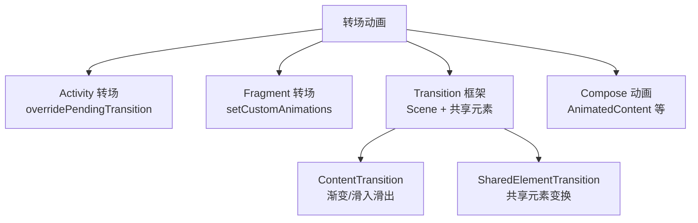
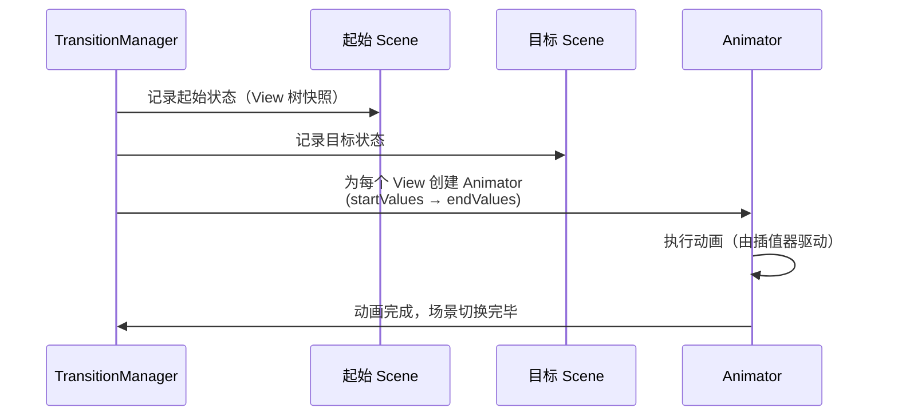

# 转场动画与共享元素

> 从页面 A 跳转到页面 B，如何让过渡丝滑自然？本文详解 Activity/Fragment 转场动画、Transition 场景切换、共享元素（ShareElement）原理，以及 Compose 时代的动画方案。

## 一、转场动画体系



## 二、Activity 转场动画

### 2.1 传统方式：overridePendingTransition

::: code-tabs

@tab:active Java

```java
// 启动时
startActivity(new Intent(this, DetailActivity.class));
overridePendingTransition(R.anim.slide_in_right, R.anim.slide_out_left);

// 返回时（在 B 页面）
finish();
overridePendingTransition(R.anim.slide_in_left, R.anim.slide_out_right);
```

@tab Kotlin

```kotlin
// 启动时
startActivity(Intent(this, DetailActivity::class.java))
overridePendingTransition(R.anim.slide_in_right, R.anim.slide_out_left)

// 返回时（在 B 页面）
finish()
overridePendingTransition(R.anim.slide_in_left, R.anim.slide_out_right)
```

:::

```xml
<!-- res/anim/slide_in_right.xml -->
<set xmlns:android="http://schemas.android.com/apk/res/android"
    android:interpolator="@android:anim/decelerate_interpolator">
    <translate android:fromXDelta="100%" android:toXDelta="0"
        android:duration="300" />
</set>
```

### 2.2 现代方式：Activity Transition API（5.0+）

::: code-tabs

@tab:active Java

```java
// 进入页面
Bundle options = ActivityOptionsCompat.makeSceneTransitionAnimation(
        this,
        imageView, "shared_image"    // (共享 View, 过渡名)
).toBundle();
startActivity(new Intent(this, DetailActivity.class), options);
```

@tab Kotlin

```kotlin
// 进入页面
val options = ActivityOptionsCompat.makeSceneTransitionAnimation(
    this,
    imageView, "shared_image"    // (共享 View, 过渡名)
).toBundle()
startActivity(Intent(this, DetailActivity::class.java), options)
```

:::

```xml
<!-- A 页面布局 -->
<ImageView android:id="@+id/image" android:transitionName="shared_image" />

<!-- B 页面布局：相同 transitionName 才匹配 -->
<ImageView android:id="@+id/big_image" android:transitionName="shared_image" />
```

> 匹配规则：**两个页面上 transitionName 相同的 View** 组成共享元素对，系统自动插值生成"从 A 的位置大小变到 B 的位置大小"的动画。

## 三、Transition 框架详解

### 3.1 核心概念

| 概念 | 说明 |
|------|------|
| Scene | 场景（一组 View 层级状态） |
| Transition | 从一个 Scene 到另一个 Scene 的变化动画 |
| TransitionManager | 场景切换调度器 |
| 共享元素 | 两个场景中相同的 View |

### 3.2 Scene 切换（同一容器内状态切换）

::: code-tabs

@tab:active Java

```java
// 场景一：初始布局
Scene scene1 = Scene.getSceneForLayout(container, R.layout.scene_start, this);
// 场景二：目标布局
Scene scene2 = Scene.getSceneForLayout(container, R.layout.scene_end, this);

// 默认过渡
TransitionManager.go(scene2);

// 自定义过渡（渐变 + 位移动画）
TransitionManager.go(scene2, new AutoTransition());

// 延迟切换
TransitionManager.beginDelayedTransition(container);   // 记录当前状态
// ...修改 container 内的 View（如移位置、改大小）
// 结束时自动生成过渡动画
```

@tab Kotlin

```kotlin
// 场景一：初始布局
val scene1 = Scene.getSceneForLayout(container, R.layout.scene_start, this)
// 场景二：目标布局
val scene2 = Scene.getSceneForLayout(container, R.layout.scene_end, this)

// 默认过渡
TransitionManager.go(scene2)

// 自定义过渡（渐变 + 位移动画）
TransitionManager.go(scene2, AutoTransition())

// 延迟切换
TransitionManager.beginDelayedTransition(container)   // 记录当前状态
// ...修改 container 内的 View（如移位置、改大小）
// 结束时自动生成过渡动画
```

:::

### 3.3 内置 Transition 类型

| Transition | 效果 |
|-----------|------|
| `Fade` | 淡入淡出 |
| `Slide` | 滑入滑出 |
| `Explode` | 从边缘散开/聚合 |
| `ChangeBounds` | 位置/大小变化 |
| `ChangeTransform` | 旋转/缩放变化 |
| `ChangeImageTransform` | 图片变换 |
| `AutoTransition` | Fade + ChangeBounds 组合 |
| `TransitionSet` | 多个 Transition 组合 |

### 3.4 共享元素支持的动画类型

::: code-tabs

@tab:active Java

```java
// 全局配置（Theme 中定义更佳）
TransitionSet enterTransition = new TransitionSet();
enterTransition.addTransition(new ChangeBounds());
enterTransition.addTransition(new ChangeTransform());
enterTransition.addTransition(new ChangeImageTransform());
enterTransition.addTransition(new ChangeClipBounds());
enterTransition.setDuration(400);
getWindow().setSharedElementEnterTransition(enterTransition);
getWindow().setSharedElementReturnTransition(enterTransition);
```

@tab Kotlin

```kotlin
// 全局配置（Theme 中定义更佳）
window.sharedElementEnterTransition = TransitionSet().apply {
    addTransition(ChangeBounds())
    addTransition(ChangeTransform())
    addTransition(ChangeImageTransform())
    addTransition(ChangeClipBounds())
    duration = 400
}
window.sharedElementReturnTransition = window.sharedElementEnterTransition
```

:::

## 四、Fragment 转场

::: code-tabs

@tab:active Java

```java
supportFragmentManager.beginTransaction()
        .setCustomAnimations(
                R.anim.slide_in_right,     // 进入动画
                R.anim.slide_out_left,     // 退出动画
                R.anim.slide_in_left,      // 返回进入
                R.anim.slide_out_right     // 返回退出
        )
        .replace(R.id.container, new DetailFragment())
        .addSharedElement(imageView, "shared_image")   // 共享元素
        .addToBackStack(null)
        .commit();
```

@tab Kotlin

```kotlin
supportFragmentManager.beginTransaction()
    .setCustomAnimations(
        R.anim.slide_in_right,     // 进入动画
        R.anim.slide_out_left,     // 退出动画
        R.anim.slide_in_left,      // 返回进入
        R.anim.slide_out_right     // 返回退出
    )
    .replace(R.id.container, DetailFragment())
    .addSharedElement(imageView, "shared_image")   // 共享元素
    .addToBackStack(null)
    .commit()
```

:::

## 五、Transition 原理



> **原理本质**：Transition 记录 View 树"之前"与"之后"的状态快照，为每个发生变化的属性创建 Animator，插值过渡。共享元素只是"两个场景中都存在、需要跟随动画"的特殊 View。

## 六、转场动画与性能

| 优化点 | 说明 |
|--------|------|
| 减少共享元素数量 | 3-5 个以内，过多动画叠加卡顿 |
| 避免重布局 | ChangeBounds 会触发 layout，避免动画过程中改布局 |
| 大图共享 | 大 Bitmap 共享移动易掉帧，可先缩小再过渡 |
| 关闭硬件加速 | 极少数兼容问题时可关闭（不推荐） |
| 用属性动画 | Transition 内部也是 Animator，遵循属性动画性能规则 |

## 七、Compose 时代的动画

::: code-tabs

@tab:active Java

@tab Kotlin

```kotlin
// Compose 中页面/内容切换
AnimatedContent(
    targetState = currentPage,
    transitionSpec = {
        // 定义进入/退出动画
        (slideInHorizontally() + fadeIn()) togetherWith
            (slideOutHorizontally() + fadeOut())
    }
) { page -> PageContent(page) }

// 共享元素（Compose 1.7+ 正式支持）
SharedTransitionLayout {
    AnimatedContent(...) { page ->
        if (page == Detail) {
            Image(
                modifier = Modifier.sharedElement(
                    rememberSharedContentState(key = "cover"),
                    animatedVisibilityScope = this@AnimatedContent
                )
            )
        }
    }
}
```

:::

| 方案 | 场景 |
|------|------|
| `AnimatedVisibility` | 显隐动画 |
| `AnimatedContent` | 内容切换（转场） |
| `animate*AsState` | 单值动画 |
| `SharedTransitionLayout` | 共享元素 |
| `Transition` | 多值组合过渡 |

## 八、高频面试题

### Q1：共享元素动画的原理是什么？
::: details 查看答案
系统收集 A 页面与 B 页面中 `transitionName` 相同的 View 作为共享元素对，分别记录它们在两个场景中的位置、大小、变换矩阵、图片裁剪等状态快照，然后通过 ChangeBounds/ChangeTransform/ChangeImageTransform 等 Transition 为这些属性差异创建 Animator，从 A 的状态平滑插值到 B 的状态。本质是"同一 View 在两个场景间的属性差值动画"。
:::

### Q2：Transition 框架的核心类有哪些？简述 Scene 切换流程？
::: details 查看答案
核心类：Scene（场景）、Transition（变化动画）、TransitionManager（调度器）、TransitionSet（组合）。流程：① Scene 记录 View 树状态；② TransitionManager.go(scene2) 或 beginDelayedTransition 时对比前后状态；③ 为差异属性创建 Animator；④ 动画驱动属性过渡。beginDelayedTransition 是先记录当前状态，代码修改容器后自动生成动画。
:::

### Q3：Activity 转场动画有哪些实现方式？
::: details 查看答案
① 传统 `overridePendingTransition`：手动指定进入/退出动画资源，Android 5.0 前方案；② Activity Transition API（5.0+）：`makeSceneTransitionAnimation` + `transitionName`，支持共享元素与内容过渡；③ 需在主题中设置 `windowContentTransitions` 开启。Modern 方案：Compose Navigation 配合 AnimatedContent 实现页面级动画。
:::

### Q4：转场动画如何优化性能避免卡顿？
::: details 查看答案
① 控制共享元素数量（建议 ≤5）；② 避免动画期间触发重新布局（ChangeBounds 本身会 layout，避免再改布局参数）；③ 大图先采样缩小再共享过渡，减少 GPU 纹理压力；④ 动画时长适中（300-500ms），配合合适的插值器；⑤ 复杂页面用 TransitionSet 合并而非多个独立 Transition 串行。
:::

### Q5：Compose 中如何实现页面转场和共享元素动画？
::: details 查看答案
Compose 用 `AnimatedContent` 实现内容/页面切换转场，transitionSpec 中通过 slideIn/slideOut、fadeIn/fadeOut、scaleIn 等组合定义进入退出动画；共享元素用 `SharedTransitionLayout` + `Modifier.sharedElement(rememberSharedContentState(key))` 实现，要求动画内容在同一个 AnimatedContent 作用域内，key 唯一标识共享元素。
:::

## 小结

- Activity 转场：overridePendingTransition（传统） / Activity Transition API（现代）
- Fragment 转场：setCustomAnimations + addSharedElement
- Transition 框架：Scene 状态快照 + Transition 差值动画
- 共享元素：相同 transitionName 配对，属性插值过渡
- Compose：AnimatedContent + SharedTransitionLayout 承担转场职责
- 性能：控制共享元素数量、避免动画中重布局

> 进阶阅读：[补间动画与插值器](/ui/animation/tween-animation.md) | [属性动画机制](/ui/animation/property-animation.md) | [Jetpack Compose 核心概念](/jetpack/compose/compose-basics.md)
