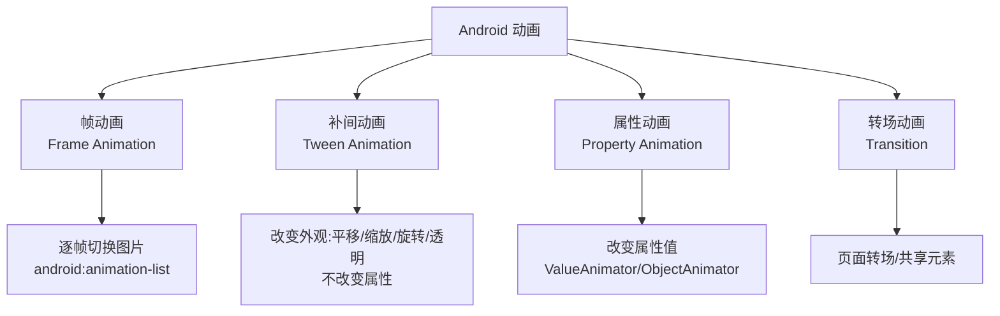
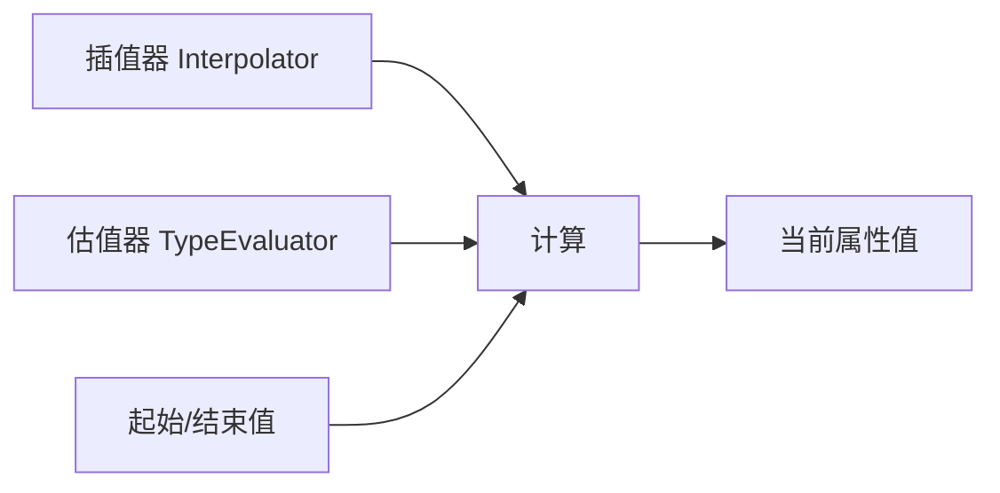
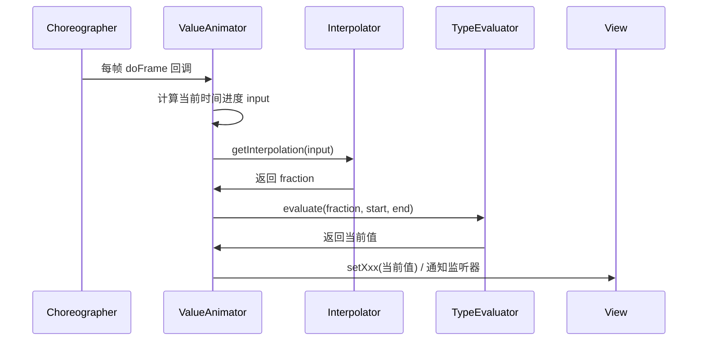

# 🎞️ 补间动画与插值器

> 动画是 Android UI 的灵魂。掌握帧动画、补间动画、属性动画三大体系的差异，理解插值器（Interpolator）与估值器（Evaluator）如何协同计算，才能写出流畅自然的动画。

## 一、Android 动画体系总览



| 动画类型 | 机制 | 改变属性？ | 推荐度 |
|---------|------|-----------|--------|
| 帧动画 | 逐帧换图 | 否 | ⭐ 简单场景 |
| 补间动画 | 外观变换（Matrix） | ❌ 不改变真实位置 | ⭐⭐ |
| 属性动画 | 直接改属性值 | ✅ 真实改变 | ⭐⭐⭐⭐⭐ |
| 转场动画 | 场景切换 | ✅ | ⭐⭐⭐⭐ |

## 二、帧动画（Frame Animation）

```xml
<!-- res/drawable/frame_anim.xml -->
<animation-list xmlns:android="http://schemas.android.com/apk/res/android"
    android:oneshot="false">
    <item android:drawable="@drawable/frame_1" android:duration="100" />
    <item android:drawable="@drawable/frame_2" android:duration="100" />
    <item android:drawable="@drawable/frame_3" android:duration="100" />
</animation-list>
```

```kotlin
imageView.setBackgroundResource(R.drawable.frame_anim)
val anim = imageView.background as AnimationDrawable
anim.start()
```

| 优点 | 缺点 |
|------|------|
| 实现简单、效果可控 | 每帧都是 Bitmap，**内存占用大** |
| 适合加载动画 | 不适合复杂/长动画 |
| 兼容性好 | 无法交互控制 |

> 💡 优化：帧动画图片用 WebP 动画替代，或改用 Lottie（矢量动画）。

## 三、补间动画（Tween Animation）

补间动画通过 `Animation` 对 View 做**外观变换**：平移、缩放、旋转、透明。

### 3.1 XML 定义

```xml
<!-- res/anim/translate_anim.xml -->
<set xmlns:android="http://schemas.android.com/apk/res/android"
    android:duration="1000"
    android:fillAfter="true"
    android:interpolator="@android:anim/accelerate_decelerate_interpolator">

    <translate
        android:fromXDelta="0"
        android:toXDelta="300"
        android:fromYDelta="0"
        android:toYDelta="0" />

    <alpha
        android:fromAlpha="1.0"
        android:toAlpha="0.3" />

    <scale
        android:fromXScale="1.0"
        android:toXScale="1.5"
        android:pivotX="50%"
        android:pivotY="50%" />

    <rotate
        android:fromDegrees="0"
        android:toDegrees="360"
        android:pivotX="50%"
        android:pivotY="50%" />
</set>
```

### 3.2 代码方式

```kotlin
val anim = TranslateAnimation(0f, 300f, 0f, 0f).apply {
    duration = 1000
    fillAfter = true
}
view.startAnimation(anim)
```

### 3.3 补间动画的致命缺陷

```kotlin
// ⚠️ 问题：动画结束后，view 的实际位置/大小没变！
view.startAnimation(TranslateAnimation(0f, 300f, 0f, 0f))

// 点击事件仍在原位置：
// 动画只是修改了 View 的绘制 Matrix（视觉位移），
// 并没有修改 layout 参数 → getX()/点击区域都在原地
```

| 缺陷 | 说明 |
|------|------|
| 不改变真实属性 | 视觉动了，坐标没动 |
| 点击区域错位 | 动画后点击无效区域 |
| 无法获得动画后的真实位置 | `getLeft()` 等不变 |
| 有限的能力 | 只有 4 种变换 |

> 💡 这正是**属性动画**诞生的原因：直接操作属性，真实改变状态。

## 四、属性动画（Property Animation）

### 4.1 核心类

```kotlin
// ValueAnimator：只负责数值变化
val animator = ValueAnimator.ofFloat(0f, 1f).apply {
    duration = 1000
    addUpdateListener { anim ->
        val value = anim.animatedValue as Float
        view.alpha = value           // 自己手动应用
        view.translationX = 300f * value
    }
    start()
}

// ObjectAnimator：自动设置属性
ObjectAnimator.ofFloat(view, "translationX", 0f, 300f).apply {
    duration = 1000
    start()
}

// 组合动画
AnimatorSet().apply {
    playTogether(
        ObjectAnimator.ofFloat(view, "translationX", 0f, 300f),
        ObjectAnimator.ofFloat(view, "alpha", 1f, 0.3f),
        ObjectAnimator.ofFloat(view, "rotation", 0f, 360f)
    )
    duration = 1000
    start()
}
```

### 4.2 动画三要素



| 要素 | 作用 | 默认值 |
|------|------|--------|
| **插值器** Interpolator | 根据时间进度 t（0→1）计算**完成度** fraction | `LinearInterpolator` |
| **估值器** TypeEvaluator | 根据 fraction 计算**具体属性值** | `FloatEvaluator` |
| 时间 | duration 内的时间片 | — |

```java
// 插值器：时间 → 进度
public interface Interpolator extends TimeInterpolator {
    float getInterpolation(float input);  // input 0→1 时间比例，返回 0→1 进度
}

// 估值器：进度 → 值
public interface TypeEvaluator<T> {
    T evaluate(float fraction, T startValue, T endValue);
}
```

### 4.3 自定义插值器示例

```kotlin
// 自定义：先加速后反弹（弹性效果）
class BounceInterpolator : Interpolator {
    override fun getInterpolation(t: Float): Float {
        return if (t < 0.5f) 4f * t * t * t
        else 1f - Math.pow((-2 * t + 2).toDouble(), 3.0).toFloat() / 2 + 0.5f
    }
}
```

### 4.4 内置插值器对比

| 插值器 | 效果 |
|--------|------|
| `LinearInterpolator` | 匀速 |
| `AccelerateInterpolator` | 加速 |
| `DecelerateInterpolator` | 减速 |
| `AccelerateDecelerateInterpolator` | 先加速后减速（默认） |
| `AnticipateInterpolator` | 先回退再前进 |
| `OvershootInterpolator` | 冲过终点再回弹 |
| `BounceInterpolator` | 落地弹跳 |
| `PathInterpolator` | 贝塞尔曲线自定义 |

### 4.5 自定义估值器（颜色渐变）

```kotlin
class ArgbEvaluator : TypeEvaluator<Int> {
    override fun evaluate(fraction: Float, startValue: Int, endValue: Int): Int {
        val startA = (startValue shr 24) and 0xff
        val startR = (startValue shr 16) and 0xff
        val startG = (startValue shr 8) and 0xff
        val startB = startValue and 0xff
        val endA = (endValue shr 24) and 0xff
        val endR = (endValue shr 16) and 0xff
        val endG = (endValue shr 8) and 0xff
        val endB = endValue and 0xff
        return ((startA + ((endA - startA) * fraction).toInt()) shl 24) or
                ((startR + ((endR - startR) * fraction).toInt()) shl 16) or
                ((startG + ((endG - startG) * fraction).toInt()) shl 8) or
                (startB + ((endB - startB) * fraction).toInt())
    }
}

// 使用
ObjectAnimator.ofObject(view, "backgroundColor", ArgbEvaluator(), Color.RED, Color.BLUE)
```

## 五、属性动画的原理



> 💡 属性动画依赖 Choreographer 的每帧回调计算属性值，所以动画与 VSYNC 同步，掉帧时动画自动"跳过"耗时帧，保持流畅。

### setter 找不到怎么办？

```kotlin
// ObjectAnimator 通过反射调用 setter：setTranslationX()
// 若 View 没有对应 setter：
// 1. 报错：property 未找到
// 2. 解决：自己实现
class MyView : View {
    var progress: Float = 0f
        set(value) {
            field = value
            invalidate()   // 触发重绘
        }
}
ObjectAnimator.ofFloat(myView, "progress", 0f, 1f).start()
```

## 六、动画监听

```kotlin
ObjectAnimator.ofFloat(view, "translationX", 0f, 300f).apply {
    duration = 1000
    addListener(object : AnimatorListenerAdapter() {
        override fun onAnimationEnd(animation: Animator) {
            // 动画结束
        }
    })
    start()
}
```

## 七、高频面试题

### Q1：补间动画和属性动画的区别？
::: details 查看答案
① **本质**：补间动画只做外观变换（Matrix 变换 View 的绘制效果），不改变 View 真实属性；属性动画直接调用 setter 修改属性值（translationX/alpha/rotation 等）。② **效果**：补间动画后点击区域仍在原地、getLeft() 不变；属性动画后一切真实变化。③ **能力**：补间只有 4 种变换（平/缩/旋/透），属性动画可对任意属性动画化。④ **性能**：补间动画不触发重绘效率高但局限大；属性动画每帧回调计算。现代开发一律推荐属性动画。
:::

### Q2：插值器（Interpolator）和估值器（TypeEvaluator）的作用与区别？
::: details 查看答案
插值器输入是时间进度（0→1），输出是动画完成度 fraction，决定"速度曲线"（匀速/加速/回弹等）；估值器输入是 fraction，输出是具体属性值（如 0→300 的位移、红→蓝的颜色）。两者串联：时间 → 插值器 → 完成度 → 估值器 → 属性值。LinearInterpolator 只是把时间直接当完成度，所以两者常被混淆。
:::

### Q3：为什么补间动画之后点击事件失效/位置错乱？
::: details 查看答案
补间动画通过修改绘制矩阵实现视觉位移，View 的 layout 参数（left/top）从未改变，点击命中检测基于真实布局坐标，所以点击区域仍在原位置。解决方案：动画结束后手动修改 layout 参数，或直接用属性动画（translationX 会同步更新触摸坐标系），或给 View 设置 setOnClickListener 前先 setAnimation 的 fillAfter 并修正位置。
:::

### Q4：属性动画的原理是什么？
::: details 查看答案
ValueAnimator 向 Choreographer 注册帧回调，每帧 VSYNC 触发 doFrame：① 根据已过时间计算 input（0→1）；② 通过插值器得到 fraction；③ 通过估值器得到当前属性值；④ 反射调用 View 的 setter（如 setTranslationX）或通知 addUpdateListener，View 内部 invalidate 触发重绘。ObjectAnimator 封装了反射 setter 的自动调用。
:::

### Q5：AnimatorSet 和 ValueAnimator.ofFloat 组合动画怎么用？
::: details 查看答案
AnimatorSet 通过 playTogether（同时）、playSequentially（顺序）、with/before/after（依赖关系）编排多个动画。示例：`AnimatorSet().apply { playTogether(translationAnim, alphaAnim); start() }`。注意：AnimatorSet 内部用延迟调度模拟同步，复杂依赖链可能不精确；现代方案可用协程 `animate()` 扩展或 Compose Animation API 替代。
:::

## 小结

- 三大动画：帧动画（逐帧换图）、补间动画（外观变换）、属性动画（真实改属性）
- 补间动画的缺陷 = 属性动画存在的理由
- 插值器管"速度曲线"，估值器管"值如何算"：时间 → fraction → 值
- 属性动画由 Choreographer 驱动，与 VSYNC 同步
- 自定义动画 = 自定义插值器（速度）+ 自定义估值器（值）+ 动画监听

> 📖 进阶阅读：[属性动画机制](/ui/animation/property-animation.md) | [转场动画与共享元素](/ui/animation/scene-transition.md) | [渲染原理与硬件加速](/ui/render/render-principle.md)
