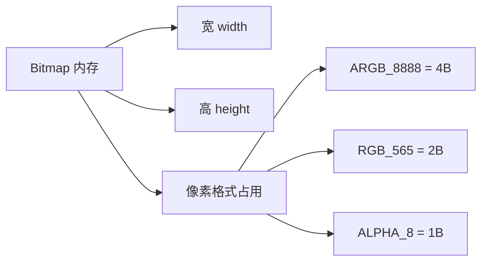
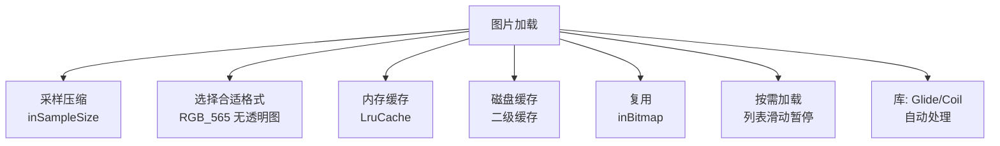

# Bitmap 压缩与内存优化

> 面试高频指数：高 — "Bitmap 占用多少内存？如何压缩图片？inSampleSize 采样原理？"是内存优化面试的必考题，OOM 治理的核心。

## 一、Bitmap 内存模型

### 1.1 内存计算



**核心公式**：

```
内存 = width × height × 每像素字节数
```

| 格式 | 每像素 | 说明 |
|------|--------|------|
| ARGB_8888 | 4 字节 | 默认，全彩 + 透明 |
| RGB_565 | 2 字节 | 无透明，色彩略差 |
| ARGB_4444 | 2 字节 | 已废弃，质量差 |
| ALPHA_8 | 1 字节 | 仅透明通道 |
| RGBA_F16 | 8 字节 | 高动态范围 |

> 示例：1080×1920 的 ARGB_8888 图 = 1080×1920×4 ≈ **7.9MB**，一张 12MP 照片解码可达 48MB，极易 OOM。

### 1.2 Android 8.0 的存储变化

| 版本 | 存储位置 |
|------|----------|
| Android 7.0 及以下 | Java 堆内存 |
| Android 8.0+ | Native 内存（像素数据） |

- 8.0 后像素数据在 Native 堆，Java 层只是引用
- 但 Native 内存仍受系统整体限制，仍需控制

## 二、采样压缩（decode 时压缩）

### 2.1 inSampleSize 原理

**采样压缩是 OOM 治理的第一道防线**：解码时按比例缩减像素，而不是解码后再缩放。

```kotlin
// 第一步：只读边界（inJustDecodeBounds），不加载像素
val options = BitmapFactory.Options().apply {
    inJustDecodeBounds = true
}
BitmapFactory.decodeFile(path, options)

// 第二步：计算采样率
val reqWidth = 1080
val reqHeight = 1920
options.inSampleSize = calculateInSampleSize(options, reqWidth, reqHeight)

// 第三步：真正解码（已压缩）
options.inJustDecodeBounds = false
val bitmap = BitmapFactory.decodeFile(path, options)
```

```kotlin
// 采样率计算
private fun calculateInSampleSize(
    options: BitmapFactory.Options,
    reqWidth: Int, reqHeight: Int
): Int {
    val (height, width) = options.outHeight to options.outWidth
    var inSampleSize = 1
    if (height > reqHeight || width > reqWidth) {
        val halfHeight = height / 2
        val halfWidth = width / 2
        // 循环倍增，直到尺寸满足需求
        while (halfHeight / inSampleSize >= reqHeight &&
               halfWidth / inSampleSize >= reqWidth) {
            inSampleSize *= 2
        }
    }
    return inSampleSize
}
```

### 2.2 采样率规则

| inSampleSize | 效果 | 内存 |
|--------------|------|------|
| 1 | 原图 | 100% |
| 2 | 宽高各减半 | 25% |
| 4 | 宽高各 1/4 | 6.25% |
| n | 宽高各 1/n | 1/n² |

> 关键点：inSampleSize **只能是 2 的幂**（系统会向下取整到 2 的幂）；inJustDecodeBounds 只读尺寸不分配内存，可放心调用。

## 三、质量压缩（重新编码）

### 3.1 compress 压缩

```kotlin
// 质量压缩：调整编码质量，不改变像素尺寸
fun compressQuality(bitmap: Bitmap, quality: Int = 80): ByteArray {
    val output = ByteArrayOutputStream()
    bitmap.compress(Bitmap.CompressFormat.JPEG, quality, output)
    return output.toByteArray()
}
```

| 格式 | 特点 | 适用 |
|------|------|------|
| JPEG | 有损，质量可调 | 照片，无透明通道 |
| PNG | 无损，文件大 | 图标、需要透明的图 |
| WEBP | 有损/无损，体积小 | 现代推荐 |

> 注意：质量压缩用于**减少文件体积**（上传、存储），不减少内存占用（解码后仍是原像素）；**内存优化靠采样压缩**。

### 3.2 尺寸压缩（缩放）

```kotlin
// 尺寸压缩：改变像素尺寸，直接减少内存
fun compressScale(bitmap: Bitmap, maxWidth: Int, maxHeight: Int): Bitmap {
    val scale = minOf(
        maxWidth.toFloat() / bitmap.width,
        maxHeight.toFloat() / bitmap.height,
        1f
    )
    if (scale >= 1f) return bitmap
    return Bitmap.createScaledBitmap(
        bitmap,
        (bitmap.width * scale).toInt(),
        (bitmap.height * scale).toInt(),
        true
    )
}
```

## 四、缓存与复用

### 4.1 LruCache 内存缓存

```kotlin
// 图片内存缓存：最近最少使用
val cacheSize = (Runtime.getRuntime().maxMemory() / 8).toInt()  // 1/8 堆内存

val lruCache = object : LruCache<String, Bitmap>(cacheSize) {
    // 计算单个 Bitmap 的大小
    override fun sizeOf(key: String, value: Bitmap): Int {
        return value.allocationByteCount  // 8.0+ 用这个
    }
}
```

### 4.2 inBitmap 复用

```kotlin
// Bitmap 复用：重复利用像素内存
val reusableBitmap = Bitmap.createBitmap(100, 100, Bitmap.Config.ARGB_8888)

val options = BitmapFactory.Options().apply {
    inMutable = true                 // 可复用前提
    inBitmap = reusableBitmap        // 复用其像素内存
}
BitmapFactory.decodeResource(res, R.drawable.img, options)
```

复用条件：

- `inMutable = true`
- 目标 Bitmap 与复用 Bitmap **尺寸一致或更小**
- Android 4.4+ 放宽为"不超过即可"

## 五、OOM 预防策略

### 5.1 完整策略清单



| 策略 | 收益 |
|------|------|
| inSampleSize 采样 | 解码时减像素，内存直接降 |
| RGB_565 | 无透明图内存减半 |
| LruCache | 控制缓存上限 |
| inBitmap | 复用像素内存，减少分配 |
| 及时 recycle（8.0 前） | 释放 Java 层引用 |
| 图片库 | Glide/Coil 自动采样 + 缓存 |

### 5.2 大图查看场景

```kotlin
// 超大图（长图）用 BitmapRegionDecoder 分块加载
val decoder = BitmapRegionDecoder.newInstance(inputStream, false)

// 只解码可见区域
val rect = Rect(0, 0, visibleWidth, visibleHeight)
val region = decoder.decodeRegion(rect, BitmapFactory.Options())
```

## 六、高频面试题

### Q1：一张 1080×1920 的 ARGB_8888 图片占多少内存？怎么计算？
::: details 查看答案
内存 = 宽 × 高 × 每像素字节数 = 1080 × 1920 × 4 ≈ 7.9MB。ARGB_8888 每像素 4 字节（A/R/G/B 各 1 字节），RGB_565 是 2 字节。12MP 照片（4000×3000）ARGB_8888 约 48MB，非常容易 OOM。注意：Android 8.0+ 像素数据存 Native 堆，但仍计入应用总内存；getByteCount/getAllocationByteCount 可获取实际大小。优化：采样压缩 + RGB_565 + 缓存。
:::

### Q2：inSampleSize 采样压缩的原理是什么？为什么必须是 2 的幂？
::: details 查看答案
inSampleSize 在解码阶段按比例跳过像素：值为 2 时宽高各取 1/2，内存降为 1/4。原理：解码器在读取图片数据时直接每隔 N 个像素采样一个，不加载全部像素，所以内存直接减少。必须是 2 的幂：解码器（libjpeg 等）的采样器按 2 的幂次降采样实现简单高效，非 2 的幂会被向下取整（如 3 变成 2）。先用 inJustDecodeBounds 读尺寸，计算合适的 inSampleSize 再真正解码，是标准流程。
:::

### Q3：质量压缩和采样压缩有什么区别？各自解决什么问题？
::: details 查看答案
质量压缩（bitmap.compress(JPEG, quality, ...)）重新编码图片，减少文件体积（用于上传、存储、传输），但不改变像素尺寸，解码后内存不变；采样压缩（inSampleSize）在解码时减少像素数量，直接降低内存占用（用于加载显示）。尺寸压缩（createScaledBitmap）改变像素尺寸，也可降低内存。三个场景对应三个目标：文件小用质量压缩，显示省内存用采样压缩，需要特定尺寸用尺寸压缩。实际加载大图时通常采样 + 格式双管齐下。
:::

### Q4：如何避免 Bitmap 导致的 OOM？
::: details 查看答案
① 解码时采样压缩：inJustDecodeBounds 读尺寸 + inSampleSize 缩放；② 选择合适的格式：无透明需求用 RGB_565（内存减半）；③ 内存缓存控制：LruCache 设合理上限（如 1/8 堆内存）；④ 磁盘缓存：Glide 等二级缓存避免重复解码；⑤ inBitmap 复用像素内存，减少 GC 压力；⑥ 列表滑动时暂停加载、回收不可见项（8.0 前 recycle）；⑦ 超大图用 BitmapRegionDecoder 分块；⑧ 用 Glide/Coil 自动处理以上策略。
:::

### Q5：Bitmap 在 Android 8.0 前后的内存分配有什么变化？
::: details 查看答案
Android 7.0 及以下：Bitmap 像素数据分配在 Java 堆（Dalvik/ART 堆），容易触发 GC 和堆上限，需手动 recycle() 释放；Android 8.0+：像素数据移到 Native 堆（通过 Ashmem/硬件位图），Java 层只是引用，不受 Java 堆限制，也不再建议手动 recycle（会导致图片闪烁），改用 allocationByteCount 统计内存。但 Native 内存仍占用系统总内存，配置低的设备仍需控制总量，且 GC 仍负责引用释放。
:::

## 七、小结

Bitmap 压缩要点：

1. 内存 = 宽 × 高 × 字节/像素，ARGB_8888 是 4 字节
2. inSampleSize 采样：解码时降像素，2 的幂
3. inJustDecodeBounds 先读尺寸
4. 质量压缩减体积，采样压缩减内存
5. LruCache + inBitmap + 图片库组合防 OOM
6. 8.0+ 像素在 Native 堆，控制总量仍需采样

相关阅读：[Bitmap 详解与内存模型](/ui/bitmap/bitmap-guide.md)、[Glide 源码解析](/ui/bitmap/glide-source.md)、[硬件加速渲染详解](/ui/render/hardware-acceleration.md)、[内存优化实战](/advanced/performance/memory-optimization.md)。
