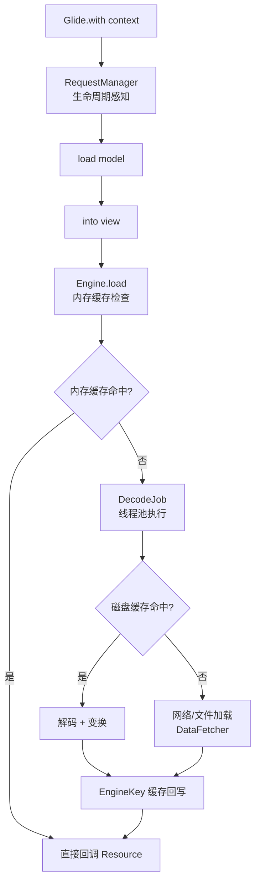
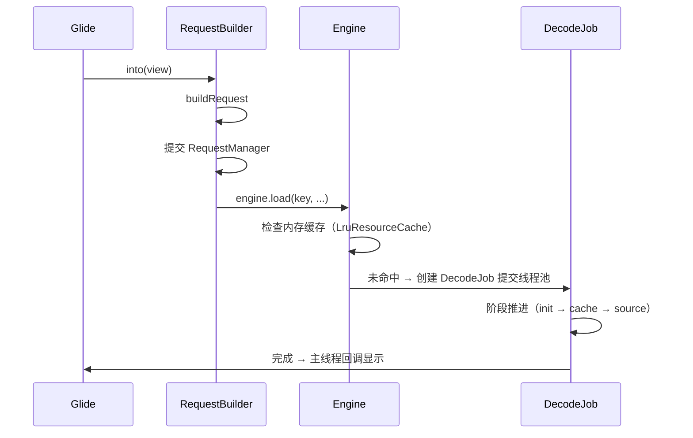
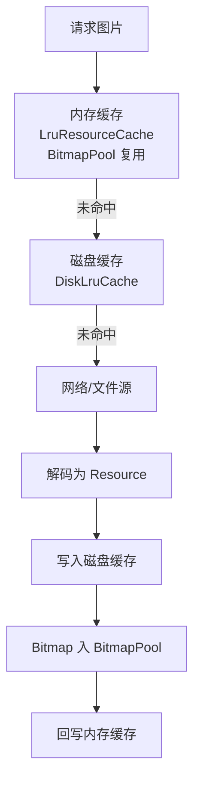

# 🖼️ Glide 图片加载源码分析

> Glide 是 Android 最流行的图片加载库。它为什么这么快？缓存如何设计？为什么能感知生命周期？本文从 `load()` 到 `into()` 拆解 Glide 4.x 的完整加载链路。

## 一、Glide 核心架构



## 二、with()：生命周期绑定

### 2.1 with 的 6 个重载

```kotlin
Glide.with(context)          // Context：绑定 Application/Activity 生命周期
Glide.with(activity)         // Activity：跟随 onStop/onStart 暂停恢复
Glide.with(fragment)         // Fragment：跟随 Fragment 生命周期
Glide.with(view)             // 从 View 推导出 Activity/Fragment
```

### 2.2 生命周期绑定原理

```mermaid
flowchart LR
    A[with(Activity)] --> B[RequestManagerRetriever]
    B --> C{Activity 已销毁?}
    C -->|是| D[绑定 Application<br>不感知生命周期]
    C -->|否| E[创建无 UI Fragment<br>SupportRequestManagerFragment]
    E --> F[Fragment 持有 Lifecycle<br>onStart/onStop/onDestroy 回调]
    F --> G[RequestManager 暂停/恢复/清理请求]
```

> 💡 关键技巧：**Glide 在目标 Activity 中插入一个透明的 SupportRequestManagerFragment**，通过 Fragment 的生命周期回调驱动请求管理，从而感知页面销毁并自动取消加载、释放资源——避免图片加载导致的内存泄漏。

### 2.3 绑定 Application 的后果

```kotlin
// 若 Context 不是 Activity/Fragment（如自定义 View 传入 Application）
// → 无法感知生命周期，图片加载不会随页面销毁取消
Glide.with(applicationContext)   // ⚠️ 不推荐，除非确实全局
```

## 三、load()：模型到数据源

```kotlin
Glide.with(this)
    .load("https://.../image.jpg")   // 支持 String URL / Uri / File / 资源 ID / byte[]
    .placeholder(R.drawable.placeholder)   // 占位图
    .error(R.drawable.error)               // 错误图
    .override(300, 300)                    // 固定尺寸
    .centerCrop()                          // 裁剪策略
    .into(imageView)
```

### RequestOptions 链式配置

| 配置 | 作用 |
|------|------|
| `placeholder` / `error` | 占位/错误图 |
| `override(w,h)` | 覆盖目标尺寸（影响采样） |
| `centerCrop` / `fitCenter` | 裁剪/适应 |
| `diskCacheStrategy` | 磁盘缓存策略 |
| `skipMemoryCache` | 跳过内存缓存 |
| `onlyRetrieveFromCache` | 只用缓存 |
| `.asBitmap()` / `.asGif()` | 指定解码类型 |

## 四、into()：目标与请求执行

### 4.1 执行链路



### 4.2 请求 Key 的构成

```kotlin
// EngineKey：决定缓存命中与否
data class EngineKey(
    val model, val signature, val width, val height,
    val transformations, val resourceClass, val transcodeClass,
    val options, val overrideWidth, val overrideHeight
)
```

> 💡 同一个 URL，**不同尺寸/裁剪策略 = 不同 Key = 不同缓存条目**，这也是为什么 `override()` 改变后图片会重新加载。

## 五、缓存体系

### 5.1 三级缓存结构



| 缓存 | 实现 | Key | 作用 |
|------|------|-----|------|
| 内存缓存 | `LruResourceCache` | EngineKey | 秒开已加载图片 |
| Bitmap 池 | `LruBitmapPool` | Bitmap.Config/尺寸 | 复用 Bitmap 内存，避免 GC |
| 磁盘缓存 | `DiskLruCache` | SafeKey（SHA-256） | 冷启动/二次加载 |

### 5.2 磁盘缓存策略

| 策略 | 说明 |
|------|------|
| `DATA` | 只缓存原始数据（原图） |
| `RESOURCE` | 只缓存解码后资源（处理过的图） |
| `ALL`（默认） | 都缓存 |
| `AUTOMATIC` | 自动选择（默认推荐） |
| `NONE` | 不缓存 |

```kotlin
Glide.with(this)
    .load(url)
    .diskCacheStrategy(DiskCacheStrategy.DATA)   // 原图缓存
    .into(imageView)
```

> 💡 **RESOURCE 策略**适合"同一图多种尺寸"场景（各尺寸缓存一份）；**DATA 策略**适合"一张图只显示一次"或需要原图的场景。

## 六、图片变换（Transformations）

```kotlin
Glide.with(this)
    .load(url)
    .transform(CenterCrop(), RoundedCorners(16))   // 组合变换：裁剪 + 圆角
    .into(imageView)
```

| 变换 | 效果 |
|------|------|
| `CenterCrop` | 居中裁剪 |
| `FitCenter` | 等比缩放适应 |
| `CircleCrop` | 圆形头像 |
| `RoundedCorners` | 圆角 |
| `BlurTransformation` | 高斯模糊 |
| 自定义 Transform | 继承 BitmapTransformation |

```kotlin
// 自定义变换
class GrayscaleTransform : BitmapTransformation() {
    override fun transform(pool: BitmapPool, toTransform: Bitmap,
                           outWidth: Int, outHeight: Int): Bitmap {
        // 颜色矩阵去色
        val colorMatrix = ColorMatrix().apply { setSaturation(0f) }
        val paint = Paint().apply { colorFilter = ColorMatrixColorFilter(colorMatrix) }
        val result = pool.get(toTransform.width, toTransform.height, Bitmap.Config.ARGB_8888)
        Canvas(result).drawBitmap(toTransform, 0f, 0f, paint)
        return result
    }
    override fun updateDiskCacheKey(messageDigest: MessageDigest) {
        messageDigest.update("grayscale".toByteArray())
    }
}
```

> ⚠️ 变换会改变 EngineKey（transformations 参与 Key 计算），因此不同变换使用独立缓存。

## 七、生命周期与内存

### 7.1 生命周期绑定效果

| 生命周期 | Glide 行为 |
|---------|-----------|
| onStart | 恢复请求（重启加载） |
| onStop | 暂停未完成请求 |
| onDestroy | 清除该页面的所有请求与资源 |

### 7.2 内存优化实践

```kotlin
// 1. 列表复用：into 前先 clear（RecyclerView 复用防错位）
Glide.with(itemView).clear(holder.imageView)

// 2. 大图降采样：override 配合 centerCrop
.override(400, 400).centerCrop()

// 3. 避免内存缓存堆积：低频大图 skipMemoryCache
.skipMemoryCache(true)
```

## 八、高频面试题

### Q1：Glide 的缓存机制是怎样的？
::: details 查看答案
Glide 采用**内存 + 磁盘**两级缓存：① 内存缓存 LruResourceCache 以 EngineKey（model+尺寸+变换等）为 Key，LRU 算法淘汰；② Bitmap 池（LruBitmapPool）复用 Bitmap 内存，避免频繁 GC；③ 磁盘缓存 DiskLruCache 以 URL 的 SHA-256（SafeKey）为 Key，策略分 DATA（原图）/RESOURCE（解码后）/ALL（默认）/NONE。加载顺序：内存 → 磁盘 → 网络。
:::

### Q2：Glide 为什么能感知 Activity 生命周期？有什么好处？
::: details 查看答案
Glide.with(activity) 时，RequestManagerRetriever 在目标 Activity 中插入一个透明的 SupportRequestManagerFragment，该 Fragment 实现 LifecycleOwner，把生命周期事件（onStart/onStop/onDestroy）转发给 RequestManager。好处：页面不可见时自动暂停加载、恢复时继续、销毁时取消请求并释放资源，防止图片加载造成的内存泄漏与流量浪费。
:::

### Q3：图片加载完成后会做什么处理？Bitmap 内存如何回收？
::: details 查看答案
加载完成后：① 按目标尺寸采样解码（BitmapFactory.Options.inSampleSize 降采样）；② 应用变换（裁剪/圆角/模糊）；③ 图片 Bitmap 优先放入 BitmapPool 复用（Glide 4.x 使用 inBitmap 复用已释放的 Bitmap 内存块），而不是直接交给 GC，减少 GC 压力；④ 缓存回写内存与磁盘。页面销毁或 remove 时释放引用。
:::

### Q4：Glide 与 Picasso / Fresco / Coil 的对比？
::: details 查看答案
Picasso 体积小、API 简洁，但缓存策略简单、无 Bitmap 池、生命周期处理弱；Glide 缓存机制完善（Bitmap 池 + 磁盘分级）、生命周期感知、GIF 支持、变换丰富，是主流选择；Fresco 内存管理最强（Ashmem 匿名共享内存），适合超大图/图片密集型 App（如 FB），但集成重；Coil 是 Kotlin 协程实现，体积最小、支持 Compose，适合 Kotlin/Compose 项目。选择依据：图片规模、Compose 使用、Kotlin 化程度。
:::

### Q5：Glide 加载大图为什么不会 OOM？降采样原理？
::: details 查看答案
① 解码前根据目标尺寸（into 的 View 尺寸或 override）计算 inSampleSize，先降采样再解码，内存只分配目标大小而非原图大小；② 使用 BitmapPool 复用内存；③ 生命周期管理防止页面泄漏堆积；④ 默认 RGB_565（低色深）压缩内存（高版本默认 ARGB_8888）。注意：如果直接传原图 Bitmap 或用普通 ImageView 加载超清图，仍可能 OOM。
:::

## 小结

- Glide.with 通过透明 Fragment 感知生命周期，自动暂停/恢复/清理
- EngineKey 决定缓存命中：尺寸、变换、策略都影响 Key
- 缓存三级：内存 Lru → Bitmap 池 → 磁盘 DiskLruCache
- 磁盘策略：DATA 原图 / RESOURCE 处理图 / ALL 默认
- 变换参与 Key 计算，自定义变换继承 BitmapTransformation
- 列表复用需 clear，大图必须降采样

> 📖 进阶阅读：[Bitmap 详解与图片压缩](/ui/bitmap/bitmap-guide.md) | [LeakCanary 源码分析](/advanced/performance/leakcanary-analysis.md) | [内存优化与内存泄漏排查](/advanced/performance/memory-optimization.md)
