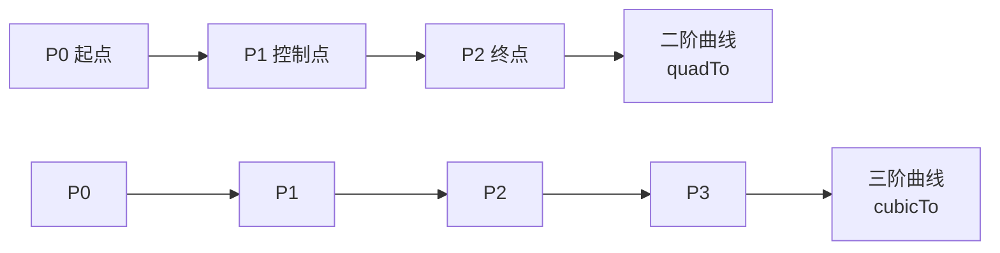
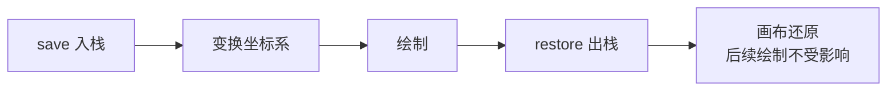

# Canvas 与 Path 绘制艺术

> 自定义 View 的精髓在 Canvas。掌握 Canvas 变换、Path 曲线、Paint 效果，才能画出雷达图、仪表盘、图表等复杂 UI。本文是自定义绘制的进阶实战手册。

## 一、Canvas 核心概念

**Canvas（画布）** 是绘制指令的载体：`Canvas.drawXxx(paint)` 把图形绘制到其绑定的 Bitmap/View 上。

```mermaid
flowchart LR
    A[自定义 View] --> B[onDraw(canvas)]
    B --> C[Canvas 绘制指令]
    C --> D[Paint 决定样式]
    C --> E[坐标变换 save/translate/restore]
    C --> F[硬件加速渲染]
```

| API | 用途 |
|-----|------|
| `drawRect` / `drawRoundRect` | 矩形/圆角矩形 |
| `drawCircle` / `drawOval` | 圆/椭圆 |
| `drawLine` / `drawLines` | 直线 |
| `drawPath` | 路径（最强大） |
| `drawBitmap` | 位图 |
| `drawText` | 文字 |
| `drawArc` | 弧形/扇形 |

## 二、Paint 样式体系

```kotlin
val paint = Paint(Paint.ANTI_ALIAS_FLAG).apply {
    style = Paint.Style.FILL          // FILL / STROKE / FILL_AND_STROKE
    color = Color.parseColor("#3F51B5")
    strokeWidth = 6f                  // 描边宽度
    strokeCap = Paint.Cap.ROUND       // 端点样式
    strokeJoin = Paint.Join.ROUND     // 拐角样式
    isAntiAlias = true                // 抗锯齿
    isDither = true                   // 抖动（色彩过渡平滑）
    textSize = 40f                    // 文字大小
    typeface = Typeface.DEFAULT_BOLD  // 字体
    textAlign = Paint.Align.CENTER    // 文字对齐
}
```

### 样式速查表

| Paint 属性 | 可选值 | 作用 |
|-----------|--------|------|
| `style` | FILL / STROKE / FILL_AND_STROKE | 填充/描边 |
| `strokeCap` | BUTT / ROUND / SQUARE | 线端点 |
| `strokeJoin` | MITER / ROUND / BEVEL | 线拐角 |
| `color` | 颜色值 | 主色 |
| `shader` | LinearGradient 等 | 渐变（比 color 优先） |
| `maskFilter` | BlurMaskFilter | 模糊 |
| `shadowLayer` | 半径+偏移+颜色 | 阴影 |

## 三、Path：路径绘制

### 3.1 基础路径

```kotlin
val path = Path().apply {
    moveTo(100f, 100f)        // 移动到起点
    lineTo(300f, 100f)        // 直线
    lineTo(300f, 300f)
    close()                   // 闭合（回到起点）
}
canvas.drawPath(path, paint)
```

### 3.2 贝塞尔曲线

```kotlin
// 二阶贝塞尔：quadTo(控制点, 终点)
val path = Path().apply {
    moveTo(100f, 300f)
    quadTo(200f, 100f, 300f, 300f)   // 抛物线
}

// 三阶贝塞尔：cubicTo(控制点1, 控制点2, 终点)
val path2 = Path().apply {
    moveTo(100f, 400f)
    cubicTo(150f, 200f, 250f, 600f, 300f, 400f)  // S 形曲线
}
```



> 贝塞尔曲线是**图形动画（QQ 气泡、拖拽返回）、图表（折线平滑）**的基石。

### 3.3 Path 常用方法

| 方法 | 作用 |
|------|------|
| `moveTo` / `lineTo` | 移动/画线 |
| `quadTo` / `cubicTo` | 二阶/三阶贝塞尔 |
| `arcTo` / `addArc` | 弧线 |
| `addCircle` / `addRect` / `addRoundRect` | 添加图形 |
| `addPath` | 合并路径 |
| `op(path, Op.INTERSECT)` | 布尔运算（交集等） |
| `setFillType(FillType.EVEN_ODD)` | 填充规则 |
| `measure()` | 路径长度测量 |

### 3.4 PathMeasure 实现动画

```kotlin
// 用 PathMeasure 实现"描边路径动画"（如加载进度环）
val pathMeasure = PathMeasure(circlePath, false)
val animator = ValueAnimator.ofFloat(0f, 1f).apply {
    duration = 2000
    addUpdateListener {
        val fraction = it.animatedValue as Float
        val stop = pathMeasure.length * fraction
        // 动态截取路径片段绘制
        val drawPath = Path()
        pathMeasure.getSegment(0f, stop, drawPath, true)
        invalidate()
    }
    repeatCount = ValueAnimator.INFINITE
    start()
}
```

## 四、Canvas 变换与保存/恢复

```kotlin
canvas.save()                  // 保存当前画布状态（入栈）
canvas.translate(100f, 100f)   // 平移坐标系
canvas.rotate(45f)             // 旋转
canvas.scale(0.5f, 0.5f)       // 缩放
canvas.skew(0.1f, 0f)          // 斜切
// ... 绘制（基于变换后的坐标系）
canvas.restore()               // 恢复画布状态（出栈）
```



> **save/restore 必须成对使用**（可用 `saveLayer` 做图层混合），漏 restore 会导致后续绘制全部错乱。

## 五、高级效果

### 5.1 渐变 Shader

```kotlin
// 线性渐变
paint.shader = LinearGradient(
    0f, 0f, width.toFloat(), height.toFloat(),
    intArrayOf(Color.RED, Color.BLUE),
    null, Shader.TileMode.CLAMP
)

// 径向渐变（雷达图/仪表盘常用）
paint.shader = RadialGradient(
    cx, cy, radius,
    Color.YELLOW, Color.TRANSPARENT,
    Shader.TileMode.CLAMP
)
```

### 5.2 阴影与模糊

```kotlin
// 文字/图形阴影
paint.setShadowLayer(radius = 8f, dx = 2f, dy = 4f, shadowColor = Color.GRAY)

// 模糊（需关闭硬件加速或降低复杂度）
paint.maskFilter = BlurMaskFilter(10f, BlurMaskFilter.Blur.NORMAL)
```

### 5.3 剪裁 Clip

```kotlin
// 把绘制限制在圆形区域（头像裁圆）
canvas.save()
canvas.clipPath(circlePath)      // 裁剪
canvas.drawBitmap(avatar, 0f, 0f, paint)   // 只显示圆内部分
canvas.restore()
```

## 六、文字绘制

```kotlin
val text = "WikiAndroid"
val paint = Paint().apply {
    textSize = 48f
    textAlign = Paint.Align.CENTER
    typeface = Typeface.create(Typeface.DEFAULT, Typeface.BOLD)
}

// 基线计算：文字垂直居中
val fm = paint.fontMetrics
val baseline = (height - (fm.descent - fm.ascent)) / 2 - fm.ascent
canvas.drawText(text, width / 2f, baseline, paint)

// 测量文字宽度
val textWidth = paint.measureText(text)
```

| 文字概念 | 说明 |
|---------|------|
| ascent / descent | 文字顶部/底部（基线之上/之下） |
| baseline | 绘制基准线（drawText 的 y 参数） |
| leading | 行间距 |
| StaticLayout | 多行文字排版工具 |

## 七、绘制性能优化

| 优化 | 说明 |
|------|------|
| 减少 invalidate 频率 | 合并绘制，避免每帧全量重绘 |
| 用 invalidate(rect) 局部刷新 | 只重绘变化区域 |
| 复用 Paint/Path 对象 | 避免 onDraw 中 new 对象引发 GC |
| 避免分配 | onDraw 高频调用，不能创建对象 |
| 复杂效果降级 | 模糊/阴影在低端机关闭 |
| 使用 hardwareAccelerated | 显示列表缓存 |

```kotlin
// 正确姿势：对象在 init/构造中创建，onDraw 只绘制
class ProgressView @JvmOverloads constructor(
    context: Context, attrs: AttributeSet? = null
) : View(context, attrs) {

    private val paint = Paint(Paint.ANTI_ALIAS_FLAG)   // 复用！
    private val path = Path()                          // 复用！

    override fun onDraw(canvas: Canvas) {
        super.onDraw(canvas)
        path.reset()          // 清空复用，不 new
        // ... 绘制逻辑
        canvas.drawPath(path, paint)
    }
}
```

## 八、高频面试题

### Q1：自定义 View 的 onDraw 中要注意什么性能问题？
::: details 查看答案
① onDraw 每帧都会被调用，绝不能在其中创建对象（触发频繁 GC 卡顿），Paint/Path/Rect 等对象应在 init 中创建复用；② 减少 invalidate 频率，能用局部刷新就局部刷新；③ 复杂图形（模糊、阴影、大路径）慎用，低端机可降级；④ 使用硬件加速的显示列表缓存，未变化的 View 无需重绘；⑤ 分层绘制，把静态背景与动态内容分开图层。
:::

### Q2：Canvas 的 save 和 restore 是做什么的？为什么必须成对？
::: details 查看答案
save() 把当前画布状态（坐标系变换、剪裁区域）压入栈保存；restore() 恢复栈顶状态。它们让"局部变换"不影响后续绘制：先 save 再 translate/rotate 绘制复杂图形，最后 restore 还原坐标系。不成对使用会导致变换累积，后续绘制全部错位。saveLayer 还可创建透明图层实现混合效果（成本较高）。
:::

### Q3：贝塞尔曲线是什么？在 Android 绘制中有什么用？
::: details 查看答案
贝塞尔曲线由起点、终点和若干控制点定义的平滑曲线：二阶（quadTo）一个控制点，三阶（cubicTo）两个控制点。Android 中用于：QQ 拖拽气泡变形、下拉刷新弹性动画、折线图平滑连接、签名板笔迹、进度环描边（PathMeasure 截取）等。动画中常用 ValueAnimator 驱动参数实现曲线形态变化。
:::

### Q4：如何实现一个圆形头像 / 圆角图片？
::: details 查看答案
两种方案：① 绘制时裁剪：canvas.save() + canvas.clipPath(圆角/圆形 Path) + drawBitmap + restore，简单但每帧都有裁剪开销；② 用 Shader 绘制：创建 BitmapShader 绑定图片，paint.shader = BitmapShader + 绘制圆形，GPU 高效。现代项目常用 Glide 的 CircleCrop/RoundedCorners 变换（本质也是 BitmapShader）。注意 BitmapShader 需按 View 尺寸创建或处理边界。
:::

### Q5：绘制文字如何实现垂直居中？
::: details 查看答案
drawText 的 y 参数是**基线 baseline**，不是文字中心。垂直居中公式：baseline = (viewHeight - (descent - ascent)) / 2 - ascent（ascent 为负值）。通过 paint.fontMetrics 获取 ascent/descent 计算。多行文字用 StaticLayout/TextPaint 排版，设置 alignment 与 maxLines 后整体居中。
:::

## 小结

- Canvas 是绘制指令载体，Paint 决定样式，Path 定义轮廓
- 贝塞尔曲线（quadTo/cubicTo）是复杂图形与动画的核心
- save/restore 成对使用管理坐标系变换
- Shader 渐变、clip 裁剪、setShadowLayer 阴影是高级效果三件套
- onDraw 禁止创建对象，对象复用 + 局部刷新是性能关键
- 文字绘制基于基线，垂直居中需 fontMetrics 计算

> 进阶阅读：[自定义 View 实战](/ui/custom-view/custom-view-guide.md) | [自定义 ViewGroup](/ui/custom-view/custom-viewgroup.md) | [View 绘制流程详解](/ui/view/view-draw-process.md)
