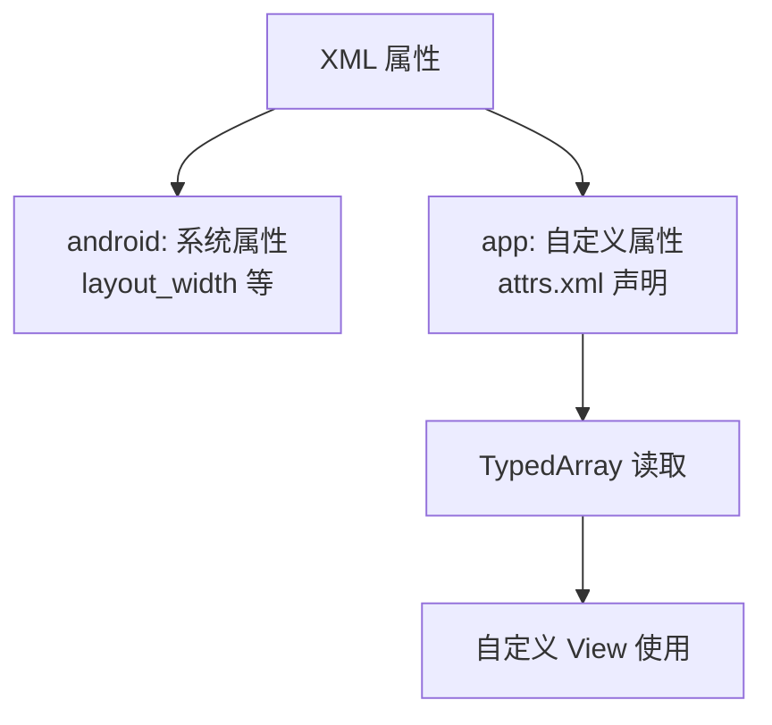
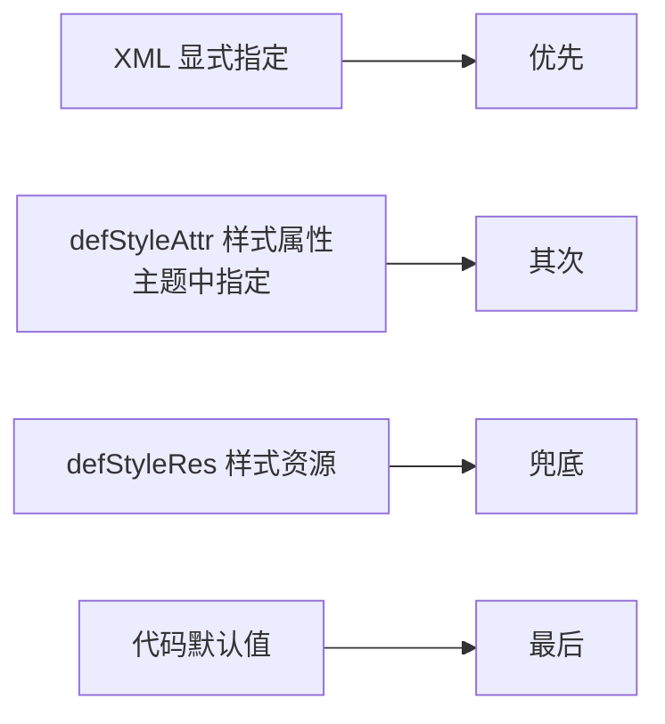

# 自定义属性详解

> 面试高频指数：中 — 自定义 View 必配自定义属性，attrs.xml 声明、TypedArray 解析、obtainStyledAttributes 的参数含义是高频考点。

## 一、为什么需要自定义属性

### 1.1 场景

```xml
<!-- 需求：自定义仪表盘 View，支持 XML 配置颜色和刻度 -->
<com.example.views.GaugeView
    android:layout_width="200dp"
    android:layout_height="200dp"
    app:gaugeColor="#FF5722"
    app:maxValue="100"
    app:showMark="true" />
```

没有自定义属性就只能硬编码或 setter 设置，XML 布局无法灵活配置。

### 1.2 属性体系总览



## 二、声明属性：attrs.xml

### 2.1 基本声明

```xml
<!-- res/values/attrs.xml -->
<resources>
    <declare-styleable name="GaugeView">
        <!-- 颜色 -->
        <attr name="gaugeColor" format="color" />
        <!-- 整数值 -->
        <attr name="maxValue" format="integer" />
        <!-- 布尔值 -->
        <attr name="showMark" format="boolean" />
        <!-- 枚举 -->
        <attr name="gaugeStyle">
            <enum name="simple" value="0" />
            <enum name="fancy" value="1" />
        </attr>
        <!-- 引用资源 -->
        <attr name="backgroundDrawable" format="reference" />
    </declare-styleable>
</resources>
```

### 2.2 format 类型大全

| format | XML 写法 | 说明 |
|--------|----------|------|
| `color` | `#FF0000` / `@color/red` | 颜色 |
| `dimension` | `12dp` | 尺寸 |
| `integer` | `100` | 整数 |
| `float` | `0.5` | 浮点 |
| `boolean` | `true/false` | 布尔 |
| `string` | `"文本"` | 字符串 |
| `reference` | `@drawable/xxx` | 资源引用 |
| `enum` | 枚举值 | 有限选项 |
| `flag` | 位组合 | `center|top` |
| `fraction` | `30%` | 百分比 |
| 组合 | `color\|reference` | 支持多种 |

### 2.3 复用属性

```xml
<resources>
    <!-- 全局 attr（不加 declare-styleable，可被多个 View 复用） -->
    <attr name="customText" format="string" />

    <declare-styleable name="ViewA">
        <attr name="customText" />
    </declare-styleable>
    <declare-styleable name="ViewB">
        <attr name="customText" />
    </declare-styleable>
</resources>
```

> 关键点：不加 declare-styleable 包裹的 attr 是全局属性，多个 View 可共享；放在 declare-styleable 内的属于该 View。

## 三、解析属性：obtainStyledAttributes

### 3.1 构造函数解析

::: code-tabs

@tab:active Java

```java
public class GaugeView extends View {

    private int gaugeColor = Color.BLUE;
    private int maxValue = 100;
    private boolean showMark = true;
    private int gaugeStyle = 0;

    public GaugeView(Context context) {
        this(context, null);
    }

    public GaugeView(Context context, AttributeSet attrs) {
        this(context, attrs, 0);
    }

    public GaugeView(Context context, AttributeSet attrs, int defStyleAttr) {
        super(context, attrs, defStyleAttr);
        // 获取 TypedArray
        TypedArray ta = context.obtainStyledAttributes(
                attrs,                 // XML 属性集合
                R.styleable.GaugeView,  // 需要读取的属性
                defStyleAttr,           // 主题中的默认样式属性
                0                       // 直接默认样式资源
        );

        try {
            // 读取属性（第二个参数是默认值）
            gaugeColor = ta.getColor(
                    R.styleable.GaugeView_gaugeColor, Color.BLUE);
            maxValue = ta.getInt(
                    R.styleable.GaugeView_maxValue, 100);
            showMark = ta.getBoolean(
                    R.styleable.GaugeView_showMark, true);
            gaugeStyle = ta.getInt(
                    R.styleable.GaugeView_gaugeStyle, 0);
        } finally {
            // 必须回收，否则资源泄漏（lint 报错）
            ta.recycle();
        }
    }
}
```

@tab Kotlin

```kotlin
class GaugeView @JvmOverloads constructor(
    context: Context,
    attrs: AttributeSet? = null,
    defStyleAttr: Int = 0
) : View(context, attrs, defStyleAttr) {

    private var gaugeColor: Int = Color.BLUE
    private var maxValue: Int = 100
    private var showMark: Boolean = true
    private var gaugeStyle: Int = 0

    init {
        // 获取 TypedArray
        val ta = context.obtainStyledAttributes(
            attrs,                // XML 属性集合
            R.styleable.GaugeView, // 需要读取的属性
            defStyleAttr,          // 主题中的默认样式属性
            0                      // 直接默认样式资源
        )

        try {
            // 读取属性（第二个参数是默认值）
            gaugeColor = ta.getColor(
                R.styleable.GaugeView_gaugeColor, Color.BLUE)
            maxValue = ta.getInt(
                R.styleable.GaugeView_maxValue, 100)
            showMark = ta.getBoolean(
                R.styleable.GaugeView_showMark, true)
            gaugeStyle = ta.getInt(
                R.styleable.GaugeView_gaugeStyle, 0)
        } finally {
            // 必须回收，否则资源泄漏（lint 报错）
            ta.recycle()
        }
    }
}
```

:::

### 3.2 读取方法对应

| format | 读取方法 |
|--------|----------|
| color | `ta.getColor(index, default)` |
| dimension | `ta.getDimension(index, default)` / `getDimensionPixelSize` |
| integer | `ta.getInt(index, default)` |
| float | `ta.getFloat(index, default)` |
| boolean | `ta.getBoolean(index, default)` |
| string | `ta.getString(index)` |
| reference | `ta.getResourceId(index, 0)` |
| enum | `ta.getInt(index, default)` |
| flag | `ta.getInt(index, 0)` |
| 组合 | 先判断类型再对应读取 |

### 3.3 资源引用解析

::: code-tabs

@tab:active Java

```java
// 属性是引用类型时的两种读取
int drawableRes = ta.getResourceId(
        R.styleable.GaugeView_backgroundDrawable, 0);

// 方式一：如果 XML 写的是引用，getDrawable 会自动解引用
Drawable drawable = ta.getDrawable(
        R.styleable.GaugeView_backgroundDrawable);
```

@tab Kotlin

```kotlin
// 属性是引用类型时的两种读取
val drawableRes = ta.getResourceId(
    R.styleable.GaugeView_backgroundDrawable, 0)

// 方式一：如果 XML 写的是引用，getDrawable 会自动解引用
val drawable = ta.getDrawable(
    R.styleable.GaugeView_backgroundDrawable)
```

:::

## 四、主题样式与默认值

### 4.1 三层默认值体系



**优先级**：XML 显式 > 主题 style 中指定 > defStyleRes > 代码默认值。

### 4.2 完整构造函数示例

::: code-tabs

@tab:active Java

```java
public class GaugeView extends View {

    public GaugeView(Context context, AttributeSet attrs, int defStyleAttr) {
        super(context, attrs, defStyleAttr);
        TypedArray ta = context.obtainStyledAttributes(
                attrs,
                R.styleable.GaugeView,
                defStyleAttr,           // 来自主题（如 android:gaugeStyle）
                R.style.GaugeViewStyle   // 默认样式资源
        );
        ...
        ta.recycle();
    }
}
```

@tab Kotlin

```kotlin
class GaugeView @JvmOverloads constructor(
    context: Context,
    attrs: AttributeSet? = null,
    defStyleAttr: Int = 0
) : View(context, attrs, defStyleAttr) {

    init {
        val ta = context.obtainStyledAttributes(
            attrs,
            R.styleable.GaugeView,
            defStyleAttr,          // 来自主题（如 android:gaugeStyle）
            R.style.GaugeViewStyle  // 默认样式资源
        )
        ...
        ta.recycle()
    }
}
```

:::

> 关键点：defStyleAttr 是主题中的属性名（如 `?attr/gaugeStyle`），defStyleRes 是默认样式资源（`@style/GaugeViewStyle`），两者配合实现"不写属性也有合理默认值"。

## 五、styleable 在主题中的使用

### 5.1 主题中提供默认值

```xml
<!-- res/values/styles.xml -->
<style name="GaugeViewStyle">
    <item name="gaugeColor">#3F51B5</item>
    <item name="maxValue">200</item>
</style>
```

### 5.2 Theme 中指定默认

```xml
<!-- themes.xml -->
<style name="AppTheme" parent="Theme.Material3.DayNight">
    <item name="gaugeColor">#FF5722</item>
</style>
```

此时所有 GaugeView 未显式写 gaugeColor 时默认取主题值。

## 六、DataBinding 与自定义属性

### 6.1 DataBinding 绑定

```xml
<!-- 布局中通过 app 命名空间直接绑定 -->
<com.example.views.GaugeView
    android:layout_width="wrap_content"
    android:layout_height="wrap_content"
    app:gaugeColor="@{viewModel.color}"
    app:maxValue="@{viewModel.max}" />
```

::: code-tabs

@tab:active Java

```java
// BindingAdapter 处理属性设置
@BindingAdapter("gaugeColor")
public static void setGaugeColor(GaugeView view, int color) {
    view.setGaugeColor(color);
}
```

@tab Kotlin

```kotlin
// BindingAdapter 处理属性设置
@BindingAdapter("gaugeColor")
fun setGaugeColor(view: GaugeView, color: Int) {
    view.setGaugeColor(color)
}
```

:::

> 自定义属性 + BindingAdapter 是 DataBinding 数据驱动的标准姿势。

## 七、高频面试题

### Q1：自定义属性怎么实现？完整流程是什么？
::: details 查看答案
① 在 res/values/attrs.xml 中用 declare-styleable 声明属性及 format（color/dimension/enum 等）；② 自定义 View 构造函数接收 AttributeSet，用 context.obtainStyledAttributes(attrs, R.styleable.Xxx, defStyleAttr, defStyleRes) 获取 TypedArray；③ 用对应 getter（getColor/getDimension/getInt 等）读取属性值并设置默认值；④ 必须调用 ta.recycle() 回收 TypedArray（避免资源泄漏）；⑤ 布局中通过 app 命名空间（xmlns:app）使用属性。注意 View 需要三个参数的构造函数以接收 defStyleAttr。
:::

### Q2：TypedArray 是什么？为什么用完后要 recycle()？
::: details 查看答案
TypedArray 是属性数组的封装，obtainStyledAttributes 从资源中解析出需要的属性值集合。recycle() 释放内部持有的资源缓存（Parcel 内存），不调用会内存泄漏，lint 会报 "obtainStyledAttributes should be recycled" 警告。正确姿势：try-finally 或 use 中保证回收。此外 TypedArray 用完应立即 recycle，不要在 View 中持有长期使用。
:::

### Q3：defStyleAttr 和 defStyleRes 有什么区别？
::: details 查看答案
defStyleAttr 是主题中的一个样式属性（如 ?attr/gaugeStyle），当 XML 未显式指定属性时，系统会在主题中查找该属性指向的样式作为属性来源，适合"整个 App 统一默认外观"；defStyleRes 是直接指定的默认样式资源（@style/GaugeViewStyle），不依赖主题。优先级：XML 显式 > defStyleAttr 指向的样式 > defStyleRes > 代码默认值。系统控件的 android:defStyle 也使用这套机制。
:::

### Q4：自定义 View 为什么需要三个参数的构造函数？
::: details 查看答案
View 的标准构造函数：① 单参数（context）：代码 new 创建，无属性；② 双参数（context, attrs）：XML 创建时调用，能读取 XML 属性；③ 三参数（context, attrs, defStyleAttr）：能同时读取主题中的默认样式属性；④ 四参数（context, attrs, defStyleAttr, defStyleRes）：API 21+，显式默认样式。用 @JvmOverloads 或 Kotlin 默认参数确保 XML 创建时走双/三参数版本，否则属性丢失。系统 View 子类必须至少提供三参数构造函数。
:::

### Q5：自定义属性如何支持"引用资源"和"直接值"两种写法？
::: details 查看答案
两种方式：① 声明 format="reference|color" 等组合格式，XML 中可写 @color/red 或 #FF0000；读取时先用 ta.hasValue(index) 判断，或用 getColor 直接读（getColor 内部对引用自动解引用）；② 单独声明两个属性分别处理。推荐方式：format 组合 + 对应 getter（getColor/getDimension/getDrawable 都支持自动解引用）。getResourceId 用于拿资源 id 做进一步判断（如 theme 切换时需重取资源）。
:::

## 八、小结

自定义属性要点：

1. attrs.xml 声明 format 类型
2. obtainStyledAttributes + 对应 getter 解析
3. recycle() 必须调用
4. defStyleAttr/defStyleRes 提供主题默认值
5. 三参数构造函数接收主题样式
6. BindingAdapter 对接 DataBinding

相关阅读：[自定义 View 完全指南](/ui/custom-view/custom-view-guide.md)、[主题与样式系统](/android/resource/theme-style.md)、[资源系统详解](/android/resource/resource-basics.md)、[自定义 ViewGroup 详解](/ui/custom-view/custom-viewgroup.md)。
