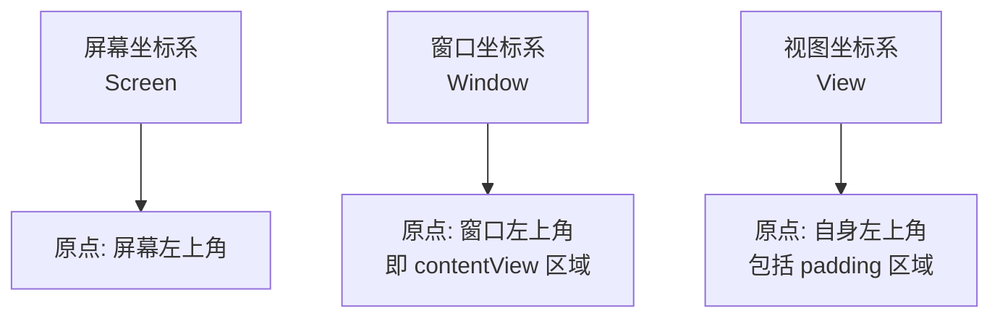
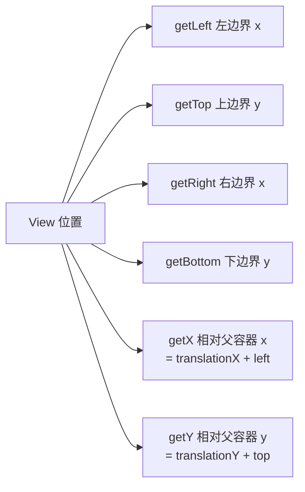
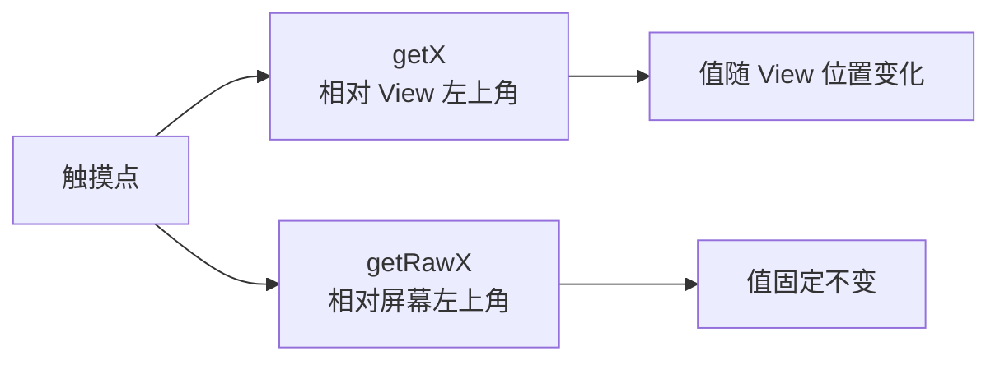

# 坐标系与触摸位置获取

> 面试高频指数：高 — "getX() 和 getRawX() 有什么区别？getLocationInWindow 与 getLocationOnScreen 的区别"是事件分发与自定义 View 的必考基础。

## 一、Android 坐标系总览

### 1.1 三个坐标系

屏幕、窗口、视图三层坐标各有原点：



| 坐标系 | 原点 | 用途 |
|--------|------|------|
| 屏幕坐标 | 屏幕左上角 | getRawX/getRawY |
| 窗口坐标 | 窗口（内容区）左上角 | getLocationInWindow |
| 视图坐标 | View 自身左上角 | getX/getY、getLeft/getTop |

### 1.2 关键结论

- **窗口坐标 = 屏幕坐标 - 状态栏高度**（无系统窗口叠加时）
- 全屏/沉浸式时窗口原点接近屏幕原点
- 不同窗口（Dialog、PopupWindow）的窗口原点不同

## 二、View 坐标属性

### 2.1 位置相关属性

位置属性分两组：布局位置与含平移的当前位置：



| 属性 | 含义 | 坐标系 |
|------|------|--------|
| `left/top/right/bottom` | 布局位置（相对父容器） | 视图坐标 |
| `x/y` | 当前绘制位置（含平移） | 视图坐标 |
| `translationX/Y` | 平移量 | 视图坐标 |
| `getWidth/Height` | right - left / bottom - top | 尺寸 |

> 关键点：`getX() = getLeft() + getTranslationX()`，动画平移时 x 变化而 left 不变。

### 2.2 滑动相关

滚动类 API 移动的是内容：

| API | 作用 |
|-----|------|
| `scrollTo(x, y)` | 滚动到绝对位置 |
| `scrollBy(dx, dy)` | 相对滚动 |
| `getScrollX/Y` | 内容滚动偏移（内容移动方向相反） |

> 注意：scrollTo 移动的是**内容**而非 View 本身，scrollX 正值表示内容左移。

## 三、MotionEvent 坐标

### 3.1 事件坐标 API

onTouchEvent 里能拿到两种坐标：

::: code-tabs

@tab:active Java

```java
@Override
public boolean onTouchEvent(MotionEvent event) {
    switch (event.getActionMasked()) {
        case MotionEvent.ACTION_DOWN:
            // 相对 View 自身左上角
            float x = event.getX();
            float y = event.getY();
            // 相对屏幕左上角
            float rawX = event.getRawX();
            float rawY = event.getRawY();
            break;
    }
    return super.onTouchEvent(event);
}
```

@tab Kotlin

```kotlin
override fun onTouchEvent(event: MotionEvent): Boolean {
    when (event.actionMasked) {
        MotionEvent.ACTION_DOWN -> {
            // 相对 View 自身左上角
            val x = event.x
            val y = event.y
            // 相对屏幕左上角
            val rawX = event.rawX
            val rawY = event.rawY
        }
    }
    return super.onTouchEvent(event)
}
```

:::

各 API 的基准与注意点：

| API | 坐标 | 注意 |

### 3.2 getX 与 getRawX 的区别

两者基准不同，关系如下：



**换算关系**：

```
getRawX() = getX() + view.getLeft() + 父容器的偏移
```

> 常见场景：**拖拽跟随手指**必须用 getRawX/getRawY（View 移动后 getX 会变化，导致拖拽漂移）。

## 四、View 与窗口的位置获取

### 4.1 三个核心方法

取位置的两个方法与一个判断可见性的方法：

::: code-tabs

@tab:active Java

```java
int[] location = new int[2];

// 相对窗口（内容区）左上角
view.getLocationInWindow(location);
// location[0] = x, location[1] = y

// 相对屏幕左上角
view.getLocationOnScreen(location);

// 相对某个祖先 View（Android 12+ 可配合 WindowInsets 计算，一般用上面两种方式）
```

@tab Kotlin

```kotlin
val location = IntArray(2)

// 相对窗口（内容区）左上角
view.getLocationInWindow(location)
// location[0] = x, location[1] = y

// 相对屏幕左上角
view.getLocationOnScreen(location)

// 相对某个祖先 View
view.getLocationInWindowToParent ?: 0  // API 30+，一般用下面方式
```

:::

### 4.2 区别与换算

三个方法基准不同，用途各异：

| 方法 | 基准 | 典型用途 |
|------|------|----------|
| `getLocationInWindow` | 窗口左上角 | 弹出 PopupWindow/Dialog 定位 |
| `getLocationOnScreen` | 屏幕左上角 | 截图、埋点上报、手势判断 |
| `getGlobalVisibleRect` | 屏幕左上角（含部分可见） | 判断是否完全可见 |

**两者关系**：`onScreen = inWindow + 窗口偏移`（状态栏高度等，不同系统版本有差异）。

### 4.3 判断 View 可见性

结合 getGlobalVisibleRect 判断是否完全可见：

::: code-tabs

@tab:active Java

```java
// 判断 View 是否完全在屏幕内
public boolean isCompletelyVisible(View view) {
    Rect rect = new Rect();
    view.getGlobalVisibleRect(rect);
    int screenHeight = view.getResources().getDisplayMetrics().heightPixels;
    return rect.top >= 0 && rect.bottom <= screenHeight;
}
```

@tab Kotlin

```kotlin
// 判断 View 是否完全在屏幕内
fun View.isCompletelyVisible(): Boolean {
    val rect = Rect()
    getGlobalVisibleRect(rect)
    val screenHeight = resources.displayMetrics.heightPixels
    return rect.top >= 0 && rect.bottom <= screenHeight
}
```

:::

## 五、坐标转换实战

### 5.1 手指位置 → 屏幕坐标

拖拽跟随手指必须用 rawX/rawY 防漂移：

::: code-tabs

@tab:active Java

```java
public class DragView extends View {

    private float offsetX = 0f;
    private float offsetY = 0f;

    public DragView(Context context) {
        super(context);
    }

    public DragView(Context context, AttributeSet attrs) {
        super(context, attrs);
    }

    @Override
    public boolean onTouchEvent(MotionEvent event) {
        switch (event.getActionMasked()) {
            case MotionEvent.ACTION_DOWN:
                // 记录按下时 View 位置与手指位置差值
                int[] location = new int[2];
                getLocationOnScreen(location);
                offsetX = event.getRawX() - location[0];
                offsetY = event.getRawY() - location[1];
                break;
            case MotionEvent.ACTION_MOVE:
                // 用 rawX 移动，避免 getX 漂移
                setTranslationX(event.getRawX() - offsetX);
                setTranslationY(event.getRawY() - offsetY);
                break;
        }
        return true;
    }
}
```

@tab Kotlin

```kotlin
class DragView @JvmOverloads constructor(
    context: Context, attrs: AttributeSet? = null
) : View(context, attrs) {

    private var offsetX = 0f
    private var offsetY = 0f

    override fun onTouchEvent(event: MotionEvent): Boolean {
        when (event.actionMasked) {
            MotionEvent.ACTION_DOWN -> {
                // 记录按下时 View 位置与手指位置差值
                val location = IntArray(2)
                getLocationOnScreen(location)
                offsetX = event.rawX - location[0]
                offsetY = event.rawY - location[1]
            }
            MotionEvent.ACTION_MOVE -> {
                // 用 rawX 移动，避免 getX 漂移
                translationX = event.rawX - offsetX
                translationY = event.rawY - offsetY
            }
        }
        return true
    }
}
```

:::

### 5.2 PopupWindow 定位

用 getLocationInWindow 拿到锚点位置再偏移：

::: code-tabs

@tab:active Java

```java
// 让 PopupWindow 出现在目标 View 正下方
int[] location = new int[2];
anchorView.getLocationInWindow(location);
popupWindow.showAtLocation(
        anchorView,
        Gravity.TOP | Gravity.START,
        location[0],
        location[1] + anchorView.getHeight()
);
```

@tab Kotlin

```kotlin
// 让 PopupWindow 出现在目标 View 正下方
val location = IntArray(2)
anchorView.getLocationInWindow(location)
popupWindow.showAtLocation(
    anchorView,
    Gravity.TOP or Gravity.START,
    location[0],
    location[1] + anchorView.height
)
```

:::

## 六、坐标系转换矩阵

### 6.1 View 变换矩阵

父坐标映射到子 View 局部坐标：

::: code-tabs

@tab:active Java

```java
// 将触摸坐标转换为子 View 局部坐标
Matrix matrix = new Matrix();
child.getMatrix().invert(matrix);
float[] point = new float[]{event.getX(), event.getY()};
matrix.mapPoints(point);
```

@tab Kotlin

```kotlin
// 将触摸坐标转换为子 View 局部坐标
val matrix = Matrix()
child.getMatrix().invert(matrix)
val point = floatArrayOf(event.x, event.y)
matrix.mapPoints(point)
```

:::

### 6.2 View 与 Canvas 坐标

绘制与触摸都在 View 局部坐标系里：

- `onDraw(canvas)` 中 Canvas 原点 = View 左上角（含 padding 需自行平移）
- `canvas.translate()` 后绘制坐标随之变化
- 自定义 View 中触摸点坐标与 Canvas 坐标一致（都在 View 局部坐标）

## 七、高频面试题

### Q1：getX() 和 getRawX() 有什么区别？
::: details 查看答案
getX()/getY() 返回触摸点相对当前 View 左上角的坐标，值随 View 在屏幕中的位置变化；getRawX()/getRawY() 返回相对屏幕左上角的坐标，值固定不变。换算关系：getRawX = getX + View 在屏幕中的偏移（含父容器与窗口偏移）。拖拽场景必须用 getRawX/getRawY：如果 View 跟随手指移动，getX 的基准（View 左上角）也在移动，直接用 getX 会产生漂移。
:::

### Q2：getLocationInWindow 和 getLocationOnScreen 有什么区别？
::: details 查看答案
getLocationInWindow 返回 View 相对窗口（内容区）左上角的坐标，getLocationOnScreen 返回相对整个屏幕左上角的坐标。两者差值 = 窗口相对屏幕的偏移，主要由状态栏高度决定（沉浸式/全屏时偏移为 0）。使用场景：popupWindow.showAtLocation、Dialog 定位用 InWindow；埋点上报、手势区域判断、判断是否可见用 OnScreen。注意多窗口（分屏）时需用 Display 坐标进一步换算。
:::

### Q3：getLeft/getTop 和 getX/getY 有什么区别？
::: details 查看答案
left/top 是布局位置，在 layout 阶段确定，表示 View 相对父容器的边界位置，动画平移不改变 left/top；x/y 是当前绘制位置，x = left + translationX，y = top + translationY，会随属性动画的 translationX/Y 改变。所以：判断静态布局位置用 left/top，判断动画过程中的实时位置用 x/y。scrollTo/scrollBy 移动的是内容（getScrollX/Y 记录），与 View 自身位置无关。
:::

### Q4：如何把触摸坐标转换为子 View 的局部坐标？
::: details 查看答案
① 直接用子 View 的 onTouchEvent 中 event.x/event.y（自动是局部坐标）；② 在父容器中需手动转换：减去子 View 的位置偏移（child.getLeft()、getTop()），即 localX = event.x - child.getLeft()；③ 若子 View 有旋转缩放变换，用矩阵：child.getMatrix().invert(matrix) 后 matrix.mapPoints() 把父坐标映射为局部坐标；④ 也可用 View.offsetTopAndBottom 等 API 计算 offset。推荐场景用 getLocationOnScreen 统一换算到屏幕坐标再相减。
:::

### Q5：View 的 scrollTo 和 translationX 都能移动，有什么区别？
::: details 查看答案
scrollTo/scrollBy 移动的是 View 的内容（子 View 或绘制内容），View 自身位置（left/top）不变，内容相对 View 偏移，偏移量记录在 getScrollX/Y，滚动后 onDraw 的 Canvas 已平移；translationX/Y 移动的是 View 本身（配合 layout 位置），getX = getLeft + translationX，不影响内容绘制坐标。场景：列表滚动用 scrollTo；拖拽、动画移动 View 用 translationX/Y（不触发 re-layout，性能好）。
:::

## 八、小结

坐标系要点：

1. 三大坐标系：屏幕 / 窗口 / 视图
2. getX 相对自身，getRawX 相对屏幕
3. x = left + translationX，动画用 x
4. InWindow 用于弹窗定位，OnScreen 用于可见性判断
5. 拖拽用 rawX/rawY 防漂移

相关阅读：[事件分发机制详解](/ui/event/event-dispatch.md)、[多点触控与手势识别](/ui/event/multitouch.md)、[自定义 View 完全指南](/ui/custom-view/custom-view-guide.md)、[Window 机制详解](/ui/window/window-mechanism.md)。
