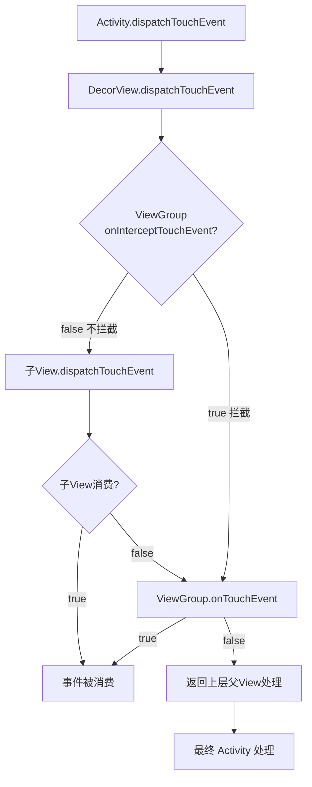

# 👆 事件分发机制完全解析

> 面试高频指数：⭐⭐⭐⭐⭐
> 事件分发是 Android 面试必考难点，本文从源码角度彻底讲透。

## 1. 三个核心方法

| 方法 | 所属 | 作用 |
| --- | --- | --- |
| `dispatchTouchEvent` | View / ViewGroup | 事件分发入口 |
| `onInterceptTouchEvent` | ViewGroup 独有 | 是否拦截事件 |
| `onTouchEvent` | View / ViewGroup | 是否消费事件 |

```text
分发链条：
Activity.dispatchTouchEvent
  └─ PhoneWindow（superDispatchTouchEvent）
      └─ DecorView.dispatchTouchEvent
          └─ ViewGroup.dispatchTouchEvent
              ├─ onInterceptTouchEvent()   ← 拦截判断
              ├─ 子 View.dispatchTouchEvent
              │    └─ 子 View.onTouchEvent  ← 消费判断
              └─ 自己 onTouchEvent          ← 兜底消费
```

## 2. ViewGroup 分发逻辑（伪代码）

```java
// ViewGroup.dispatchTouchEvent 核心逻辑
public boolean dispatchTouchEvent(MotionEvent ev) {
    // ① 是否拦截
    final boolean intercepted = onInterceptTouchEvent(ev);

    // ② 不拦截 → 分发给子 View
    if (!intercepted) {
        // 从后往前遍历子 View（后添加的先处理，保证 z 序）
        for (int i = childCount - 1; i >= 0; i--) {
            View child = getChildAt(i);
            if (child.dispatchTouchEvent(ev)) {
                // 子 View 消费了事件
                mTarget = child;
                return true;
            }
        }
    }

    // ③ 没人消费 → 自己处理
    return super.dispatchTouchEvent(ev);   // 即 onTouchEvent
}
```

**关键规则**：

- `ACTION_DOWN` 决定后续事件的目标（`mTarget` 记录消费 DOWN 的 View）。
- 事件序列（DOWN → MOVE... → UP）只能被同一个 View 消费（除非拦截）。
- ViewGroup 默认不拦截（`onInterceptTouchEvent` 返回 false）。

## 3. View 的消费逻辑

```java
// View.dispatchTouchEvent 核心逻辑
public boolean dispatchTouchEvent(MotionEvent event) {
    // ① 先给 OnTouchListener（若设置了）
    if (mOnTouchListener != null && mOnTouchListener.onTouch(this, event)) {
        return true;                    // Listener 消费
    }
    // ② 再给 onTouchEvent
    return onTouchEvent(event);
}
```

**优先级**：`OnTouchListener > onTouchEvent > OnClickListener`（onClick 在
onTouchEvent 的 ACTION_UP 中触发）。

```java
// onTouchEvent 中点击事件的触发
if (action == MotionEvent.ACTION_UP) {
    if (mOnClickListener != null) {
        mOnClickListener.onClick(this);   // 点击回调在 UP 时触发
    }
}
```

**View 可点击**：`CLICKABLE`（Button 默认 true）或 `LONG_CLICKABLE` 为 true 时，
`onTouchEvent` 返回 true 消费事件；否则返回 false（TextView 默认不消费）。

## 4. 事件传递的完整流程图



## 5. 细节与坑

### 5.1 DOWN 不拦截就锁定目标

```text
一旦 DOWN 被某个 View 消费，后续 MOVE/UP 都发给它（mTarget）
除非父 View 在后续事件中调用 requestDisallowInterceptTouchEvent(true)
```

### 5.2 两个关键 API

```kotlin
// 子 View 禁止父 View 拦截（内部拦截法的关键）
parent.requestDisallowInterceptTouchEvent(true)

// ViewGroup 主动不拦截后续事件
// 在 onInterceptTouchEvent 中：DOWN 返回 false，MOVE 时再判断
```

### 5.3 事件的坐标

```kotlin
// getX/getY：相对当前 View 的坐标
// getRawX/getRawY：相对屏幕的坐标
// 父 View 处理子 View 事件时注意坐标转换（ViewGroup 分发给子 View 时会减去子 View 位置）
```

## 6. 高频面试题

**Q1：事件分发机制是怎样的？**
A：自顶向下分发（Activity → ViewGroup → View），自底向上回传。
核心方法：dispatchTouchEvent（分发）→ onInterceptTouchEvent（拦截）→
onTouchEvent（消费）。DOWN 决定事件序列的目标 View。

**Q2：onTouch 和 onTouchEvent 和 onClick 的执行顺序？**
A：dispatchTouchEvent 先调用 OnTouchListener.onTouch；返回 true 则不再执行
onTouchEvent，onClick 不触发；返回 false 则执行 onTouchEvent，ACTION_UP 时
触发 OnClickListener.onClick。所以顺序：onTouch → onTouchEvent → onClick。

**Q3：如何让子 View 和父 View 同时响应事件？**
A：子 View 的 onTouchEvent 返回 true 消费事件后，父 View 无法收到。
可以让父 View 通过 `dispatchTouchEvent` 手动调用（伪共享），或用
`onInterceptTouchEvent` 拦截后再手动处理。没有直接办法，需要业务设计。

**Q4：requestDisallowInterceptTouchEvent 的作用？**
A：子 View 调用后，父 ViewGroup 不再拦截后续事件（`FLAG_DISALLOW_INTERCEPT`
标志）。常用于 ViewPager 内部子控件滑动时禁止外层拦截。注意 DOWN 事件会
重置该标志。

**Q5：为什么 DOWN 事件必须被消费？**
A：Android 以 DOWN 事件确定目标 View（mTarget），如果 DOWN 返回 false，整个
事件序列（包括 UP）都不会再传给该 View，点击效果失效。

## 7. 小结

- 三大方法：dispatch（分发）/ intercept（拦截）/ consume（消费）。
- 分发自上而下，消费自下而上；DOWN 锁定目标。
- 优先级：OnTouchListener > onTouchEvent > onClick。
- 面试重点：分发链条、拦截时机、事件序列目标确定。
