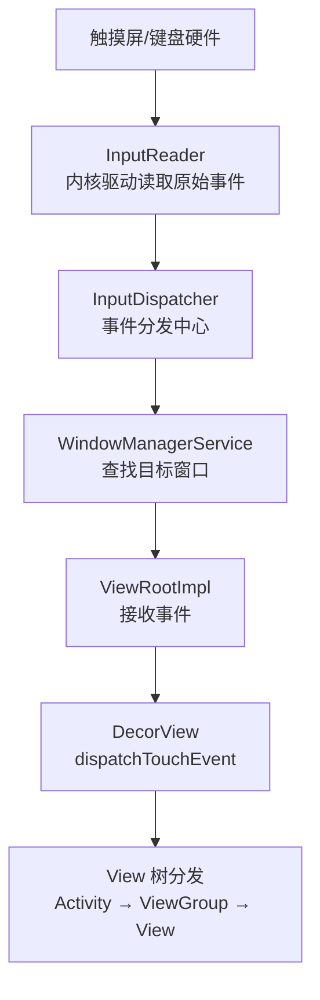
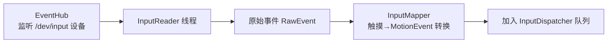
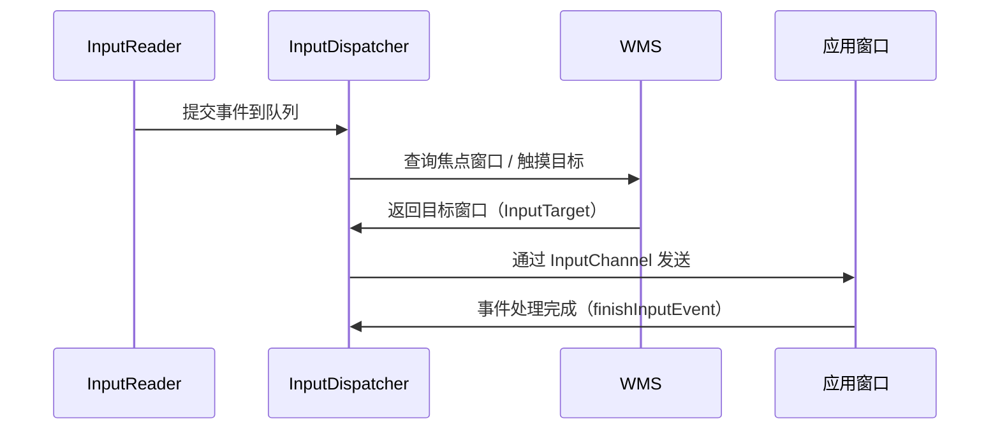
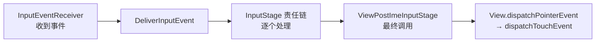
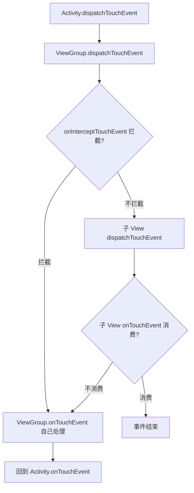
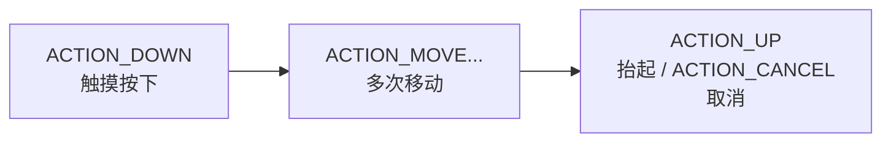
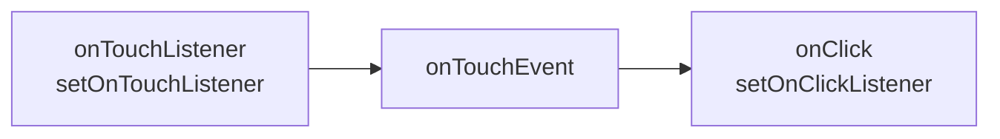

# 输入系统与触摸事件分发

> 手指按下到 `onTouchEvent` 被调用，中间经历了什么？本文打通"系统输入子系统（InputReader/InputDispatcher）→ Window → View 树分发"的完整链路，彻底理解 `dispatchTouchEvent` 三大方法。

## 一、输入事件全景链路

一次触摸从硬件到应用进程，要经过系统侧三条跳转、应用侧两次分发，整体链路如下：



链路中每个环节都由专门组件负责：

| 环节 | 组件 | 职责 |
|------|------|------|
| 事件源 | 触摸屏驱动 | 产生原始触摸坐标/压力 |
| 读取 | InputReader（系统进程） | 轮询驱动，标准化为 InputEvent |
| 分发 | InputDispatcher（系统进程） | 按窗口焦点分发到目标窗口 |
| 接收 | ViewRootImpl | 通过 InputChannel 接收事件 |
| 分发 | View 树 | Activity/ViewGroup/View 逐层传递 |

## 二、系统侧：InputReader 与 InputDispatcher

### 2.1 InputReader

InputReader 负责把硬件原始数据变成标准事件，内部三步流水线：



- **EventHub**：监听 `/dev/input/` 下的输入设备（触摸屏、键盘、鼠标）
- **InputReader 线程**：循环读取原始数据
- **InputMapper**：按设备类型转换成 MotionEvent / KeyEvent

### 2.2 InputDispatcher

事件进入分发中心后，先找目标窗口再投递，时序如下：



- **焦点分发**：键盘/按键事件发给焦点窗口；触摸事件按坐标命中的窗口分发
- **派发线程**：InputDispatcher 线程按窗口的 `inputDispatcher` 队列逐个投递
- **ANR**：应用 5 秒内未处理完输入事件 → 触发输入 ANR

> 这也是"点击无响应 5 秒 ANR"的来源之一（Input dispatching timed out）。

## 三、应用侧：ViewRootImpl 接收事件

事件到达应用进程后，ViewRootImpl 用一条 InputStage 责任链逐级处理：

::: code-tabs

@tab:active Java

```java
// ViewRootImpl 内部
InputStage mFirstPostImeInputStage;  // 责任链：输入事件处理阶段

// 责任链构成
mSyntheticInputStage → mEarlyPostImeInputStage → mPostImeInputStage
→ mFirstPostImeInputStage → ViewPostImeInputStage（默认）→ mSyntheticInputStage
```

@tab Kotlin

```kotlin
// ViewRootImpl 内部
var mFirstPostImeInputStage: InputStage?  // 责任链：输入事件处理阶段

// 责任链构成
mSyntheticInputStage → mEarlyPostImeInputStage → mPostImeInputStage
→ mFirstPostImeInputStage → ViewPostImeInputStage（默认）→ mSyntheticInputStage
```

:::

责任链最终落到 `ViewPostImeInputStage`，由它把事件交给 View 树：



## 四、View 树分发：三大方法

### 4.1 核心方法链

从 Activity 到 View 的分发决策流程——拦截与消费是两条分支：



### 4.2 三个方法的分工

三个方法各司其职，返回值都表示"事件是否被消费"：

| 方法 | 职责 | 返回值含义 |
|------|------|-----------|
| `dispatchTouchEvent` | 事件分发入口 | true=事件被消费 |
| `onInterceptTouchEvent`（仅 ViewGroup） | 是否拦截 | true=拦截，不传给子 View |
| `onTouchEvent` | 处理事件 | true=消费 |

### 4.3 分发伪代码

把上面的流程翻译成代码，核心就这几步：

::: code-tabs

@tab:active Java

```java
// ViewGroup.dispatchTouchEvent 核心逻辑（简化）
public boolean dispatchTouchEvent(MotionEvent ev) {
    if (ev.getAction() == ACTION_DOWN) {
        // 新一轮触摸序列：重置状态
        mFirstTouchTarget = null;
    }
    boolean intercepted = onInterceptTouchEvent(ev);   // 询问是否拦截
    if (!intercepted) {
        // 遍历子 View，找目标
        for (View child : children) {
            if (child.dispatchTouchEvent(ev)) {
                mFirstTouchTarget = child;   // 找到目标
                break;
            }
        }
    }
    // 没有子 View 消费 → 自己处理
    if (mFirstTouchTarget == null) {
        return onTouchEvent(ev);
    }
    return true;
}
```

@tab Kotlin

```kotlin
// ViewGroup.dispatchTouchEvent 核心逻辑（简化）
override fun dispatchTouchEvent(ev: MotionEvent): Boolean {
    if (ev.action == ACTION_DOWN) {
        // 新一轮触摸序列：重置状态
        mFirstTouchTarget = null
    }
    val intercepted = onInterceptTouchEvent(ev)   // 询问是否拦截
    if (!intercepted) {
        // 遍历子 View，找目标
        for (child in children) {
            if (child.dispatchTouchEvent(ev)) {
                mFirstTouchTarget = child   // 找到目标
                break
            }
        }
    }
    // 没有子 View 消费 → 自己处理
    if (mFirstTouchTarget == null) {
        return onTouchEvent(ev)
    }
    return true
}
```

:::

## 五、事件序列与 DOWN 关键性

### 5.1 事件序列

一次完整触摸是一个事件序列，从 DOWN 开始到 UP/CANCEL 结束：



> **关键规则**：事件序列从 DOWN 开始，到 UP/CANCEL 结束。**DOWN 事件决定了整个序列的目标**——DOWN 被谁消费，后续 MOVE/UP 就发给谁（mFirstTouchTarget 在 DOWN 时确定）。

### 5.2 ACTION_CANCEL 什么时候出现

CANCEL 不是用户动作，而是系统/父容器"收回触摸权"的信号，常见三种场景：

| 场景 | 说明 |
|------|------|
| 父 View 在 MOVE 阶段拦截 | 子 View 收到 CANCEL |
| 触摸事件被新窗口抢占 | 收到 CANCEL |
| 视图被移除/滚动容器接管 | 收到 CANCEL |

父 View 在 MOVE 阶段拦截时，系统会先给子 View 发 CANCEL——代码里的表现是这样的：

::: code-tabs

@tab:active Java

```java
@Override
public boolean onInterceptTouchEvent(MotionEvent ev) {
    if (ev.getAction() == MotionEvent.ACTION_MOVE && 条件满足) {
        // 通知子 View：你的触摸被抢走了
        return true;   // 系统会给子 View 发 ACTION_CANCEL
    }
    return super.onInterceptTouchEvent(ev);
}
```

@tab Kotlin

```kotlin
// ViewGroup 拦截后：让子 View 先收 CANCEL 再自己处理
override fun onInterceptTouchEvent(ev: MotionEvent): Boolean {
    if (ev.action == MotionEvent.ACTION_MOVE && 条件满足) {
        // 通知子 View：你的触摸被抢走了
        return true   // 系统会给子 View 发 ACTION_CANCEL
    }
    return super.onInterceptTouchEvent(ev)
}
```

:::

## 六、事件分发机制细节

### 6.1 分发顺序

```
Activity.dispatchTouchEvent
  └→ PhoneWindow.superDispatchTouchEvent
       └→ DecorView.dispatchTouchEvent
            └→ ViewGroup.dispatchTouchEvent（最外层容器）
                 └→ ... 层层向下（后添加的子 View 优先）
```

> 子 View 遍历顺序：**从后往前（绘制顺序的逆序）**，即最后 add 的 View 先收到事件（z 轴最上层优先）。

### 6.2 优先级链条（同一 View 内）



> `OnTouchListener` 优先级高于 `onTouchEvent`；**只有 onTouchEvent 返回 true（消费了 UP）才可能触发 onClick**。

## 七、高频面试题

### Q1：描述一次完整触摸事件从硬件到应用的处理流程？
::: details 查看答案
① 触摸屏硬件产生中断，内核驱动生成原始事件；② 系统进程的 InputReader 线程通过 EventHub 读取原始数据，经 InputMapper 转换成 MotionEvent；③ InputDispatcher 线程查询 WMS 确定目标窗口，通过 InputChannel 投递到应用进程；④ ViewRootImpl 的 InputStage 责任链处理，最终调用 View 树的 dispatchTouchEvent；⑤ Activity → ViewGroup → View 逐层分发，onTouchEvent 决定是否消费。
:::

### Q2：dispatchTouchEvent、onInterceptTouchEvent、onTouchEvent 三者的关系？
::: details 查看答案
dispatchTouchEvent 是分发入口，内部先询问 onInterceptTouchEvent 是否拦截：拦截则自己 onTouchEvent 处理；不拦截则遍历子 View 调用其 dispatchTouchEvent，子 View 消费则结束，否则自己 onTouchEvent 处理。返回 true 表示事件被消费，后续事件序列继续发给该消费者。onInterceptTouchEvent 只有 ViewGroup 有。
:::

### Q3：为什么说 DOWN 事件是整个事件序列的关键？
::: details 查看答案
DOWN 事件确定 mFirstTouchTarget：DOWN 被谁消费，MOVE/UP 就只发给谁（事件序列目标锁定）。如果 DOWN 没有子 View 消费，后续事件都由父 View 自己处理。这保证了触摸序列的一致性——不会出现 DOWN 给 A、MOVE 给 B 的混乱。这也是为什么 View 不消费 DOWN 就不会收到后续事件。
:::

### Q4：什么时候会收到 ACTION_CANCEL？如何处理？
::: details 查看答案
① 父 View 在 MOVE 阶段调用 onInterceptTouchEvent 返回 true 拦截事件，子 View 会收到 CANCEL；② 触摸事件被其他窗口抢占（如弹出系统弹窗）；③ 视图被移除。处理：收到 CANCEL 应恢复状态（还原背景色、停止动画、释放资源），与 UP 的区别是 CANCEL 表示"触摸被抢走"而非"正常结束"，不应触发点击逻辑。
:::

### Q5：onTouchEvent 返回 false 时点击事件还会触发吗？
::: details 查看答案
不会。onClick 的触发条件：View 的 onTouchEvent 消费了完整的 DOWN→UP 事件序列（performClick 在 UP 时调用）。若 onTouchEvent 返回 false（不消费），事件会向上抛给父 View 处理，该 View 收不到后续事件，自然无法触发 performClick。注意 setOnTouchListener 的监听器优先于 onTouchEvent，监听器返回 true 则 onTouchEvent 不再执行。
:::

## 小结

- 输入链路：硬件 → InputReader（转换） → InputDispatcher（分发） → ViewRootImpl → View 树
- InputDispatcher 通过 WMS 定位目标窗口，InputChannel 跨进程投递
- 三大方法：dispatch（分发）/ intercept（拦截）/ onTouchEvent（处理）
- DOWN 锁定目标序列，CANCEL 表示触摸被抢占
- 分发顺序：Activity → DecorView → 外层 ViewGroup → ... → 目标 View
- OnTouchListener 优先于 onTouchEvent，消费 UP 才触发 onClick

> 进阶阅读：[事件分发机制详解](/ui/event/event-dispatch.md) | [事件冲突解决方案](/ui/event/conflict-solution.md) | [WMS 窗口管理](/system/ams-wms/wms-principle.md)
