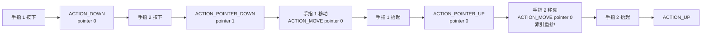

# 多点触控与手势识别

> 面试高频指数：高 — "多点触控中 ACTION_POINTER_DOWN 和 ACTION_DOWN 有什么区别？如何实现双指缩放？"是事件处理的高级考点。

## 一、多点触控基础

### 1.1 单指 vs 多指

单指触摸时事件简单：ACTION_DOWN → 多个 ACTION_MOVE → ACTION_UP。

多指触摸引入新概念，事件流如下：



### 1.2 新事件类型

多指相关的事件类型：

| 事件 | 含义 |
|------|------|
| `ACTION_POINTER_DOWN` | 第二根及以上手指按下 |
| `ACTION_POINTER_UP` | 某根手指抬起（不是最后一根） |
| `ACTION_UP` | 最后一根手指抬起（事件流结束） |
| `ACTION_CANCEL` | 事件被父容器拦截 |

> 关键点：`ACTION_DOWN` 只代表**第一根**手指按下，`ACTION_UP` 只在**最后一根**手指抬起时触发。

## 二、Pointer 与 index

### 2.1 两个索引概念

id 与 index 的区别：

| 概念 | 方法 | 说明 |
|------|------|------|
| pointerId | `getPointerId(index)` | 手指的**唯一标识**，从按下到抬起不变 |
| pointerIndex | `getActionIndex()` | 事件中的**位置索引**，会随手指抬起重排 |

处理多指事件时按 action 分流：

::: code-tabs

@tab Kotlin

```kotlin
override fun onTouchEvent(event: MotionEvent): Boolean {
    val action = event.actionMasked
    when (action) {
        MotionEvent.ACTION_POINTER_DOWN -> {
            // 新按下手指的 index
            val index = event.actionIndex
            val id = event.getPointerId(index)
            val x = event.getX(index)
            val y = event.getY(index)
            Log.d("Multi", "第 ${event.pointerCount} 指按下: id=$id ($x, $y)")
        }
        MotionEvent.ACTION_MOVE -> {
            // 遍历所有手指
            for (i in 0 until event.pointerCount) {
                val id = event.getPointerId(i)
                val x = event.getX(i)
                val y = event.getY(i)
            }
        }
        MotionEvent.ACTION_POINTER_UP -> {
            // 抬起手指的 index（注意：抬起后该 index 失效）
            val index = event.actionIndex
            val id = event.getPointerId(index)
        }
        MotionEvent.ACTION_UP -> {
            // 最后一指抬起
        }
    }
    return true
}
```

:::

### 2.2 pointerId 与 index 的区别

用实例对比两者的变化：

| 场景 | pointerId | pointerIndex |
|------|-----------|--------------|
| 手指 2 按下 | 手指 2 的 id = 1 | index = 1 |
| 手指 1 抬起 | 手指 1 的 id = 0（事件中可查） | index = 0 |
| 剩余手指 2 的后续事件 | id 仍是 1 | **index 变为 0**（重排） |

> 关键点：**跟踪具体手指用 pointerId，读取事件数据用 pointerIndex**。抬起一根手指后 index 会重排，而 id 不变。

## 三、GestureDetector 手势识别

### 3.1 使用方式

把事件交给 GestureDetector 即可识别常见手势：

::: code-tabs

@tab:active Java

```java
public class GestureView extends View {

    private final GestureDetector gestureDetector = new GestureDetector(getContext(),
            new GestureDetector.SimpleOnGestureListener() {
                // 单击
                @Override
                public boolean onSingleTapUp(MotionEvent e) {
                    Log.d("Gesture", "单击");
                    return true;
                }
                // 长按
                @Override
                public void onLongPress(MotionEvent e) {
                    Log.d("Gesture", "长按");
                }
                // 滑动
                @Override
                public boolean onFling(MotionEvent e1, MotionEvent e2,
                                       float velocityX, float velocityY) {
                    Log.d("Gesture", "甩动: vx=" + velocityX + " vy=" + velocityY);
                    return true;
                }
                // 滚动
                @Override
                public boolean onScroll(MotionEvent e1, MotionEvent e2,
                                        float distanceX, float distanceY) {
                    Log.d("Gesture", "滚动: dx=" + distanceX + " dy=" + distanceY);
                    return true;
                }
            });

    public GestureView(Context context) {
        super(context);
    }

    @Override
    public boolean onTouchEvent(MotionEvent event) {
        // 交给 GestureDetector 处理
        return gestureDetector.onTouchEvent(event);
    }
}
```

@tab Kotlin

```kotlin
class GestureView(context: Context) : View(context) {

    private val gestureDetector = GestureDetector(context,
        object : GestureDetector.SimpleOnGestureListener() {
            // 单击
            override fun onSingleTapUp(e: MotionEvent): Boolean {
                Log.d("Gesture", "单击")
                return true
            }
            // 长按
            override fun onLongPress(e: MotionEvent) {
                Log.d("Gesture", "长按")
            }
            // 滑动
            override fun onFling(
                e1: MotionEvent?, e2: MotionEvent,
                velocityX: Float, velocityY: Float
            ): Boolean {
                Log.d("Gesture", "甩动: vx=$velocityX vy=$velocityY")
                return true
            }
            // 滚动
            override fun onScroll(
                e1: MotionEvent?, e2: MotionEvent,
                distanceX: Float, distanceY: Float
            ): Boolean {
                Log.d("Gesture", "滚动: dx=$distanceX dy=$distanceY")
                return true
            }
        })

    override fun onTouchEvent(event: MotionEvent): Boolean {
        // 交给 GestureDetector 处理
        return gestureDetector.onTouchEvent(event)
    }
}
```

:::

### 3.2 手势与阈值的判定逻辑

各手势的判定条件与回调：

| 手势 | 判定条件 | 回调 |
|------|----------|------|
| 单击 | 手指按下后抬起，位移小于 touch slop | onSingleTapUp |
| 双击 | 两次单击间隔小于 double tap timeout | onDoubleTap |
| 长按 | 按住超过 long press timeout 且未移动 | onLongPress |
| 滑动 Fling | 速度超过 fling 阈值 | onFling |
| 滚动 Scroll | 位移超过 touch slop | onScroll |

> 注意：onFling 的 velocityX/Y 需要配合 `ViewConfiguration.get(context).scaledMinimumFlingVelocity` 理解，默认约 50px/s。

## 四、ScaleGestureDetector 缩放

### 4.1 双指缩放实现

ScaleGestureDetector 直接驱动缩放：

::: code-tabs

@tab:active Java

```java
public class ZoomView extends View {

    private float scaleFactor = 1f;

    private final ScaleGestureDetector scaleDetector = new ScaleGestureDetector(getContext(),
            new ScaleGestureDetector.SimpleOnScaleGestureListener() {
                // 每次缩放变化回调（手指移动时持续触发）
                @Override
                public boolean onScale(ScaleGestureDetector detector) {
                    scaleFactor *= detector.getScaleFactor();
                    scaleFactor = Math.max(0.5f, Math.min(3f, scaleFactor));
                    invalidate();
                    return true;
                }
            });

    public ZoomView(Context context) {
        super(context);
    }

    @Override
    public boolean onTouchEvent(MotionEvent event) {
        scaleDetector.onTouchEvent(event);
        return true;
    }

    @Override
    protected void onDraw(Canvas canvas) {
        canvas.scale(scaleFactor, scaleFactor, getWidth() / 2f, getHeight() / 2f);
        super.onDraw(canvas);
    }
}
```

@tab Kotlin

```kotlin
class ZoomView(context: Context) : View(context) {

    private var scaleFactor = 1f

    private val scaleDetector = ScaleGestureDetector(context,
        object : ScaleGestureDetector.SimpleOnScaleGestureListener() {
            // 每次缩放变化回调（手指移动时持续触发）
            override fun onScale(detector: ScaleGestureDetector): Boolean {
                scaleFactor *= detector.scaleFactor
                scaleFactor = scaleFactor.coerceIn(0.5f, 3f)
                invalidate()
                return true
            }
        })

    override fun onTouchEvent(event: MotionEvent): Boolean {
        scaleDetector.onTouchEvent(event)
        return true
    }

    override fun onDraw(canvas: Canvas) {
        canvas.scale(scaleFactor, scaleFactor, width / 2f, height / 2f)
        super.onDraw(canvas)
    }
}
```

:::

### 4.2 核心 API

缩放检测器的核心数据：

| API | 含义 |
|-----|------|
| `scaleFactor` | 本次回调相对上次的缩放比例 |
| `getCurrentSpan()` | 两指当前间距 |
| `getPreviousSpan()` | 两指上次间距 |
| `focusX/focusY` | 缩放焦点（两指中点） |
| `isInProgress()` | 缩放是否进行中 |

### 4.3 缩放 + 平移组合

按手指数量分流实现双指缩放单指平移：

::: code-tabs

@tab:active Java

```java
// 双指缩放 + 单指平移：按手指数量分流
@Override
public boolean onTouchEvent(MotionEvent event) {
    scaleDetector.onTouchEvent(event);
    if (!scaleDetector.isInProgress() && event.getPointerCount() == 1) {
        // 单指：平移
        switch (event.getActionMasked()) {
            case MotionEvent.ACTION_DOWN:
                lastX = event.getX();
                break;
            case MotionEvent.ACTION_MOVE:
                translateX += event.getX() - lastX;
                translateY += event.getY() - lastY;
                lastX = event.getX();
                lastY = event.getY();
                invalidate();
                break;
        }
    }
    return true;
}
```

@tab Kotlin

```kotlin
// 双指缩放 + 单指平移：按手指数量分流
override fun onTouchEvent(event: MotionEvent): Boolean {
    scaleDetector.onTouchEvent(event)
    if (!scaleDetector.isInProgress && event.pointerCount == 1) {
        // 单指：平移
        when (event.actionMasked) {
            MotionEvent.ACTION_DOWN -> lastX = event.x
            MotionEvent.ACTION_MOVE -> {
                translateX += event.x - lastX
                translateY += event.y - lastY
                lastX = event.x
                lastY = event.y
                invalidate()
            }
        }
    }
    return true
}
```

:::

## 五、自定义手势识别

### 5.1 判断角度与方向

用 dx/dy 判断滑动手势方向：

::: code-tabs

@tab:active Java

```java
// 判断手势滑动方向
private String getDirection(float dx, float dy) {
    float absX = Math.abs(dx);
    float absY = Math.abs(dy);
    if (absX > absY && dx > 0) return "右滑";
    if (absX > absY && dx < 0) return "左滑";
    if (absY > absX && dy > 0) return "下滑";
    if (absY > absX && dy < 0) return "上滑";
    return "静止";
}
```

@tab Kotlin

```kotlin
// 判断手势滑动方向
private fun getDirection(dx: Float, dy: Float): String {
    val absX = kotlin.math.abs(dx)
    val absY = kotlin.math.abs(dy)
    return when {
        absX > absY && dx > 0 -> "右滑"
        absX > absY && dx < 0 -> "左滑"
        absY > absX && dy > 0 -> "下滑"
        absY > absX && dy < 0 -> "上滑"
        else -> "静止"
    }
}
```

:::

### 5.2 触摸阈值常量

系统提供的判断阈值：

::: code-tabs

@tab:active Java

```java
ViewConfiguration vc = ViewConfiguration.get(context);
int touchSlop = vc.getScaledTouchSlop();                      // 判定移动的阈值（约 8dp）
int minFling = vc.getScaledMinimumFlingVelocity();            // fling 最小速度
int maxFling = vc.getScaledMaximumFlingVelocity();            // fling 最大速度
int doubleTapTimeout = ViewConfiguration.getDoubleTapTimeout(); // 双击间隔
int longPressTimeout = ViewConfiguration.getLongPressTimeout(); // 长按时间
```

@tab Kotlin

```kotlin
val vc = ViewConfiguration.get(context)
val touchSlop = vc.scaledTouchSlop          // 判定移动的阈值（约 8dp）
val minFling = vc.scaledMinimumFlingVelocity // fling 最小速度
val maxFling = vc.scaledMaximumFlingVelocity // fling 最大速度
val doubleTapTimeout = ViewConfiguration.getDoubleTapTimeout() // 双击间隔
val longPressTimeout = ViewConfiguration.getLongPressTimeout() // 长按时间
```

:::

> 关键点：**判断"是否移动"用 touchSlop**，位移小于它认为是点击而非滑动，避免误判。

## 六、高频面试题

### Q1：ACTION_DOWN 和 ACTION_POINTER_DOWN 有什么区别？
::: details 查看答案
ACTION_DOWN 只在第一根手指按下时触发（每轮触摸流只发生一次），它的触发标志着新的事件流开始，后续所有手指的按下都触发 ACTION_POINTER_DOWN（通过 actionIndex 区分是哪根手指）。对应关系：最后一根手指抬起触发 ACTION_UP（事件流结束），其他手指抬起触发 ACTION_POINTER_UP。注意 ACTION_POINTER_DOWN/UP 没有对应的 Down/Up 状态，需用 getActionIndex 和 getPointerId 定位具体手指。
:::

### Q2：pointerId 和 pointerIndex 有什么区别？
::: details 查看答案
pointerId 是手指的唯一标识，从按下到抬起保持不变（用 getPointerId(index) 获取），用于跨事件跟踪同一根手指；pointerIndex 是事件数组中的位置索引（用 getActionIndex() 获取），手指抬起后剩余手指的索引会重新排列（如手指 0 抬起，原手指 1 变为 index 0）。正确用法：记录手指用 id，读取 x/y 用 index，并通过 getPointerId(index) 建立 id 与 index 的映射。
:::

### Q3：如何实现双指缩放？原理是什么？
::: details 查看答案
用 ScaleGestureDetector：① 在 onTouchEvent 中把事件交给 scaleDetector.onTouchEvent；② 实现 onScale 回调，用 detector.scaleFactor 累乘得到当前缩放比例（scaleFactor 是相对上次的增量）；③ 缩放焦点用 detector.focusX/focusY（两指中点）做缩放中心；④ 限制缩放范围（coerceIn）；⑤ 配合单指平移需判断 pointerCount 分流。原理：ScaleGestureDetector 内部跟踪两指距离变化（getCurrentSpan - getPreviousSpan），按比例计算缩放因子，同时支持触摸 slop 消抖。
:::

### Q4：GestureDetector 能识别哪些手势？onFling 和 onScroll 的区别？
::: details 查看答案
GestureDetector 识别：单击（onSingleTapUp）、双击（onDoubleTap）、长按（onLongPress）、滚动（onScroll）、甩动（onFling）、按住拖动（onDown/onShowPress）。onScroll 是手指按住缓慢拖动（位移超过 touchSlop 即触发，持续回调，参数是距离差），onFling 是快速甩动（抬起时速度超过 scaledMinimumFlingVelocity 才触发，参数带初速度）。二者是"慢拖 vs 快甩"的区别，对应 ListView/RecyclerView 的滚动与惯性滑动。
:::

### Q5：多点触控中如何正确跟踪"正在被拖动的那个手指"？
::: details 查看答案
① ACTION_DOWN 时记录第一根手指的 pointerId 为 activePointerId，并记录按下位置；② ACTION_POINTER_DOWN 时根据业务决定是否切换跟踪目标（如双指缩放时切换到新手指）；③ ACTION_MOVE 中用 activePointerId 找到当前 index：val index = event.findPointerIndex(activePointerId)，再读取 getX(index)；④ 若该 index 为 -1 说明手指已抬起，需重新选择跟踪手指；⑤ ACTION_POINTER_UP 时若抬起的是 activePointerId 对应的手指，改用剩余手指中 index 0 的 id 作为新的 activePointerId。核心：用 id 跟踪、用 index 读数据、id 抬升时及时切换。
:::

## 七、小结

多点触控要点：

1. ACTION_DOWN/UP 只对应首指/末指，中间手指用 POINTER_DOWN/UP
2. pointerId 跟踪手指，pointerIndex 读取数据（会重排）
3. GestureDetector 识别单击/双击/长按/滑动
4. ScaleGestureDetector 用 scaleFactor 实现缩放
5. touchSlop 阈值判断点击与滑动
6. 缩放平移组合按 pointerCount 分流

相关阅读：[事件分发机制详解](/ui/event/event-dispatch.md)、[滑动冲突解决方案](/ui/event/conflict-solution.md)、[坐标系与触摸位置获取](/ui/event/coordinate-system.md)、[TouchHelper 详解](/ui/custom-view/touch-helper.md)。
