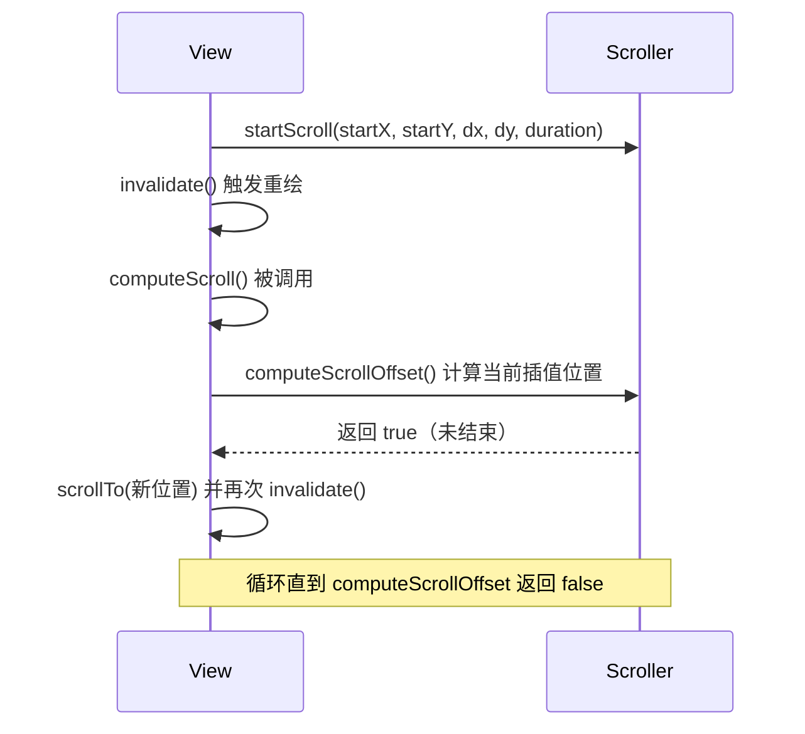

# View 滑动与弹性滑动机制

> 滑动是自定义 View 与手势交互的基础能力。本文系统梳理 View 的位置参数、事件坐标体系、三种滑动方式，以及 Scroller 弹性滑动的底层原理。

## 一、View 的位置参数

View 的位置由 `left`、`top`、`right`、`bottom` 四个顶点决定，均为**相对父容器**的坐标：

| 参数 | 含义 |
|------|------|
| `left` / `top` | 左上角相对父容器的横 / 纵坐标 |
| `right` / `bottom` | 右下角相对父容器的横 / 纵坐标 |
| `width` / `height` | `right - left` / `bottom - top` |

Android 3.0+ 新增 `x`、`y`、`translationX`、`translationY`：

```text
x = left + translationX
y = top + translationY
```

::: tip
`left/top` 是**初始布局位置**，`translationX/Y` 是**位移量**。动画平移实际改变的是 translation 而不是 left/top。
:::

## 二、MotionEvent 与 TouchSlop

### 事件坐标

| 方法 | 含义 |
|------|------|
| `getX() / getY()` | 相对当前 View 左上角的坐标 |
| `getRawX() / getRawY()` | 相对屏幕左上角的坐标 |

::: code-tabs

@tab:active Java

```java
// 手指相对 View 的位移 = 屏幕位移（raw 差值相等，但 getX 受 View 位置影响）
float dx = event.getRawX() - lastRawX;
```

@tab Kotlin

```kotlin
// 手指相对 View 的位移 = 屏幕位移（raw 差值相等，但 getX 受 View 位置影响）
val dx = event.rawX - lastRawX
```

:::

### TouchSlop（最小滑动距离）

系统可识别为"滑动"的最小距离，小于该值视为点击：

::: code-tabs

@tab:active Java

```java
int touchSlop = ViewConfiguration.get(context).getScaledTouchSlop();
// 使用：abs(dx) > touchSlop 才判定为滑动，避免误触
```

@tab Kotlin

```kotlin
val touchSlop = ViewConfiguration.get(context).scaledTouchSlop
// 使用：abs(dx) > touchSlop 才判定为滑动，避免误触
```

:::

## 三、滑动辅助类

| 辅助类 | 用途 | 关键 API |
|--------|------|----------|
| `VelocityTracker` | 追踪滑动速度 | `computeCurrentVelocity(1000)` 单位 px/s |
| `GestureDetector` | 手势检测：单击/双击/长按/快速滑动 | `onSingleTapUp` / `onFling` / `onLongPress` |
| `Scroller` | 配合 `computeScroll` 实现弹性滑动 | `startScroll` / `computeScrollOffset` |

::: code-tabs

@tab:active Java

```java
// VelocityTracker 标准用法
velocityTracker = VelocityTracker.obtain();
velocityTracker.addMovement(event);
velocityTracker.computeCurrentVelocity(1000); // 每 1000ms 的像素数
float vx = velocityTracker.getXVelocity();
// 使用完毕回收，避免内存泄漏
velocityTracker.recycle();
velocityTracker = null;
```

@tab Kotlin

```kotlin
// VelocityTracker 标准用法
velocityTracker = VelocityTracker.obtain()
velocityTracker.addMovement(event)
velocityTracker.computeCurrentVelocity(1000) // 每 1000ms 的像素数
val vx = velocityTracker.xVelocity
// 使用完毕回收，避免内存泄漏
velocityTracker.recycle()
velocityTracker = null
```

:::

## 四、三种滑动方式对比

| 方式 | 特点 | 适用场景 |
|------|------|----------|
| `scrollTo` / `scrollBy` | 改变**内容**位置而非控件位置 | 内容滚动（TextView、WebView） |
| 动画 | 操作 `translationX/Y`，3.0 以下需注意点击区域 | 过渡动画、进场出场 |
| 修改 LayoutParams | 直接改布局参数，最灵活 | 需要真实位置移动的交互 View |

::: code-tabs

@tab:active Java

```java
// scrollTo：移动到 (x, y)；scrollBy：相对当前位置移动 (x, y)
// 注意：scrollBy(dx, dy) 传正值，内容向左/向上移动（坐标系相反）
view.scrollBy(-dx, -dy);
```

@tab Kotlin

```kotlin
// scrollTo：移动到 (x, y)；scrollBy：相对当前位置移动 (x, y)
// 注意：scrollBy(dx, dy) 传正值，内容向左/向上移动（坐标系相反）
view.scrollBy(-dx, -dy)
```

:::

::: warning
动画方式滑动（`translationX/Y`）只改变视觉位置，**不改变点击区域**（Android 3.0+ 的 `PropertyAnimator` 会同步更新位置，但低于 3.0 的 View 动画不会）。
:::

## 五、弹性滑动原理

弹性滑动 = **分多次小步滑动**，让滑动过程可感知、可打断。三种实现：

### 1. Scroller + computeScroll



::: code-tabs

@tab:active Java

```java
public class SmoothScrollView extends View {

    private final Scroller scroller;

    public SmoothScrollView(Context context) {
        this(context, null);
    }

    public SmoothScrollView(Context context, AttributeSet attrs) {
        super(context, attrs);
        scroller = new Scroller(context);
    }

    public void smoothScrollTo(int destX, int destY) {
        int dx = destX - getScrollX();
        int dy = destY - getScrollY();
        scroller.startScroll(getScrollX(), getScrollY(), dx, dy, 500);
        invalidate();
    }

    @Override
    public void computeScroll() {
        if (scroller.computeScrollOffset()) {
            scrollTo(scroller.getCurrX(), scroller.getCurrY());
            postInvalidate();
        }
    }
}
```

@tab Kotlin

```kotlin
class SmoothScrollView @JvmOverloads constructor(
    context: Context, attrs: AttributeSet? = null
) : View(context, attrs) {

    private val scroller = Scroller(context)

    fun smoothScrollTo(destX: Int, destY: Int) {
        val dx = destX - scrollX
        val dy = destY - scrollY
        scroller.startScroll(scrollX, scrollY, dx, dy, 500)
        invalidate()
    }

    override fun computeScroll() {
        if (scroller.computeScrollOffset()) {
            scrollTo(scroller.currX, scroller.currY)
            postInvalidate()
        }
    }
}
```

:::

**核心**：Scroller 本身不滑动，它只是一个"位置计算器"——通过 `computeScrollOffset()` 根据时间插值计算每一帧的位置，配合 `computeScroll` 循环 `scrollTo` + `invalidate` 完成动画。

### 2. 属性动画

在 `ValueAnimator` 的 `onAnimationUpdate` 中叠加滑动逻辑：

::: code-tabs

@tab:active Java

```java
ValueAnimator animator = ValueAnimator.ofInt(0, 1);
animator.setDuration(500);
animator.addUpdateListener(animation -> {
    float fraction = animation.getAnimatedFraction();
    scrollTo(startX + (int) (dx * fraction), getScrollY());
});
animator.start();
```

@tab Kotlin

```kotlin
ValueAnimator.ofInt(0, 1).apply {
    duration = 500
    addUpdateListener {
        val fraction = it.animatedFraction
        scrollTo(startX + (dx * fraction).toInt(), scrollY)
    }
    start()
}
```

:::

### 3. 延时策略

利用 `Handler` / `View.postDelayed` 逐步移动，实现简单但效率低，适合小距离场景：

::: code-tabs

@tab:active Java

```java
view.postDelayed(new Runnable() {
    @Override
    public void run() {
        if (view.getScrollY() < targetY) {
            view.scrollBy(0, step);
            view.postDelayed(this, 16); // 约 60fps
        }
    }
}, 16);
```

@tab Kotlin

```kotlin
view.postDelayed(object : Runnable {
    override fun run() {
        if (scrollY < targetY) {
            view.scrollBy(0, step)
            view.postDelayed(this, 16) // 约 60fps
        }
    }
}, 16)
```

:::

## 六、高频面试题

### Q1：`scrollTo` 和 `scrollBy` 的区别？

::: details 查看答案
`scrollTo(x, y)` 是**绝对**滚动，直接滚动到指定位置；`scrollBy(dx, dy)` 是**相对**滚动，基于当前位置偏移。`scrollBy` 内部实现就是 `scrollTo(mScrollX + x, mScrollY + y)`。注意滚动的是**内容**而非 View 本身，且传正值内容向坐标轴反方向移动。
:::

### Q2：Scroller 实现弹性滑动的原理？

::: details 查看答案
Scroller 本身不滑动，只负责计算：`startScroll` 记录起点/终点/时长并启动插值，`computeScrollOffset()` 根据 `AnimationUtils.currentAnimationTimeMillis()` 计算当前时间对应的位置并返回是否结束。View 在 `computeScroll()` 中不断调用 `scrollTo` 到计算位置并 `invalidate` 触发下一帧，从而形成平滑滚动。整个过程是"消息循环驱动的时间插值"。
:::

### Q3：`getX/getY` 与 `getRawX/getRawY` 的区别？

::: details 查看答案
`getX/getY` 返回事件相对**当前 View 左上角**的坐标，会随 View 在屏幕上的位置变化；`getRawX/getRawY` 返回相对**屏幕左上角**的坐标，与 View 位置无关。滑动位移计算时优先用 raw 坐标，避免 View 本身移动带来的误差。
:::

### Q4：为什么 `scaledTouchSlop` 要 `abs(dx) > touchSlop` 才判定为滑动？

::: details 查看答案
TouchSlop 是系统定义的"滑动最小距离"，小于该距离的手势可能只是轻微抖动，会被判定为点击而非滑动。用 `abs(dx) > touchSlop` 判断可以在**点击与滑动之间建立阈值**，避免误判，也用于滑动冲突处理中判定用户意图方向。
:::

### Q5：动画方式滑动 View 为什么可能点击不到？

::: details 查看答案
Android 3.0 之前的 View 动画只改变绘制位置不改变实际布局位置，点击命中仍按原始区域计算，导致"看得到点不到"。3.0+ 属性动画直接修改 `translationX/Y` 等属性，且 View 的命中区域会考虑这些属性，问题得以解决。兼容写法可监听动画结束把 `left/top` 修正到最终位置。
:::

## 小结

- 位置体系：`left/top/right/bottom` 决定布局位置，`x/y = left + translation` 合成最终位置
- 滑动三件套：`scrollTo/scrollBy`（内容滚动）、动画（平移）、LayoutParams（真实移动）
- 弹性滑动核心是 **Scroller 时间插值 + computeScroll 循环重绘**，动画与 postDelayed 是替代实现

> 进阶阅读：[事件分发机制完全解析](event-dispatch.md) | [滑动冲突解决方案](conflict-solution.md) | [自定义 View 分类与实战](../custom-view/custom-view-guide.md)
