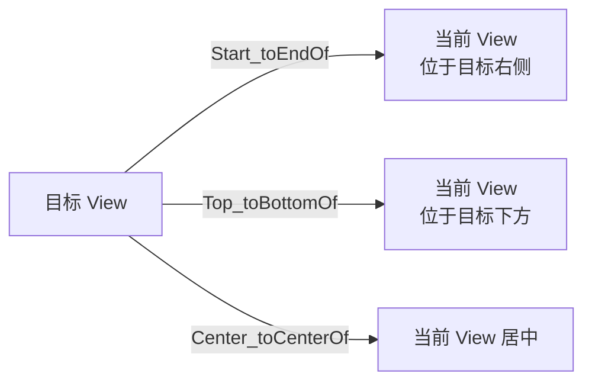

# ConstraintLayout 约束布局详解

> 面试高频指数：中 — ConstraintLayout 是官方主推的布局方案，约束、链、Guideline/Barrier 的使用与性能优势是布局优化的核心考点。

## 一、为什么用 ConstraintLayout

### 1.1 传统布局的痛点

| 问题 | 说明 |
|------|------|
| 嵌套过深 | LinearLayout 多层嵌套导致 measure/layout 递归开销大 |
| 布局僵硬 | 相对定位（RelativeLayout）只能相对兄弟节点，无法实现复杂约束 |
| 适配困难 | 屏幕尺寸多样，需要多个布局文件 |

### 1.2 ConstraintLayout 的核心优势

- **扁平化**：一个 ConstraintLayout 实现复杂布局，减少嵌套层级
- **约束体系**：任意 View 之间可建立相对关系，比 RelativeLayout 灵活
- **性能**：单次遍历测量，比多层嵌套的 LinearLayout 快
- **官方支持**：Android Studio 默认布局模板，Material 组件深度配合

```xml
<androidx.constraintlayout.widget.ConstraintLayout
    android:layout_width="match_parent"
    android:layout_height="match_parent">

    <TextView
        android:id="@+id/title"
        android:layout_width="wrap_content"
        android:layout_height="wrap_content"
        android:text="标题"
        app:layout_constraintTop_toTopOf="parent"
        app:layout_constraintStart_toStartOf="parent" />

    <TextView
        android:id="@+id/subtitle"
        android:layout_width="0dp"
        android:layout_height="wrap_content"
        android:text="副标题"
        app:layout_constraintTop_toBottomOf="@id/title"
        app:layout_constraintStart_toStartOf="@id/title"
        app:layout_constraintEnd_toEndOf="@id/title" />

</androidx.constraintlayout.widget.ConstraintLayout>
```

## 二、核心概念：约束

### 2.1 约束的建立

每个 View 至少需要 **水平方向 2 个 + 垂直方向 2 个** 约束才能确定位置：

| 属性 | 含义 |
|------|------|
| `layout_constraintStart_toStartOf` | 左边缘对齐目标左边缘 |
| `layout_constraintStart_toEndOf` | 左边缘对齐目标右边缘 |
| `layout_constraintEnd_toStartOf` | 右边缘对齐目标左边缘 |
| `layout_constraintEnd_toEndOf` | 右边缘对齐目标右边缘 |
| `layout_constraintTop_toTopOf` | 顶部对齐 |
| `layout_constraintBottom_toBottomOf` | 底部对齐 |
| `layout_constraintTop_toBottomOf` | 顶部贴目标底部（下方排列） |
| `layout_constraintBottom_toTopOf` | 底部贴目标顶部（上方排列） |
| `layout_constraintBaseline_toBaselineOf` | 文本基线对齐 |



### 2.2 约束缺失的表现

- 水平方向无约束：View 位置不确定（依赖测量顺序），可能出现错位
- 约束到 parent：用 `parent` 关键字表示父容器边缘
- **margin 方向敏感**：`layout_marginStart` 只在有 Start 约束时生效

## 三、偏移与居中

### 3.1 居中

```xml
<!-- 水平居中 + 垂直居中 -->
<Button
    android:id="@+id/center_btn"
    android:layout_width="wrap_content"
    android:layout_height="wrap_content"
    app:layout_constraintTop_toTopOf="parent"
    app:layout_constraintBottom_toBottomOf="parent"
    app:layout_constraintStart_toStartOf="parent"
    app:layout_constraintEnd_toEndOf="parent" />
```

### 3.2 偏移比例

```xml
<!-- 水平 30% 偏移 -->
<Button
    android:id="@+id/offset_btn"
    android:layout_width="wrap_content"
    android:layout_height="wrap_content"
    app:layout_constraintStart_toStartOf="parent"
    app:layout_constraintEnd_toEndOf="parent"
    app:layout_constraintTop_toTopOf="parent"
    app:layout_constraintBottom_toBottomOf="parent"
    app:layout_constraintHorizontal_bias="0.3" />
```

| 属性 | 作用 |
|------|------|
| `layout_constraintHorizontal_bias` | 水平偏移（0-1，默认 0.5 居中） |
| `layout_constraintVertical_bias` | 垂直偏移 |

## 四、链（Chain）

### 4.1 链的创建

多个 View 两两首尾相接（`Start_toEndOf` / `Top_toBottomOf`）即形成链：

```xml
<TextView android:id="@+id/a" app:layout_constraintStart_toStartOf="parent"
    app:layout_constraintEnd_toStartOf="@id/b" ... />
<TextView android:id="@+id/b" app:layout_constraintStart_toEndOf="@id/a"
    app:layout_constraintEnd_toStartOf="@id/c" ... />
<TextView android:id="@+id/c" app:layout_constraintStart_toEndOf="@id/b"
    app:layout_constraintEnd_toEndOf="parent" ... />
```

### 4.2 链的类型

| 链类型 | 样式 | 行为 |
|--------|------|------|
| `spread`（默认） | 均匀分布 | 元素间等距排列 |
| `spread_inside` | 两端贴边 | 两端贴容器，中间元素均匀分布 |
| `packed` | 打包居中 | 元素紧贴成组，整体居中（可配 bias） |
| `weighted` | 权重分配 | 配合 0dp 按权重填充剩余空间 |

```xml
<!-- 权重链：b 占满剩余宽度 -->
<TextView
    android:id="@+id/b"
    android:layout_width="0dp"
    app:layout_constraintHorizontal_weight="1" ... />
```

## 五、比例与尺寸

### 5.1 宽高比

```xml
<!-- 宽高比约束：宽 = 高的 1.5 倍 -->
<ImageView
    android:layout_width="0dp"
    android:layout_height="0dp"
    app:layout_constraintDimensionRatio="1.5"
    app:layout_constraintStart_toStartOf="parent"
    app:layout_constraintEnd_toEndOf="parent"
    app:layout_constraintTop_toTopOf="parent"
    app:layout_constraintBottom_toBottomOf="parent" />
```

### 5.2 尺寸模式

| 模式 | 写法 | 行为 |
|------|------|------|
| wrap_content | `wrap_content` | 内容包裹 |
| match_parent | `match_parent` | 建议改用 0dp + 约束 |
| match_constraint | `0dp` | 按约束填充（性能更好） |
| 比例 | `app:layout_constraintDimensionRatio` | 按比例计算 |

> 关键点：ConstraintLayout 中 `match_parent` 与 `0dp` 有细微差异，官方建议**用 0dp + 约束替代 match_parent**，测量更高效且符合约束语义。

## 六、辅助工具：Guideline 与 Barrier

### 6.1 Guideline（参考线）

```xml
<!-- 垂直参考线：位于父容器 50% 处 -->
<androidx.constraintlayout.widget.Guideline
    android:id="@+id/guideline_vertical"
    android:orientation="vertical"
    android:layout_width="wrap_content"
    android:layout_height="wrap_content"
    app:layout_constraintGuide_percent="0.5" />
```

Guideline 定位方式：

| 属性 | 说明 |
|------|------|
| `layout_constraintGuide_begin` | 距左边距固定 dp |
| `layout_constraintGuide_end` | 距右边距固定 dp |
| `layout_constraintGuide_percent` | 按父容器百分比（0-1） |

### 6.2 Barrier（屏障）

```xml
<!-- 屏障：跟随多个 View 的最右侧（动态边界） -->
<androidx.constraintlayout.widget.Barrier
    android:id="@+id/barrier_end"
    android:layout_width="wrap_content"
    android:layout_height="wrap_content"
    app:barrierDirection="end"
    app:constraint_referenced_ids="title,subtitle" />
```

- **Barrier 解决"哪个 View 更宽不确定"的问题**，自动取引用 View 的最外边界
- 常配合文本自适应内容长度的场景（标签 + 内容）

### 6.3 其他辅助类

| 工具 | 作用 |
|------|------|
| `Group` | 批量控制一组 View 的可见性 |
| `Placeholder` | 占位，运行时替换内容 |
| `Flow` | 流式布局（自动换行排列） |

## 七、性能与优化

### 7.1 性能对比

| 布局 | 测量特点 | 适用 |
|------|----------|------|
| LinearLayout | 层级嵌套时递归测量 | 简单线性排列 |
| RelativeLayout | 两次遍历测量（measure 两次） | 相对定位 |
| ConstraintLayout | 单次遍历 + 约束求解 | 复杂布局首选 |

### 7.2 优化建议

- 减少嵌套：`<include>` 复用 + ConstraintLayout 扁平化
- 用 `0dp` 代替 `match_parent`，配合约束
- 图片用 `layout_constraintDimensionRatio` 固定宽高比，避免测量跳动
- 复杂列表 Item 尽量扁平，减少 measure/layout 次数
- 配合 `tools:layout_editor_absoluteX` 只在编辑器生效，不影响运行

## 八、高频面试题

### Q1：ConstraintLayout 相比 LinearLayout/RelativeLayout 有什么优势？
::: details 查看答案
① 布局扁平化：单个 ConstraintLayout 可替代多层嵌套的 LinearLayout，减少 measure/layout 递归开销；② 灵活约束：支持任意 View 间的相对约束、链、比例、Guideline/Barrier，比 RelativeLayout 表达能力更强；③ 性能：ConstraintLayout 测量一次完成（RelativeLayout 需两次），复杂布局性能更好；④ 官方推荐：Android Studio 模板默认使用，与 Material 组件深度整合。
:::

### Q2：ConstraintLayout 中 wrap_content、match_parent、0dp 有什么区别？
::: details 查看答案
wrap_content 按内容确定尺寸；match_parent 填满父容器；0dp（match_constraint）表示尺寸由约束决定：两端都有约束时按约束填充，配 weight 时可分配剩余空间，配 ratio 时按比例计算。官方建议用 0dp + 约束替代 match_parent：语义更清晰、测量更高效，且 0dp 才能配合 bias、chain、ratio 等高级特性。
:::

### Q3：链（Chain）有哪些类型？weighted 链怎么实现？
::: details 查看答案
链类型：spread（默认，元素等距分布）、spread_inside（两端贴边，中间均匀）、packed（打包居中，可配 bias）、weighted（权重分配）。weighted 链实现：链中元素设置 layout_width="0dp"（水平链），并通过 layout_constraintHorizontal_weight 分配权重，权重大的占剩余空间多。垂直链同理用 layout_height="0dp" + layout_constraintVertical_weight。
:::

### Q4：Guideline 和 Barrier 有什么区别？
::: details 查看答案
Guideline 是固定/百分比参考线，位置固定不变（begin/end/percent 三种定位方式），其他 View 约束到它实现统一对齐；Barrier 是动态屏障，位置跟随引用的一组 View 的外边界（end/start/top/bottom 方向），解决"多个 View 中最宽/最窄的那个不确定"的问题。典型场景：Barrier 放在可能变长的两个 TextView 右侧，后续 View 约束到 Barrier 实现自适应布局。
:::

### Q5：ConstraintLayout 有哪些性能优化建议？
::: details 查看答案
① 尽量扁平化，避免深嵌套；② 用 0dp + 约束替代 match_parent；③ 列表 Item 用 ConstraintLayout 减少层级，用 ConstraintSet 做动画避免重复 inflate；④ 图片等固定比例用 dimensionRatio；⑤ Guideline/Barrier 不参与测量（无尺寸），成本低；⑥ 避免在 ConstraintLayout 中使用 wrap_content 的嵌套链导致循环测量；⑦ 用 tools 属性只影响编辑视图。
:::

## 九、小结

ConstraintLayout 要点：

1. 约束决定位置：水平 + 垂直各 2 个约束
2. bias 控制偏移、Chain 控制排列、ratio 控制比例
3. 0dp = match_constraint，配合权重/比例使用
4. Guideline 固定参考线、Barrier 动态屏障
5. 扁平化 + 少嵌套 = 更好的测量性能

相关阅读：[View 绘制流程详解](/ui/view/view-draw-process.md)、[布局优化实战](/ui/layout/layout-optimization.md)、[布局选型与性能对比](/ui/layout/layout-selection.md)、[屏幕适配方案](/ui/layout/screen-adaptation.md)。
