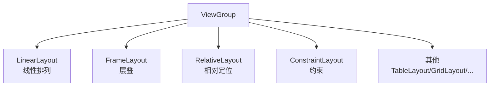
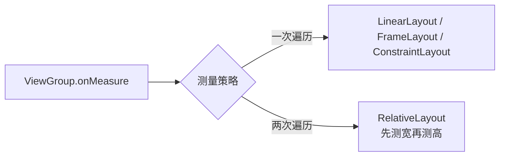
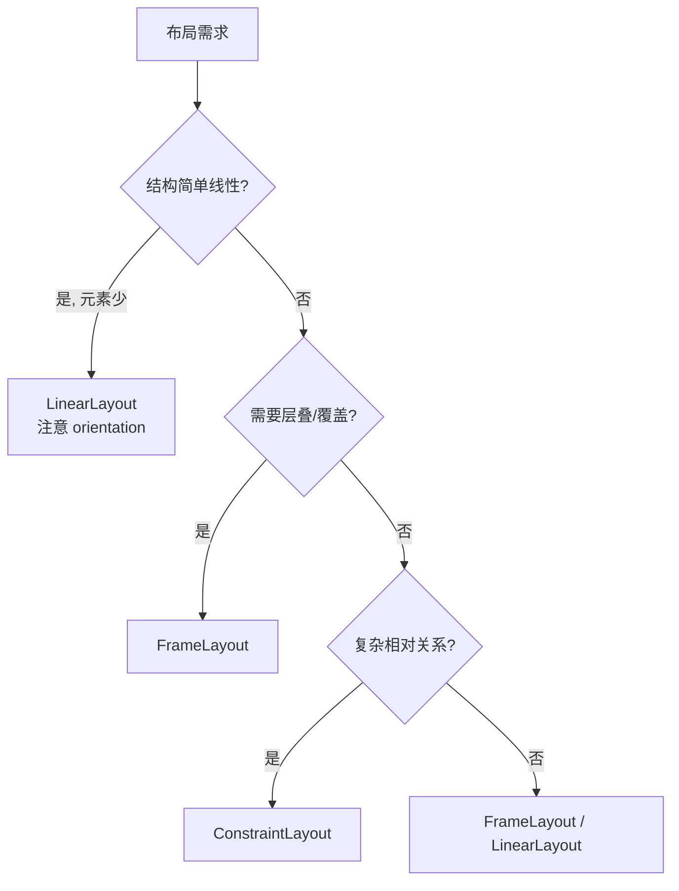

# 布局选型与性能对比

> 面试高频指数：中 — "为什么说 ConstraintLayout 性能好？RelativeLayout 为什么 measure 两次？"布局选型是布局优化面试的基础题。

## 一、四大基础布局概览

### 1.1 布局体系



| 布局 | 特点 | 典型场景 |
|------|------|----------|
| LinearLayout | 横/竖线性排列，weight 权重 | 简单线性 UI、按钮组 |
| FrameLayout | 层叠布局，后添加在上层 | 页面容器、Fragment 宿主 |
| RelativeLayout | 相对兄弟/父容器定位 | 复杂相对关系（已被 Constraint 替代） |
| ConstraintLayout | 约束 + 链 + 比例 | 复杂界面首选 |

## 二、各布局的测量成本

### 2.1 measure 阶段的开销



**RelativeLayout 的两次测量**：

- 第一次遍历：测量所有子 View 的**宽度**（因为子 View 的宽可能依赖相对关系）
- 第二次遍历：测量所有子 View 的**高度**
- 代价：子 View 数量多时测量成本翻倍

**LinearLayout 的测量**：

- 水平布局：先测高再测宽（或反之），同样可能两次遍历
- 有 weight 的子 View 需要**二次测量**（先测其他子 View，再按剩余空间分配）

### 2.2 测量成本对比

| 布局 | 测量次数 | 说明 |
|------|----------|------|
| FrameLayout | 1 次 | 子 View 不依赖彼此 |
| ConstraintLayout | 1 次（优化后） | 约束求解器一次求解 |
| LinearLayout | 1-2 次 | weight 时二次测量 |
| RelativeLayout | 2 次 | 宽高分两轮 |

> 关键点：布局性能主要看**测量遍历次数 × 子 View 数量 × 嵌套层级**。深嵌套的 LinearLayout 比单层 ConstraintLayout 慢得多。

## 三、选型决策树

### 3.1 按需求选型



### 3.2 选型建议表

| 场景 | 推荐 | 原因 |
|------|------|------|
| 两个按钮横排 | LinearLayout | 简单直接 |
| 页签指示器 | LinearLayout | 线性排列 + weight |
| 页面根容器 | FrameLayout | 层叠 + 轻量 |
| 圆角背景卡片 | FrameLayout + shape | 背景层 + 内容层 |
| 复杂表单页 | ConstraintLayout | 减少嵌套 |
| 列表 Item | ConstraintLayout | 扁平化，滚动性能 |
| 混合布局 | ConstraintLayout | 一条链搞定 |

## 四、层级优化实践

### 4.1 用 lint 检测嵌套

```bash
# 层级检查
./gradlew lint
# 输出 "Nested weights are bad for performance" 等警告
```

### 4.2 include 复用

```xml
<!-- 复用头部布局 -->
<include
    layout="@layout/view_toolbar"
    android:layout_width="match_parent"
    android:layout_height="wrap_content" />

<!-- include 中覆盖属性 -->
<include
    layout="@layout/view_card"
    android:layout_width="match_parent"
    android:layout_height="wrap_content"
    android:layout_margin="12dp" />
```

### 4.3 merge 减少层级

```xml
<!-- merge 标签：消除 include 产生的多余层级 -->
<?xml version="1.0" encoding="utf-8"?>
<merge xmlns:android="http://schemas.android.com/apk/res/android">
    <TextView
        android:layout_width="wrap_content"
        android:layout_height="wrap_content"
        android:text="标题" />
    <ImageView
        android:layout_width="wrap_content"
        android:layout_height="wrap_content" />
</merge>
```

> merge 直接展开到父布局，不产生额外 ViewGroup 节点；只能作为 include 的根或布局根。

### 4.4 ViewStub 延迟加载

```xml
<!-- 初始不可见，按需 inflate -->
<ViewStub
    android:id="@+id/stub_ad"
    android:layout="@layout/view_ad"
    android:layout_width="match_parent"
    android:layout_height="wrap_content" />
```

```kotlin
// 使用时才 inflate（只 inflate 一次）
val adView = findViewById<ViewStub>(R.id.stub_ad).inflate()
```

## 五、性能优化清单

| 优化项 | 做法 | 收益 |
|--------|------|------|
| 减少嵌套 | ConstraintLayout 扁平化 | 降低测量递归 |
| 避免 weight 嵌套 | 嵌套 weight 二次测量 | 提升 measure 速度 |
| 避免过度绘制 | 背景裁剪、透明层级合并 | 提升 draw 速度 |
| 延迟加载 | ViewStub | 减少初始 inflate |
| 复用布局 | include + merge | 代码维护 + 层级 |
| 固定尺寸 | 图片固定宽高，避免重复测量 | 列表滚动流畅 |

## 六、高频面试题

### Q1：RelativeLayout 为什么 measure 两次？ConstrainLayout 为什么不用？
::: details 查看答案
RelativeLayout 的子 View 可以相对其他子 View 定位，测量时无法一次确定所有子 View 的尺寸：第一轮先测所有子 View 的宽度，第二轮再测高度（因为高度可能依赖宽度结果）。ConstrainLayout 用约束求解器（ConstraintSolver）一次性求解所有约束关系，无需分两轮，所以单次遍历即可完成测量，子 View 多时性能优势明显。
:::

### Q2：LinearLayout 的 weight 为什么会导致二次测量？
::: details 查看答案
weight 分配规则是"先测量所有非 weight 子 View，剩余空间按权重分配给 weight 子 View"：第一轮测量非 weight 子 View 确定总占用，第二轮用剩余空间计算 weight 子 View 的尺寸。若 LinearLayout 再嵌套一层 weight LinearLayout，每层都会二次测量，测量成本成倍增加。所以官方建议避免嵌套 weight，或改用 ConstraintLayout 的链。
:::

### Q3：include、merge、ViewStub 各有什么作用？
::: details 查看答案
include 用于复用布局代码，按需覆盖属性，但不减少层级；merge 用于消除 include 引入的多余 ViewGroup 层级（合并到父布局直接展开，要求父布局能容纳其子 View 类型）；ViewStub 是轻量占位视图，初始不 inflate（零成本），调用 inflate() 时按需加载且只加载一次，之后 ViewStub 被替换为目标布局，适合广告位、高级功能等低频 UI。
:::

### Q4：如何排查布局性能问题？
::: details 查看答案
① 用 Layout Inspector 查看 View 层级树，找出过深嵌套；② 用开发者选项的"显示布局边界"直观查看层级；③ lint 检查 "Nested weights" 等性能警告；④ 用 Profile GPU Rendering 观察布局阶段耗时；⑤ 配合 Systrace 抓取 measure/layout 阶段 trace，定位高耗时节点；⑥ 列表 Item 复用 + 扁平化，避免 inflate 开销。
:::

### Q5：为什么说 ConstraintLayout 是列表 Item 的最佳选择？
::: details 查看答案
列表 Item 会被大量实例化和滚动重建，性能敏感：① ConstraintLayout 扁平化减少嵌套，measure/layout 开销小；② 单次测量，避免 RelativeLayout 两次遍历；③ 一个布局文件适配多种屏幕，避免多套 Item 布局；④ 支持 Guideline/Barrier 等辅助工具实现自适应；⑤ 与 RecyclerView 配合可用 ConstraintSet 做 Item 内动画，避免额外动画布局。
:::

## 七、小结

布局选型要点：

1. 简单线性用 LinearLayout，层叠用 FrameLayout
2. 复杂相对关系用 ConstraintLayout，避免 RelativeLayout
3. 测量成本：ConstraintLayout ≈ FrameLayout < LinearLayout < RelativeLayout
4. 优化三板斧：扁平化、include/merge 复用、ViewStub 延迟加载
5. 列表 Item 首选 ConstraintLayout

相关阅读：[View 绘制流程详解](/ui/view/view-draw-process.md)、[ConstraintLayout 约束布局详解](/ui/layout/constraintlayout-guide.md)、[布局优化实战](/ui/layout/layout-optimization.md)、[MeasureSpec 完全解析](/ui/view/measurespec.md)。
