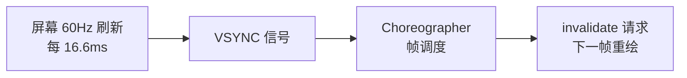
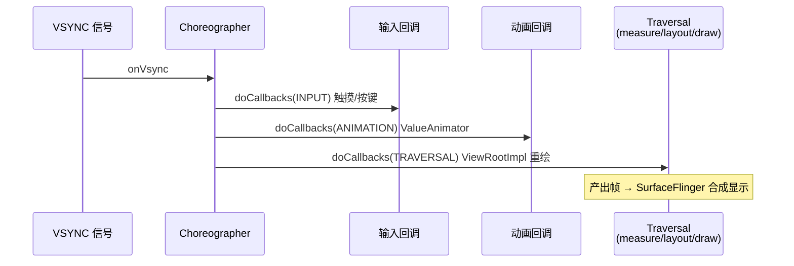
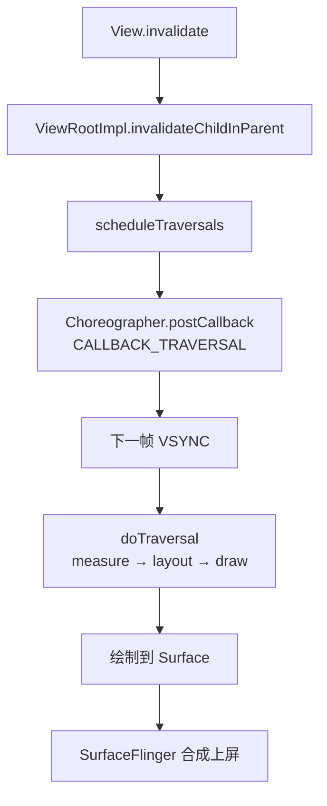
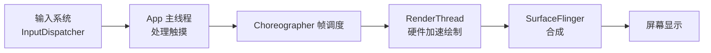

# Choreographer 帧调度机制

> 面试高频指数：高 — "Choreographer 是什么？VSYNC 与 doFrame 的关系？如何检测掉帧？"是渲染原理面试的核心题，也是性能优化必问。

## 一、为什么需要 Choreographer

### 1.1 问题背景

Android 渲染需要与屏幕刷新同步：



- 屏幕固定 60Hz（或 90/120Hz）刷新
- 绘制与刷新不同步会产生**撕裂（tearing）**和卡顿
- Choreographer 统一协调：**输入、动画、绘制**都在 VSYNC 时刻执行

### 1.2 Choreographer 的职责

| 职责 | 说明 |
|------|------|
| 接收 VSYNC | 系统每帧通过 DisplayEventReceiver 回调 |
| 帧回调调度 | doFrame 按顺序执行 3 类回调 |
| 协调三阶段 | 输入处理 → 动画 → 绘制 |
| 掉帧检测 | 计算错过帧数，回调 FrameCallback |

## 二、VSYNC 与帧调度

### 2.1 VSYNC 是什么

**VSYNC（Vertical Synchronization，垂直同步）**：屏幕刷新完成一帧后发出的同步信号。

- 60Hz 屏幕：每秒 60 次 VSYNC，间隔约 16.6ms
- 高刷屏：90Hz = 11.1ms，120Hz = 8.3ms
- 系统在 VSYNC 时刻统一派发帧任务，避免绘制一半被扫描

### 2.2 doFrame 的执行

::: code-tabs

@tab:active Java

```java
// Choreographer 内部核心：每帧执行
private void doFrame(long frameTimeNanos, FrameInfo frame) {
    long intendedFrameTimeNanos = frameTimeNanos;
    // 计算掉帧数（当前帧时间 - 期望帧时间）
    long jitterNanos = frameTimeNanos - intendedFrameTimeNanos;
    if (jitterNanos >= SKIPPED_FRAME_WARNING_LIMIT) {
        // 超过 32ms 视为掉帧，log 警告
        Log.i("Choreographer", "Skipped " + frames + " frames!");
    }

    // 1. 输入事件回调（INPUT）
    doCallbacks(Choreographer.CALLBACK_INPUT, frameTimeNanos);
    // 2. 动画回调（ANIMATION）
    doCallbacks(Choreographer.CALLBACK_ANIMATION, frameTimeNanos);
    // 3. 遍历/测量/绘制请求（TRAVERSAL）
    doCallbacks(Choreographer.CALLBACK_TRAVERSAL, frameTimeNanos);
}
```

@tab Kotlin

```kotlin
// Choreographer 内部核心：每帧执行
private fun doFrame(frameTimeNanos: Long, frame: FrameInfo?) {
    val intendedFrameTimeNanos = frameTimeNanos
    // 计算掉帧数（当前帧时间 - 期望帧时间）
    val jitterNanos = frameTimeNanos - intendedFrameTimeNanos
    if (jitterNanos >= SKIPPED_FRAME_WARNING_LIMIT) {
        // 超过 32ms 视为掉帧，log 警告
        Log.i("Choreographer", "Skipped $frames frames!")
    }

    // 1. 输入事件回调（INPUT）
    doCallbacks(Choreographer.CALLBACK_INPUT, frameTimeNanos)
    // 2. 动画回调（ANIMATION）
    doCallbacks(Choreographer.CALLBACK_ANIMATION, frameTimeNanos)
    // 3. 遍历/测量/绘制请求（TRAVERSAL）
    doCallbacks(Choreographer.CALLBACK_TRAVERSAL, frameTimeNanos)
}
```

:::

### 2.3 三类回调顺序



> 关键点：所有 UI 工作（触摸响应、动画、布局绘制）都被压缩到**同一帧的 VSYNC 窗口**内完成，保证一致性。

## 三、invalidate 与帧请求

### 3.1 View.invalidate 的完整链路



### 3.2 关键 API

| API | 作用 |
|-----|------|
| `postFrameCallback(cb)` | 下一帧回调（每帧一次） |
| `postFrameCallbackDelayed(cb, delay)` | 延迟指定毫秒回调 |
| `postCallback(type, cb)` | 指定类型回调（输入/动画/遍历） |
| `removeFrameCallback(cb)` | 移除帧回调 |

::: code-tabs

@tab:active Java

```java
// 自定义 FPS 统计：每帧回调
public class FpsTracker {
    private int frameCount = 0;
    private long startTime = 0;
    private float fps = 0f;

    public void start() {
        startTime = System.nanoTime();
        Choreographer.getInstance().postFrameCallback(this::onFrame);
    }

    private void onFrame(long frameTimeNanos) {
        frameCount++;
        long elapsed = (frameTimeNanos - startTime) / 1_000_000;
        if (elapsed >= 1000) {
            fps = frameCount * 1000f / elapsed;
            Log.d("Fps", "FPS: " + fps);
            frameCount = 0;
            startTime = frameTimeNanos;
        }
        // 持续注册下一帧
        Choreographer.getInstance().postFrameCallback(this::onFrame);
    }
}
```

@tab Kotlin

```kotlin
// 自定义 FPS 统计：每帧回调
class FpsTracker {
    private var frameCount = 0
    private var startTime = 0L
    private var fps = 0f

    fun start() {
        startTime = System.nanoTime()
        Choreographer.getInstance().postFrameCallback(::onFrame)
    }

    private fun onFrame(frameTimeNanos: Long) {
        frameCount++
        val elapsed = (frameTimeNanos - startTime) / 1_000_000
        if (elapsed >= 1000) {
            fps = frameCount * 1000f / elapsed
            Log.d("Fps", "FPS: $fps")
            frameCount = 0
            startTime = frameTimeNanos
        }
        // 持续注册下一帧
        Choreographer.getInstance().postFrameCallback(::onFrame)
    }
}
```

:::

## 四、掉帧（Jank）分析

### 4.1 掉帧的原因

| 原因 | 说明 |
|------|------|
| 主线程耗时 | 大量计算、IO、反射阻塞消息队列 |
| 布局过重 | measure/layout 遍历开销大 |
| 过度绘制 | 多层透明叠加，GPU 负载高 |
| GC 频繁 | 内存抖动触发 GC 暂停 |
| 锁竞争 | Binder 调用同步等待 |
| 资源加载 | 主线程 decode 大图 |

### 4.2 掉帧检测手段

::: code-tabs

@tab:active Java

```java
// 方式一：Choreographer 帧间隔检测
final AtomicLong lastFrameTime = new AtomicLong(0);
Choreographer.getInstance().postFrameCallback(new Choreographer.FrameCallback() {
    @Override
    public void doFrame(long frameTimeNanos) {
        long last = lastFrameTime.get();
        if (last != 0L) {
            long gapMs = (frameTimeNanos - last) / 1_000_000;
            if (gapMs > 50) {
                Log.w("Jank", "掉帧: 帧间隔 " + gapMs + "ms");
            }
        }
        lastFrameTime.set(frameTimeNanos);
        Choreographer.getInstance().postFrameCallback(this);
    }
});
```

@tab Kotlin

```kotlin
// 方式一：Choreographer 帧间隔检测
val lastFrameTime = AtomicLong(0)
Choreographer.getInstance().postFrameCallback(object : Choreographer.FrameCallback {
    override fun doFrame(frameTimeNanos: Long) {
        val last = lastFrameTime.get()
        if (last != 0L) {
            val gapMs = (frameTimeNanos - last) / 1_000_000
            if (gapMs > 50) {
                Log.w("Jank", "掉帧: 帧间隔 ${gapMs}ms")
            }
        }
        lastFrameTime.set(frameTimeNanos)
        Choreographer.getInstance().postFrameCallback(this)
    }
})
```

:::

| 工具 | 用途 |
|------|------|
| `adb shell dumpsys gfxinfo <pkg> framestats` | 帧耗时统计 |
| Systrace / Perfetto | 主线程与渲染线程 trace |
| 开发者选项"GPU 呈现模式分析" | 柱状图直观看帧耗时 |
| JankStats（Jetpack） | 业务侧帧统计 |

## 五、Choreographer 与动画/渲染协作

### 5.1 ValueAnimator 的驱动

::: code-tabs

@tab:active Java

```java
// ValueAnimator 内部：通过 Choreographer 每帧驱动
private void startAnimation() {
    mLastFrameTime = 0;
    postAnimationCallback();   // 注册 ANIMATION 类型回调
}

private void postAnimationCallback() {
    mChoreographer.postCallback(
            Choreographer.CALLBACK_ANIMATION, mAnimateFromValueCallback, null);
}
```

@tab Kotlin

```kotlin
// ValueAnimator 内部：通过 Choreographer 每帧驱动
private fun startAnimation() {
    mLastFrameTime = 0
    postAnimationCallback()   // 注册 ANIMATION 类型回调
}

private fun postAnimationCallback() {
    mChoreographer.postCallback(
        Choreographer.CALLBACK_ANIMATION, mAnimateFromValueCallback, null)
}
```

:::

### 5.2 输入处理与渲染管线



Android 8.0+ 引入 RenderThread：**绘制命令（DrawCall）在渲染线程异步执行**，与主线程解耦，主线程只负责构建显示列表。

## 六、高频面试题

### Q1：Choreographer 是什么？它的作用是什么？
::: details 查看答案
Choreographer（编舞者）是 Android 的帧调度器，负责在 VSYNC 信号的驱动下协调 UI 帧的生成：① 接收系统 VSYNC 回调（通过 DisplayEventReceiver）；② 按顺序执行三类回调：输入（INPUT）、动画（ANIMATION）、遍历绘制（TRAVERSAL）；③ View.invalidate 通过它 postCallback 注册下一帧的重绘任务；④ 动画（ValueAnimator）通过它每帧驱动；⑤ 能检测掉帧（帧间隔超过 32ms 打日志）。它是"UI 流畅性"的核心枢纽，所有界面更新最终都汇总到它调度。
:::

### Q2：什么是 VSYNC？为什么需要它？
::: details 查看答案
VSYNC（垂直同步）是屏幕完成一帧刷新后发出的同步信号：① 屏幕以固定频率刷新（60/90/120Hz），VSYNC 标记"可以开始准备下一帧"的时刻；② 没有 VSYNC 时，绘制和扫描可能错位导致撕裂（tearing，屏幕上半是旧帧下半是新帧）；③ 系统在 VSYNC 时刻统一派发输入、动画、绘制任务，保证一帧内内容一致；④ 高刷屏 VSYNC 频率更高，每帧时间更短，对主线程耗时更敏感（120Hz 只有 8.3ms）。
:::

### Q3：View.invalidate() 之后发生了什么？为什么不是立即重绘？
::: details 查看答案
invalidate 只是把 View 标记为脏（dirty），并不会立即重绘：① invalidate → ViewRootImpl.scheduleTraversals → Choreographer.postCallback(CALLBACK_TRAVERSAL)；② 等下一帧 VSYNC 到来，Choreographer 回调 doFrame，执行 doTraversal：measure → layout → draw；③ 这样把多次 invalidate 合并到一帧执行，避免重复绘制；④ invalidate 只能在主线程调用（线程检查），requestLayout 则会触发 measure+layout。延迟重绘的机制保证了 60fps 下的绘制效率。
:::

### Q4：如何检测和定位掉帧？
::: details 查看答案
① Choreographer.postFrameCallback 自己统计帧间隔（>16.6ms 即可能掉帧，>50ms 明显卡顿），标记可疑时间段；② adb shell dumpsys gfxinfo framestats 查看每帧耗时分布（draw/process/execute 阶段）；③ Systrace/Perfetto 抓主线程和渲染线程 trace，定位耗时方法；④ 开发者选项 GPU 呈现模式分析看柱状图；⑤ Jetpack JankStats 接入线上帧统计。定位后常见优化：去嵌套、减少过度绘制、图片压缩、避免主线程 IO、减少对象分配。
:::

### Q5：Choreographer 的 doFrame 里三类回调为什么按 INPUT → ANIMATION → TRAVERSAL 的顺序？
::: details 查看答案
这个顺序保证一帧内的一致性：① 先处理输入（触摸/按键），让最新的交互状态进入；② 再执行动画（ValueAnimator 等），基于最新输入计算动画值；③ 最后遍历绘制（measure/layout/draw），把输入和动画的结果绘制到屏幕。如果顺序颠倒或并行，可能出现"动画先于输入"导致位置错乱。同时每帧只做一次遍历，把多次 invalidate 合并，是保证 60fps 流畅度的关键设计。
:::

## 七、小结

Choreographer 要点：

1. 帧调度器：VSYNC 驱动，协调输入/动画/绘制
2. 三类回调：INPUT → ANIMATION → TRAVERSAL
3. invalidate 不立即重绘，合并到下一帧
4. 掉帧 = 帧间隔超过 16.6ms，用 FrameCallback 检测
5. RenderThread 承担绘制，主线程只构建显示列表
6. 流畅性优化的核心工具

相关阅读：[渲染原理与流程详解](/ui/render/render-principle.md)、[硬件加速渲染详解](/ui/render/hardware-acceleration.md)、[View 绘制流程详解](/ui/view/view-draw-process.md)、[插值器与估值器原理](/ui/animation/interpolator-evaluator.md)。
