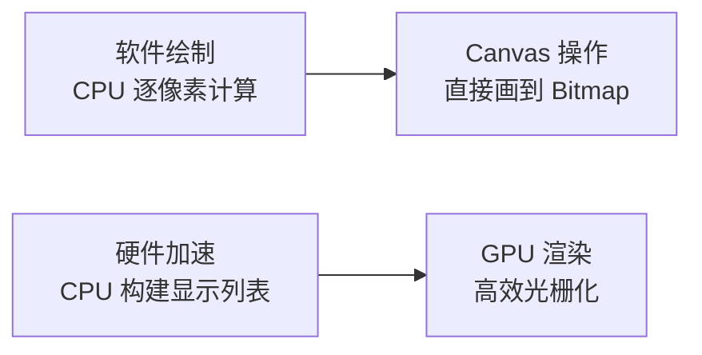
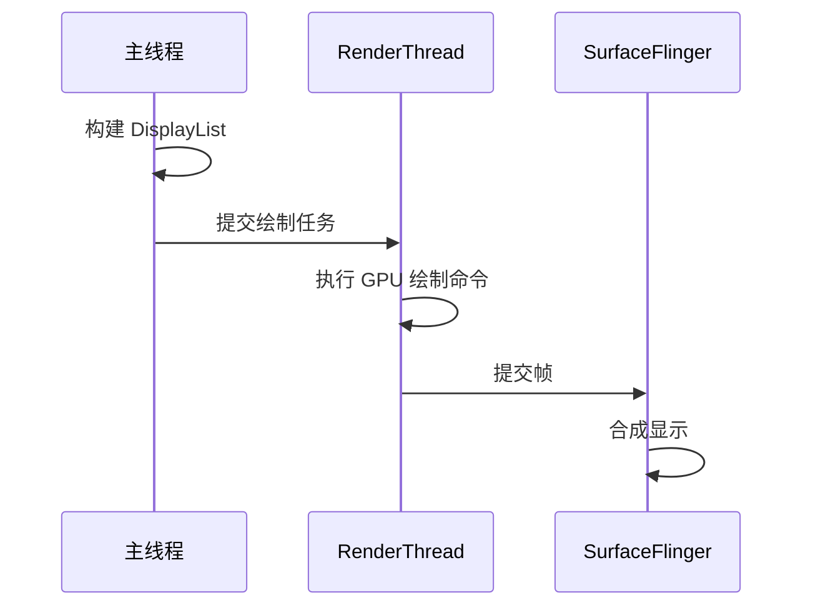
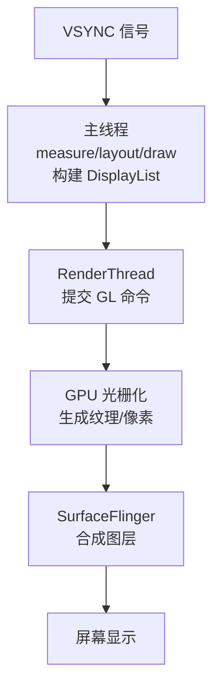
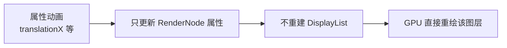

# 硬件加速渲染详解

> 面试高频指数：高 — "什么是硬件加速？DisplayList 是什么？为什么说 Canvas 绘制有兼容性限制？"是渲染原理面试核心题。

## 一、什么是硬件加速

### 1.1 定义

**硬件加速（Hardware Acceleration）**：将 View 的绘制工作从 CPU（软件绘制）迁移到 GPU（图形处理器），通过 OpenGL/DirectX 等图形 API 完成。



| 维度 | 软件绘制 | 硬件加速 |
|------|----------|----------|
| 执行者 | CPU | GPU |
| 绘制方式 | 逐像素光栅化 | 显示列表 + 纹理缓存 |
| 复杂图形 | 慢 | 快（GPU 并行） |
| 动画 | 每帧全量重绘 | 只更新变化部分 |
| 兼容性 | 全支持 | 部分 API 限制 |

### 1.2 开启方式

```xml
<!-- 全局开启（默认开启） -->
<application android:hardwareAccelerated="true" />

<!-- 单个 Activity 开启 -->
<activity android:hardwareAccelerated="true" />

<!-- 单个 View 无法直接控制，需在层级中控制 -->
```

Android 4.0+ 默认开启，3.0-3.2 需要显式配置。

## 二、硬件加速的渲染管线

### 2.1 显示列表（DisplayList）

**DisplayList** 是硬件加速的核心概念：View 的绘制操作被记录为**绘制指令序列**，而非直接执行。


优势：

- **指令可缓存**：View 未变化时跳过 onDraw 直接复用
- **局部更新**：只重绘脏区域对应的指令
- **减少 CPU 开销**：onDraw 不必每帧执行

### 2.2 RenderThread（渲染线程）

Android 8.0+ 引入 RenderThread：



**作用**：把 GPU 绘制命令从主线程分离，主线程不被绘制阻塞，动画更流畅。

## 三、GPU 绘制流程

### 3.1 完整帧流程



### 3.2 硬件加速下的关键优化

| 优化 | 原理 |
|------|------|
| 纹理缓存 | Bitmap 上传 GPU 纹理后复用，避免重复上传 |
| 脏区域重绘 | 只更新变化区域对应的指令 |
| 属性动画优化 | alpha/translation 等属性动画只更新属性，不重建 DisplayList |
| 图层合成 | 复杂效果用 RenderNode/Layer 离线合成 |

## 四、硬件加速的限制

### 4.1 不支持的 Canvas API

硬件加速下部分 API 不支持（会被忽略或抛异常）：

| API | 限制 |
|-----|------|
| `drawPicture` | 不支持 |
| `drawTextOnPath` | 部分支持 |
| `saveLayer` 复杂用法 | 有兼容性差异 |
| `setMaskFilter` | 不支持（API 28 移除） |
| `setShadowLayer` | 有替代方案 |
| 软件抗锯齿 | 部分不支持 |
| Xfermode 某些模式 | 部分限制 |

> 关键点：`Canvas.isHardwareAccelerated()` 可判断当前是否硬件加速，兼容性处理时先判断再降级。

### 4.2 关闭硬件加速的场景

| 场景 | 原因 |
|------|------|
| 大量使用不支持的 API | 需要软件绘制兼容 |
| 极端兼容性要求 | 旧设备 GPU 驱动问题 |
| 特定动画效果 | 需要 CPU 精确控制 |

::: code-tabs

@tab:active Java

```java
// 在 View 层面关闭（API 11+）
view.setLayerType(View.LAYER_TYPE_SOFTWARE, null);
```

@tab Kotlin

```kotlin
// 在 View 层面关闭（API 11+）
view.setLayerType(View.LAYER_TYPE_SOFTWARE, null)
```

:::

| LayerType | 说明 |
|-----------|------|
| `LAYER_TYPE_NONE` | 默认，不设图层 |
| `LAYER_TYPE_SOFTWARE` | 软件渲染到 Bitmap 图层 |
| `LAYER_TYPE_HARDWARE` | GPU 渲染到硬件图层（可做离屏缓存） |

## 五、硬件加速与动画性能

### 5.1 属性动画为什么流畅



- 软件绘制：每帧重绘整个 View（CPU 压力大）
- 硬件加速：alpha/translation/scale 等**属性动画只更新属性节点**，GPU 合成时直接应用变换，动画流畅

### 5.2 最佳实践

| 实践 | 说明 |
|------|------|
| 用属性动画而非补间动画 | 硬件加速更友好 |
| 避免每帧创建对象 | 减少 GC 影响 |
| 复杂图形离屏缓存 | setLayerType(HARDWARE) |
| 减少过度绘制 | 避免多层透明叠加 |
| 大图用 RGB_565 | 减少纹理内存 |

## 六、高频面试题

### Q1：什么是硬件加速？和软件绘制有什么区别？
::: details 查看答案
硬件加速把 View 绘制从 CPU 迁移到 GPU 执行：CPU 只负责构建绘制指令（DisplayList），GPU 负责光栅化渲染。区别：① 软件绘制用 Canvas 直接画到 Bitmap（CPU 逐像素计算），硬件加速记录指令后由 GPU 并行处理；② 硬件加速支持显示列表缓存、脏区域更新、纹理复用，复杂界面性能更好；③ 动画方面硬件加速只更新属性节点，不重绘整帧；④ 兼容性：硬件加速对部分 Canvas API 有限制。Android 4.0+ 默认开启。
:::

### Q2：DisplayList 是什么？它有什么作用？
::: details 查看答案
DisplayList（显示列表）是硬件加速下的绘制指令集合：View 的 onDraw 中调用 Canvas API 时，不直接绘制而是把操作记录成指令列表（如 drawRect、drawBitmap、translate 等）。作用：① 指令可缓存，View 无变化时复用列表，跳过 onDraw；② 局部更新，只重绘变化区域对应的指令；③ 属性动画（alpha/translation）只更新节点属性，不必重建列表；④ RenderThread 根据列表提交 GPU 绘制命令，减少主线程负担。
:::

### Q3：RenderThread 是做什么的？为什么需要它？
::: details 查看答案
RenderThread（渲染线程）是 Android 8.0+ 引入的独立线程，负责执行 GPU 绘制命令：主线程构建完 DisplayList 后提交给 RenderThread，RenderThread 调用 OpenGL API 完成光栅化并把帧提交给 SurfaceFlinger。好处：① 主线程与绘制并行，主线程不被 GPU 绘制阻塞；② 动画期间主线程可继续处理输入和布局，提升响应性；③ 绘制命令批量提交，减少 IPC 开销。这是"主线程不卡、渲染不卡"并行架构的关键。
:::

### Q4：硬件加速下哪些 Canvas API 不可用？怎么处理？
::: details 查看答案
硬件加速不支持的 API 包括：drawPicture（不支持）、setMaskFilter（API 28 起移除）、drawTextOnPath（部分）、saveLayer 的某些参数、部分 Xfermode 模式、setShadowLayer 的部分用法等。处理方式：① 用 Canvas.isHardwareAccelerated() 判断当前是否硬件加速，做降级分支；② 明确需要软件特性的 View 用 setLayerType(LAYER_TYPE_SOFTWARE, null) 单独关闭；③ 用替代 API（如 elevation 替代 shadowLayer，blurMaskFilter 替代 maskFilter）；④ 尽量只对个别 View 关闭，避免全局性能回退。
:::

### Q5：为什么属性动画在硬件加速下更流畅？
::: details 查看答案
硬件加速下，translationX/alpha/scale 等属性动画：① 只更新 View 对应 RenderNode 的属性（position/alpha/transform），不重建 DisplayList、不触发 onDraw；② GPU 合成时直接对图层做矩阵变换和透明度混合，由 GPU 并行完成，CPU 开销极小；③ 而无硬件加速时每帧都要完整重绘（CPU 逐像素），成本高。所以动画尽量用属性动画操作这 8 类属性（translation/scale/rotation/alpha），避免触发 layout 的动画（如改 margin）。
:::

## 七、小结

硬件加速要点：

1. CPU 构建指令、GPU 渲染，Android 4.0+ 默认开启
2. DisplayList 缓存绘制指令，未变化不重绘
3. RenderThread 分离渲染与主线程
4. 属性动画只更新 RenderNode，不重建列表
5. 部分 Canvas API 不兼容，用 isHardwareAccelerated 降级
6. LayerType 控制单个 View 的渲染方式

相关阅读：[渲染原理与流程详解](/ui/render/render-principle.md)、[Choreographer 帧调度机制](/ui/render/choreographer.md)、[View 绘制流程详解](/ui/view/view-draw-process.md)、[SurfaceView 与 TextureView 详解](/ui/render/surfaceview-textureview.md)。
