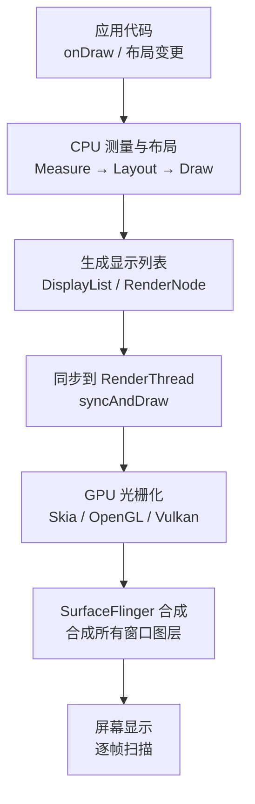
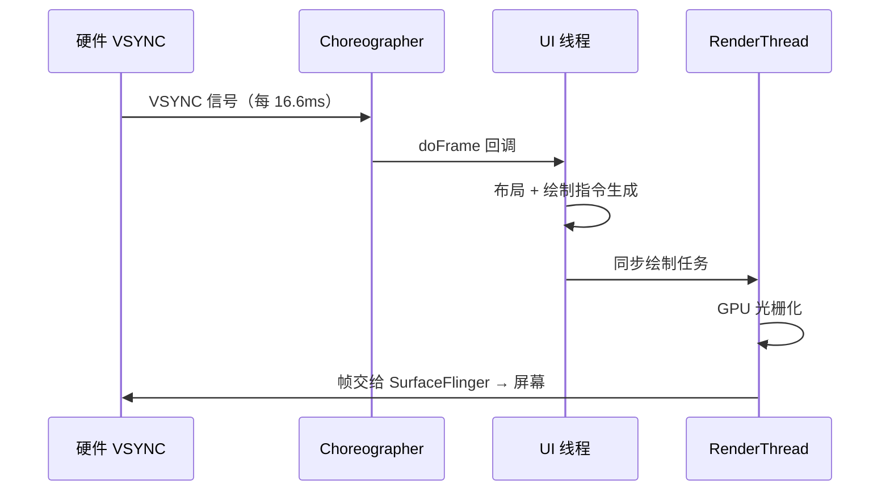
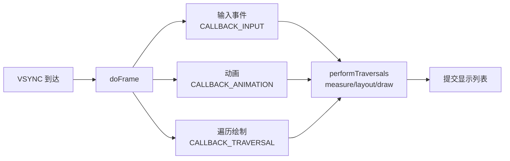
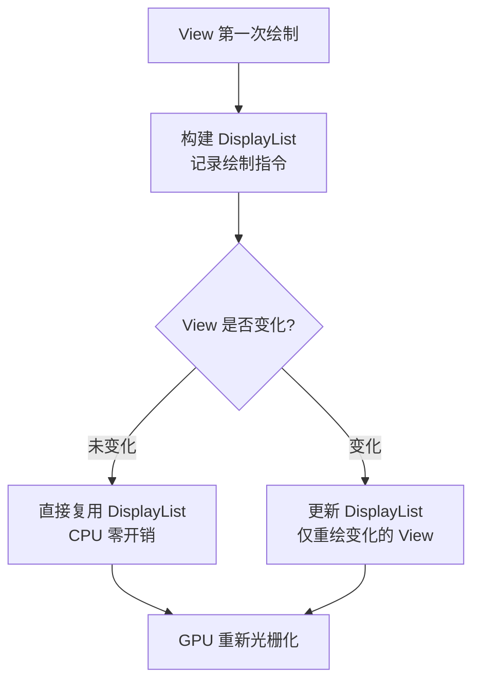
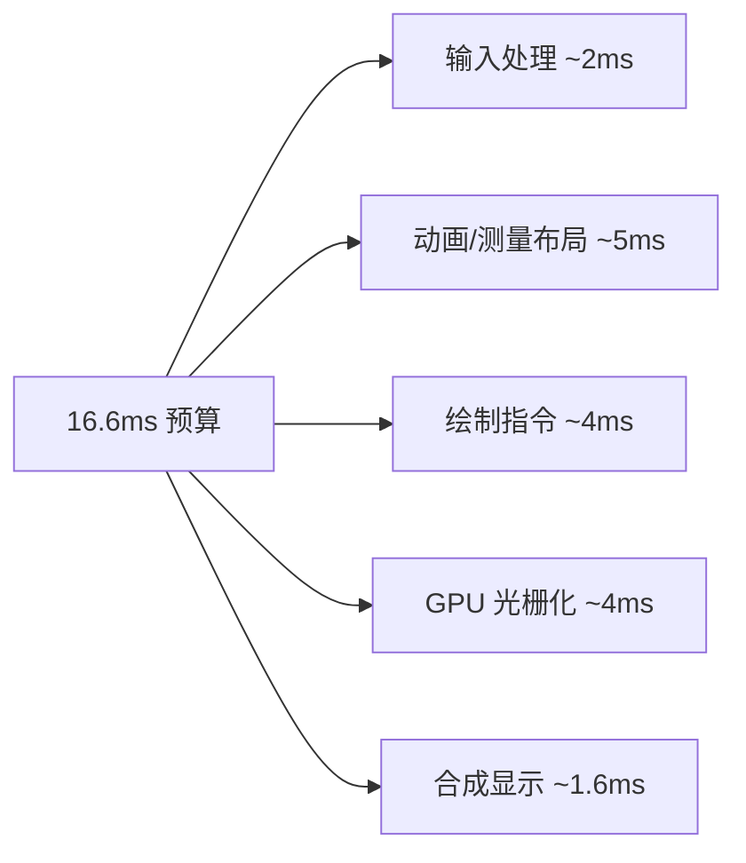

# 🖥️ 渲染原理与硬件加速

> 面试必问的"一帧画面如何渲染到屏幕"。从 VSYNC 信号、Choreographer 编排到 CPU/GPU 分工，再到 16.6ms 掉帧指标，本文一次讲透 Android 渲染管线。

## 一、一帧画面的旅程



| 阶段 | 执行者 | 职责 |
|------|--------|------|
| 测量/布局/绘制 | CPU（UI 线程） | 计算 View 尺寸位置、生成绘制指令 |
| 显示列表记录 | CPU | 把 draw 命令记录为 DisplayList |
| 光栅化 | GPU（RenderThread） | 把指令变成像素（三角形/纹理） |
| 合成 | SurfaceFlinger | 合并所有窗口的图层，交给屏幕 |

> 💡 关键点：**UI 线程只负责"生成绘制指令"，真正的像素绘制在 RenderThread/GPU 上异步执行**。这也是为什么 View 的 `onDraw` 不能做耗时操作——它阻塞的是指令生成。

## 二、VSYNC：渲染的节拍器

**VSYNC（垂直同步）** 是硬件产生的脉冲信号，屏幕每刷新一帧产生一次（60Hz 屏 = 每 16.6ms 一次）。



### 为什么需要 VSYNC？

没有 VSYNC 时，应用可能在屏幕刷新中途提交帧，导致**画面撕裂**（上半屏新帧、下半屏旧帧）。VSYNC 保证应用在信号驱动下统一节奏提交，避免撕裂。

## 三、Choreographer：帧的编排者

**Choreographer（编舞者）** 负责接收 VSYNC 信号并回调注册的帧监听器。

### doFrame 调用链

```java
// 核心调用链
Choreographer.postCallback(CALLBACK_ANIMATION, ...)
    → scheduleVsyncLocked()
    → 等待 VSYNC 信号
    → doFrame(long frameTimeNanos)   // 处理输入、动画、绘制三类回调
```



### Choreographer 与掉帧

- 每帧有 16.6ms 预算，doFrame 回调中处理完所有任务
- 若 UI 线程繁忙，VSYNC 回调延迟 → **掉帧**
- `Choreographer.FrameCallback` 可自定义帧率监听：

```kotlin
// 自定义帧率统计
Choreographer.getInstance().postFrameCallback(object : Choreographer.FrameCallback {
    var lastFrameNanos = 0L
    override fun doFrame(frameTimeNanos: Long) {
        if (lastFrameNanos != 0L) {
            val frameInterval = (frameTimeNanos - lastFrameNanos) / 1_000_000
            if (frameInterval > 16.6) {
                // 掉帧：frameInterval 超过 16.6ms
            }
        }
        lastFrameNanos = frameTimeNanos
        Choreographer.getInstance().postFrameCallback(this)  // 持续监听
    }
})
```

> 📖 这也是 BlockCanary、Matrix、Profiler 等卡顿监控工具的底层原理。

## 四、硬件加速（Hardware Acceleration）

Android 3.0+ 默认开启硬件加速，View 绘制从纯 CPU 软件绘制升级为 GPU 光栅化。

### 4.1 软件绘制 vs 硬件绘制

| 对比项 | 软件绘制（Software） | 硬件加速（Hardware） |
|--------|---------------------|---------------------|
| 绘制执行者 | CPU | GPU（RenderThread） |
| 绘制模型 | 逐 View 立即绘制（脏区重绘） | 显示列表 + 缓存（View 未变直接复用） |
| 复杂效果 | 吃力 | 阴影、圆角、模糊高效 |
| 内存 | 使用 Bitmap 缓冲 | 使用纹理（显存） |
| 兼容性 | 全部 API 支持 | 部分 Canvas API 不支持（早期版本） |

### 4.2 绘制缓存机制



> 💡 这解释了为什么复杂页面滚动流畅：**大部分 View 的绘制指令被缓存，滚动只是图层平移/合成**。

### 4.3 硬件加速检测与开关

```xml
<!-- AndroidManifest.xml 应用级/Activity 级 -->
<application android:hardwareAccelerated="true">
    <activity android:hardwareAccelerated="false" />  <!-- 单页关闭 -->
</application>
```

```kotlin
// 运行时检测
val isAccelerated = view.isHardwareAccelerated
```

> ⚠️ 硬件加速下不支持的自定义 View API（如 `drawText` 的某些参数组合）会静默降级或抛异常，自绘 View 需注意兼容。

## 五、渲染性能指标

| 指标 | 含义 | 达标 |
|------|------|------|
| FPS | 每秒帧数 | 60fps（16.6ms/帧） |
| 掉帧（Jank） | 单帧超过 16.6ms | 0 |
| 渲染时长 | 一帧 CPU+GPU 总耗时 | < 16.6ms |
| GPU 渲染时长 | 光栅化耗时 | < 8ms |
| 过度绘制 | 同一像素被绘制次数 | ≤ 2x |

### 帧耗时分解



> 💡 **优化思路**：任何阶段超支都会掉帧——布局嵌套深减测量时间、动画用属性动画减重绘、自绘 View 减指令数量、位图减 GPU 内存压力。

## 六、Profiler 工具

| 工具 | 用途 |
|------|------|
| GPU Rendering Profiler（开发者选项） | 每帧各阶段耗时条形图 |
| 显示过度绘制（开发者选项） | 蓝/绿/红直观查看 overdraw |
| Android Studio Profiler | CPU/GPU/内存综合定位 |
| `adb shell dumpsys gfxinfo` | 帧统计报告 |
| 自定义 Choreographer 监听 | 线上帧率监控 |

```bash
# 抓取帧统计
adb shell dumpsys gfxinfo <package> framestats
# 输出每帧：Draw/Prepare/Process/Execute 耗时
```

## 七、高频面试题

### Q1：一帧画面是如何从代码渲染到屏幕的？
::: details 查看答案
① CPU 在 UI 线程执行 measure/layout/draw，生成绘制指令 DisplayList；② DisplayList 同步给 RenderThread；③ RenderThread 将指令提交 GPU，GPU 光栅化成像素存入缓冲区；④ SurfaceFlinger 收到 VSYNC 信号后合成所有窗口图层，最终扫描到屏幕。整个过程由 VSYNC 节拍驱动，一帧预算 16.6ms。
:::

### Q2：Choreographer 的作用是什么？
::: details 查看答案
Choreographer 是渲染的编排者：① 通过 `postCallback` 注册帧回调，等待 VSYNC 信号；② VSYNC 到达后按顺序处理三类回调——输入事件（INPUT）、动画（ANIMATION）、布局绘制（TRAVERSAL）；③ 通过 `postFrameCallback` 提供自定义帧监听。它是 View 动画、Choreographer 驱动的帧渲染、以及帧率监控的底层机制。
:::

### Q3：硬件加速与软件绘制的区别？
::: details 查看答案
软件绘制由 CPU 直接逐 View 绘制到 Bitmap 缓冲，每次重绘成本高；硬件加速由 GPU 光栅化，绘制指令先记录为 DisplayList/RenderNode，View 未变化时直接复用缓存，复杂效果（阴影/圆角/模糊）更高效，滚动时大部分只是图层合成。但硬件加速使用显存纹理，部分 Canvas API 不兼容，自绘 View 需测试。
:::

### Q4：什么是掉帧？如何监控线上掉帧？
::: details 查看答案
一帧渲染耗时超过 16.6ms 即为掉帧，表现为滑动卡顿。监控手段：① 开发期用开发者选项的 GPU 渲染条、Profile GPU Rendering；② 线上用 Choreographer.FrameCallback 统计相邻帧时间差，超过阈值上报；③ 结合 Looper 的 Printer 打印（BlockCanary 原理）检测主线程耗时；④ Matrix 等框架提供完整的帧率采集与堆栈定位。
:::

### Q5：过度绘制是什么？如何优化？
::: details 查看答案
同一像素在一帧内被绘制多次（如多层背景叠放）即过度绘制。优化：① 去掉多余背景色（父布局与子 View 背景重复）；② 使用 `clipRect` 裁剪不可见区域；③ 扁平化布局层级，减少嵌套；④ 用 ViewStub 延迟加载；⑤ 复杂场景用 Canvas 合并绘制。开发者选项的"显示过度绘制"可直观查看（绿→红逐步严重）。
:::

## 小结

- 渲染三阶段：CPU 指令生成 → GPU 光栅化 → SurfaceFlinger 合成
- VSYNC 是渲染节拍，Choreographer 是编排者，16.6ms 是帧预算
- 硬件加速用 DisplayList 缓存 + GPU 并行，性能远优于软件绘制
- 掉帧 = 任一阶段超时，监控工具围绕 Choreographer 帧时间差
- 过度绘制、布局层级、位图内存是渲染优化三大主战场

> 📖 进阶阅读：[View 绘制流程详解](/ui/view/view-draw-process.md) | [MeasureSpec 完全解析](/ui/view/measurespec.md) | [卡顿优化实战](/advanced/performance/jank-optimization.md)
