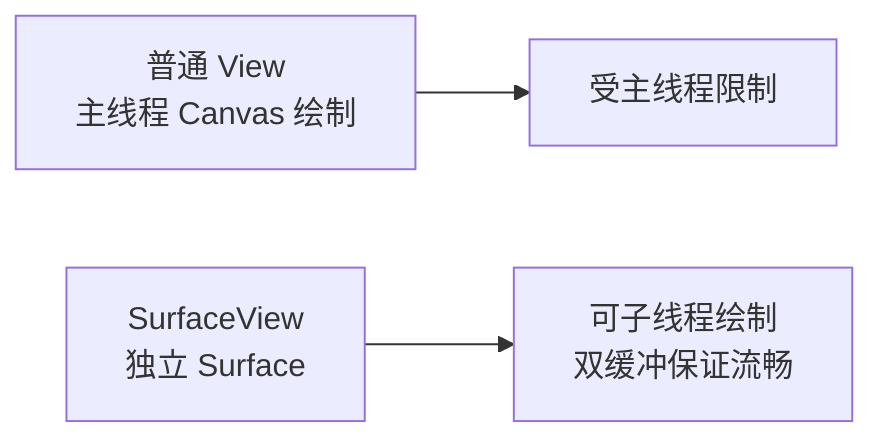
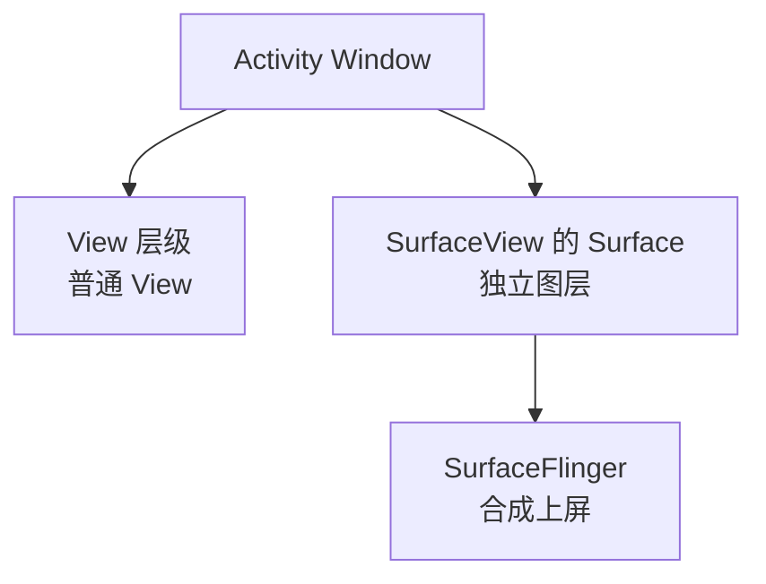
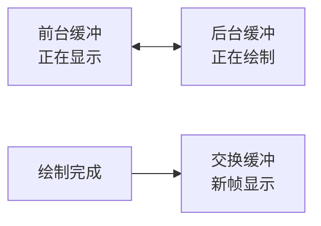
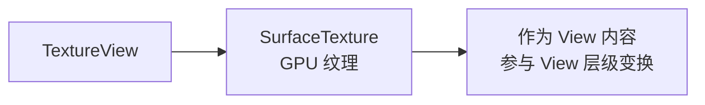
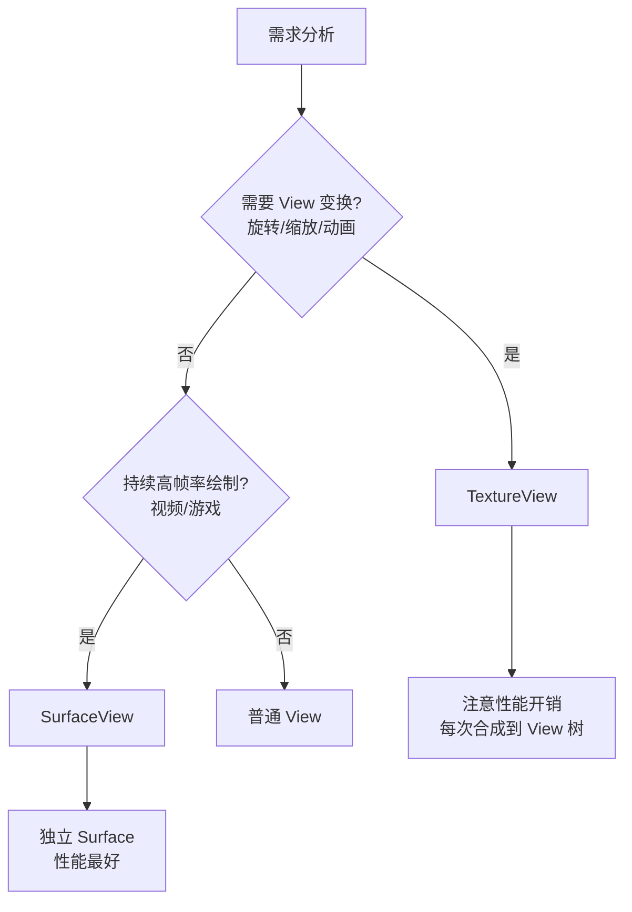

# SurfaceView 与 TextureView 详解

> 面试高频指数：中 — "SurfaceView 为什么可以在子线程绘制？TextureView 和 SurfaceView 怎么选？"是多媒体与自定义绘制的高频题。

## 一、为什么需要独立绘制视图

### 1.1 普通 View 的限制

普通 View 的绘制在**主线程 UI 线程**完成，无法在子线程操作：

- 视频播放需要持续、高性能的绘制
- 相机预览需要实时刷新画面
- 游戏需要高帧率渲染

如果这些都在主线程，会阻塞 UI 交互。因此 Android 提供 **SurfaceView**：



### 1.2 核心思想

**SurfaceView 拥有独立的 Surface**（合成层），由 WindowManager 直接管理，绘制内容通过**双缓冲机制**高效更新，与 View 层级独立。

## 二、SurfaceView 原理

### 2.1 独立 Surface



- SurfaceView 的 Surface 是**独立于主 Surface 的合成层**
- 由 SurfaceFlinger 统一合成
- 内容可以来自任何线程

### 2.2 双缓冲机制



- 绘制在后台缓冲进行，完成后交换到前台
- 避免绘制一半被屏幕扫描（撕裂）
- 视频/游戏流畅度的关键

### 2.3 SurfaceHolder 使用

```kotlin
class CameraSurfaceView(context: Context) : SurfaceView(context),
    SurfaceHolder.Callback {

    init {
        holder.addCallback(this)
    }

    override fun surfaceCreated(holder: SurfaceHolder) {
        // Surface 创建完成，可开始绘制
        startDrawingThread(holder)
    }

    override fun surfaceChanged(
        holder: SurfaceHolder, format: Int, width: Int, height: Int) {
        // Surface 尺寸变化（旋转等）
    }

    override fun surfaceDestroyed(holder: SurfaceHolder) {
        // Surface 销毁，停止绘制
        stopDrawingThread()
    }

    private fun startDrawingThread(holder: SurfaceHolder) {
        thread {
            while (isRunning) {
                // lockCanvas 获取画布（阻塞等待）
                val canvas = holder.lockCanvas() ?: continue
                try {
                    // 在子线程绘制
                    drawFrame(canvas)
                } finally {
                    // unlockCanvasAndPost 提交帧
                    holder.unlockCanvasAndPost(canvas)
                }
            }
        }
    }
}
```

> 关键点：**lockCanvas 会阻塞**等待上一帧完成（双缓冲时等待可用的后台缓冲）；绘制必须成对使用 lockCanvas/unlockCanvasAndPost。

## 三、TextureView 详解

### 3.1 特点

**TextureView** 是一个**普通 View**，但把内容渲染到**硬件纹理（SurfaceTexture）**：



- 内容存在 GPU 纹理中
- 可以像普通 View 一样**旋转、缩放、透明度、动画**
- 支持 View 层级内的覆盖顺序

### 3.2 基本使用

```kotlin
val textureView = TextureView(context)

// 监听纹理可用
textureView.surfaceTextureListener = object : TextureView.SurfaceTextureListener {
    override fun onSurfaceTextureAvailable(surface: SurfaceTexture, width: Int, height: Int) {
        // 纹理可用，开始渲染（如 Camera2 的 CaptureSession）
        openCamera(surface)
    }

    override fun onSurfaceTextureSizeChanged(surface: SurfaceTexture, width: Int, height: Int) {}

    override fun onSurfaceTextureDestroyed(surface: SurfaceTexture): Boolean = true

    override fun onSurfaceTextureUpdated(surface: SurfaceTexture) {}
}
```

### 3.3 抓帧与转换

```kotlin
// 抓取当前帧为 Bitmap
val bitmap = textureView.getBitmap()

// 转换为 Bitmap 并保存
val savedBitmap = textureView.getBitmap(bitmapWidth, bitmapHeight)
```

## 四、SurfaceView 与 TextureView 对比

### 4.1 对比表

| 维度 | SurfaceView | TextureView |
|------|-------------|-------------|
| 本质 | 独立 Surface 图层 | 普通 View + GPU 纹理 |
| 绘制线程 | 任意线程 | 主线程（内部） |
| 动画/变换 | 有限（需额外处理） | 完全支持（旋转/缩放/透明度） |
| 层级覆盖 | 在 View 层级之上，遮挡问题 | 正常参与 View 层级 |
| 双缓冲 | 支持（lockCanvas） | 依赖 SurfaceTexture 更新 |
| 性能 | 高（独立合成层） | 较高（需合成到 View 树） |
| 内存 | 独立 Buffer | 纹理内存 |
| 适用 | 视频、游戏、相机 | 需要变换的预览、抠图、直播特效 |

### 4.2 选择建议



> 关键点：**持续高帧率选 SurfaceView，需要 View 变换选 TextureView**。TextureView 每次更新需要合成进 View 层级，高帧率下有额外开销。

## 五、实战场景

### 5.1 视频播放

```kotlin
// ExoPlayer + SurfaceView（官方推荐组合）
val surfaceView = SurfaceView(context)
player.setVideoSurfaceView(surfaceView)
player.prepare()
player.play()
```

### 5.2 相机预览（Camera2 + TextureView）

```kotlin
private fun openCamera(surfaceTexture: SurfaceTexture) {
    surfaceTexture.setDefaultBufferSize(previewSize.width, previewSize.height)
    val surface = Surface(surfaceTexture)
    val request = cameraDevice.createCaptureRequest(
        CameraDevice.TEMPLATE_PREVIEW).apply {
        addTarget(surface)
    }
    cameraDevice.createCaptureSession(
        listOf(surface),
        object : CameraCaptureSession.StateCallback() {
            override fun onConfigured(session: CameraCaptureSession) {
                session.setRepeatingRequest(request.build(), null, null)
            }
            override fun onConfigureFailed(session: CameraCaptureSession) {}
        },
        null
    )
}
```

### 5.3 直播特效（TextureView + OpenGL）

- TextureView 的 SurfaceTexture 可绑定到 OpenGL 纹理
- 在 GL 中做滤镜、美颜后渲染回 SurfaceTexture
- 支持 View 变换做画中画

## 六、高频面试题

### Q1：SurfaceView 和普通 View 有什么区别？
::: details 查看答案
① 绘制线程：普通 View 只能在主线程通过 invalidate 触发 onDraw；SurfaceView 拥有独立 Surface，可在任意线程通过 lockCanvas/unlockCanvasAndPost 直接绘制；② 缓冲：SurfaceView 有独立缓冲（双缓冲机制），普通 View 绘制后合成到主 Surface；③ 层级：SurfaceView 是独立合成层，位于 View 层级之上，传统上有遮挡问题（新版本已优化）；④ 性能：SurfaceView 适合持续高帧率场景（视频、游戏、相机），普通 View 适合普通 UI。注意 SurfaceView 不支持 transform/动画，需要变换时用 TextureView。
:::

### Q2：lockCanvas 和 unlockCanvasAndPost 是做什么的？为什么必须成对调用？
::: details 查看答案
lockCanvas 获取可绘制的 Canvas（后台缓冲），绘制完成调用 unlockCanvasAndPost 提交前台显示。成对原因：① lockCanvas 会阻塞等待可用缓冲（双缓冲时等上一帧交换）；② 只有 lock 到 unlock 之间的绘制会被提交，不在期间的内容丢失；③ 不平衡调用会导致：只 lock 不 unlock 会一直持有缓冲导致卡死，只 unlock 会抛异常；④ 未解锁的 Canvas 无法显示。标准姿势：lockCanvas 后 try-finally 中 unlockCanvasAndPost，lockCanvas 返回 null（如 surface 已销毁）时直接跳过。
:::

### Q3：SurfaceView 的"独立 Surface"和 View 的层级是什么关系？
::: details 查看答案
SurfaceView 的 Surface 是独立于窗口主 Surface 的另一个合成层：窗口内普通 View 绘制到主 Surface（View 层级），SurfaceView 的 Surface 单独交给 SurfaceFlinger 合成，位置由 SurfaceView 在窗口中的 bounds 决定。因此：① SurfaceView 内容不受主线程绘制影响，可子线程高频绘制；② 传统上 SurfaceView 像"挖洞"，内容浮在 View 层级之上（低版本有遮挡问题，Android N+ 做了 Z 序优化）；③ 旋转缩放动画对它不生效，因为它是独立层。
:::

### Q4：TextureView 相比 SurfaceView 有什么优缺点？
::: details 查看答案
优点：① 是普通 View，完全支持旋转、缩放、透明度、动画等 View 变换；② 正常参与 View 层级，无遮挡问题；③ 用 getBitmap() 可直接抓帧；④ SurfaceTexture 可绑定 OpenGL 做滤镜特效。缺点：① 内容要先合成进 View 树再上屏，多一次合成开销，高帧率下性能不如 SurfaceView；② 必须主线程创建和更新；③ 内存占用（纹理）更高；④ 大尺寸时合成开销明显。结论：需要变换/特效用 TextureView，持续高帧率视频/游戏用 SurfaceView。
:::

### Q5：SurfaceView 的生命周期是怎么样的？怎么和 Activity 生命周期协调？
::: details 查看答案
SurfaceView 通过 SurfaceHolder.Callback 通知：① surfaceCreated：Surface 创建完成（首次可见或重建后），此时才能 lockCanvas 绘制；② surfaceChanged：尺寸/格式变化（如旋转），需重新适配绘制参数；③ surfaceDestroyed：Surface 销毁（Activity 不可见/退出），必须停止绘制线程，不能再 lockCanvas。协调方式：surfaceCreated 时启动绘制线程，surfaceDestroyed 时停止并等待线程退出；Activity onPause 时也可主动停止绘制释放资源。注意 Surface 重建（如切换屏幕）会重新走一遍回调，线程要能重新启动。
:::

## 七、小结

SurfaceView 与 TextureView 要点：

1. SurfaceView：独立 Surface + 双缓冲，可子线程绘制
2. lockCanvas/unlockCanvasAndPost 必须成对
3. TextureView：GPU 纹理 + 普通 View 变换能力
4. 持续高帧率选 SurfaceView，需要变换选 TextureView
5. 生命周期用 Callback/Listener 管理，避免 Surface 销毁后绘制

相关阅读：[渲染原理与流程详解](/ui/render/render-principle.md)、[硬件加速渲染详解](/ui/render/hardware-acceleration.md)、[Bitmap 详解与图片压缩](/ui/bitmap/bitmap-guide.md)、[Window 机制详解](/ui/window/window-mechanism.md)。
