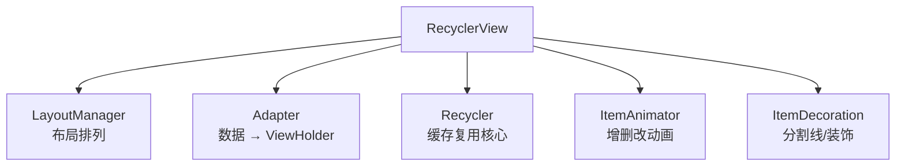
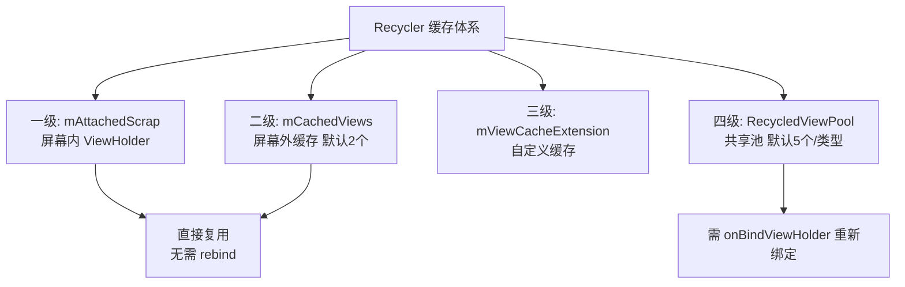
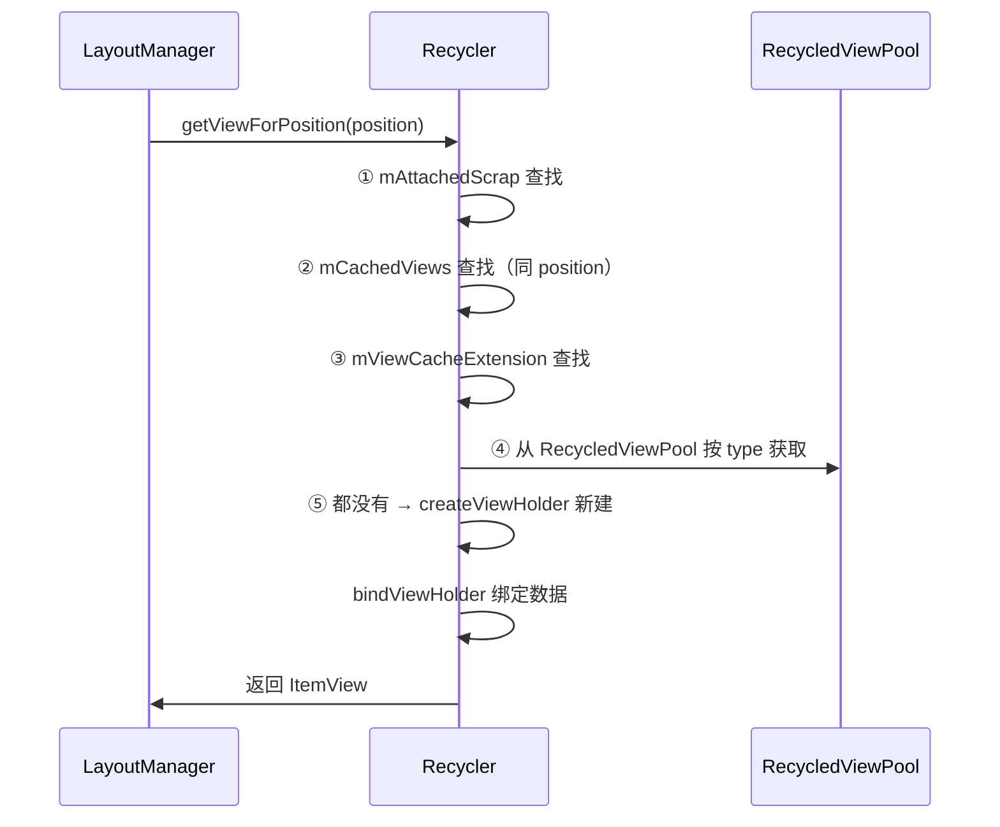
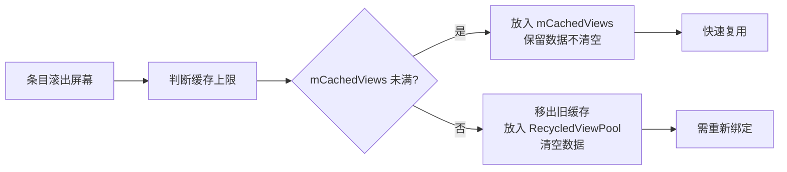
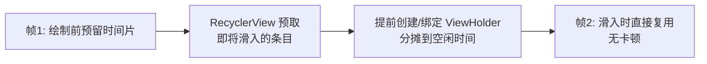

# RecyclerView 源码解析

> RecyclerView 为什么能支撑千级列表丝滑滚动？答案在它的**缓存复用机制**。本文深入源码剖析五级缓存、`onBindViewHolder` 触发时机、预取机制与性能优化要点。

## 一、RecyclerView 核心组件



| 组件 | 职责 |
|------|------|
| LayoutManager | 决定条目如何排列（Linear/Grid/Staggered） |
| Adapter | 绑定数据，创建 ViewHolder |
| Recycler | 管理 ViewHolder 的回收与复用 |
| ItemAnimator | 增删改移动画 |
| ItemDecoration | 绘制分割线、边距 |

## 二、五级缓存结构



| 缓存级别 | 容器 | 容量 | 复用成本 | 说明 |
|---------|------|------|---------|------|
| ① 屏幕内 | `mAttachedScrap` | 屏幕内条目数 | 最低 | 布局过程中暂存，直接复用 |
| ② 屏幕外 | `mCachedViews` | 默认 2 | 低 | 无需 rebind，直接复用 |
| ③ 自定义 | `mViewCacheExtension` | 自定义 | — | 极少使用 |
| ④ 共享池 | `RecycledViewPool` | 每类型默认 5 | 高 | 需重新绑定 |

## 三、回收与复用流程

### 3.1 复用（getViewForPosition）



::: code-tabs

@tab:active Java

```java
// 源码关键：getViewForPosition 内部
View getViewForPosition(int position, boolean dryRun) {
    // 1. 尝试从 scrap/cache 获取
    // 2. 尝试从 viewCacheExtension 获取
    // 3. 尝试从 RecycledViewPool 获取
    // 4. 全部 miss → adapter.createViewHolder() 新建
    // 5. adapter.bindViewHolder() 绑定
}
```

@tab Kotlin

```kotlin
// 源码关键：getViewForPosition 内部
fun getViewForPosition(position: Int, dryRun: Boolean): View {
    // 1. 尝试从 scrap/cache 获取
    // 2. 尝试从 viewCacheExtension 获取
    // 3. 尝试从 RecycledViewPool 获取
    // 4. 全部 miss → adapter.createViewHolder() 新建
    // 5. adapter.bindViewHolder() 绑定
}
```

:::

### 3.2 回收（recycleViewHolderInternal）



::: code-tabs

@tab:active Java

```java
// 源码关键：回收逻辑（简化）
void recycleViewHolderInternal(ViewHolder holder) {
    // 清空动画/标志位
    if (mCachedViews.size() >= mViewCacheMax) {   // 默认 2
        // 淘汰最早的缓存，放入 pool（清空绑定数据）
        recycleCachedViewAt(0);
    }
    mCachedViews.add(holder);   // 新回收的进缓存
}
```

@tab Kotlin

```kotlin
// 源码关键：回收逻辑（简化）
fun recycleViewHolderInternal(holder: ViewHolder) {
    // 清空动画/标志位
    if (mCachedViews.size() >= mViewCacheMax) {   // 默认 2
        // 淘汰最早的缓存，放入 pool（清空绑定数据）
        recycleCachedViewAt(0)
    }
    mCachedViews.add(holder)   // 新回收的进缓存
}
```

:::

## 四、LayoutManager 复用触发

::: code-tabs

@tab:active Java

```java
// LinearLayoutManager 填充逻辑
void fill(Recycler recycler, LayoutState layoutState) {
    while (layoutState.hasMore(state)) {
        // 获取条目 View（触发五级缓存查找）
        View view = layoutState.next(recycler);
        // 添加到布局
        addView(view);
        layoutDecoratedWithMargins(view, ...);
    }
}
```

@tab Kotlin

```kotlin
// LinearLayoutManager 填充逻辑
fun fill(recycler: Recycler, layoutState: LayoutState) {
    while (layoutState.hasMore(state)) {
        // 获取条目 View（触发五级缓存查找）
        val view = layoutState.next(recycler)
        // 添加到布局
        addView(view)
        layoutDecoratedWithMargins(view, ...)
    }
}
```

:::

> **核心思想**：LayoutManager 只关心"把 View 摆放到正确位置"，View 从哪来（新建还是复用）完全由 Recycler 决定。

## 五、预取机制（Prefetch）

### 5.1 预取原理



- **GapWorker**：RecyclerView 内部预取调度器，在 Choreographer 帧回调前执行
- **效果**：把"滚动边界处的创建+绑定"提前到帧间隙执行，滑动不掉帧

### 5.2 预取控制

::: code-tabs

@tab:active Java

```java
recyclerView.setItemViewCacheSize(5);                 // 默认 2 → 调大二级缓存
recyclerView.setNestedScrollingEnabled(false);        // 嵌套滚动场景注意
```

@tab Kotlin

```kotlin
recyclerView.setItemViewCacheSize(5)     // 默认 2 → 调大二级缓存
recyclerView.isNestedScrollingEnabled = false   // 嵌套滚动场景注意
```

:::

| 参数 | 默认 | 作用 |
|------|------|------|
| `setItemViewCacheSize` | 2 | 屏幕外免绑定缓存数量 |
| `setHasFixedSize` | false | 数据变化时是否跳过测量 |
| `RecycledViewPool.setMaxRecycledViews` | 5 | 每类型共享池上限 |

## 六、diff 更新机制

### 6.1 局部刷新 vs 全量刷新

::: code-tabs

@tab:active Java

```java
// ✗ 全量刷新：全部条目重绘 + 闪烁
adapter.notifyDataSetChanged();

// ✓ 局部刷新：精确更新
adapter.notifyItemChanged(3);          // 更新单个
adapter.notifyItemInserted(5);         // 插入
adapter.notifyItemRemoved(2);          // 删除
adapter.notifyItemRangeChanged(0, 10); // 范围更新
```

@tab Kotlin

```kotlin
// ✗ 全量刷新：全部条目重绘 + 闪烁
adapter.notifyDataSetChanged()

// ✓ 局部刷新：精确更新
adapter.notifyItemChanged(3)          // 更新单个
adapter.notifyItemInserted(5)         // 插入
adapter.notifyItemRemoved(2)          // 删除
adapter.notifyItemRangeChanged(0, 10) // 范围更新
```

:::

### 6.2 DiffUtil 高效计算差异

::: code-tabs

@tab:active Java

```java
public class UserDiffCallback extends DiffUtil.ItemCallback<User> {
    @Override
    public boolean areItemsTheSame(User oldItem, User newItem) {
        return oldItem.id == newItem.id;   // 是否是同一个条目
    }

    @Override
    public boolean areContentsTheSame(User oldItem, User newItem) {
        return oldItem.equals(newItem);    // 内容是否相同
    }
}

// 异步计算差异
DiffUtil.DiffResult diffResult = DiffUtil.calculateDiff(new UserDiffCallback(), false);
diffResult.dispatchUpdatesTo(adapter);   // 精确执行增删改移动画
```

@tab Kotlin

```kotlin
class UserDiffCallback : DiffUtil.ItemCallback<User>() {
    override fun areItemsTheSame(oldItem: User, newItem: User): Boolean =
        oldItem.id == newItem.id          // 是否是同一个条目

    override fun areContentsTheSame(oldItem: User, newItem: User): Boolean =
        oldItem == newItem                // 内容是否相同
}

// 异步计算差异
val diffResult = DiffUtil.calculateDiff(UserDiffCallback(), false)
diffResult.dispatchUpdatesTo(adapter)   // 精确执行增删改移动画
```

:::

> 列表数据频繁变化（聊天、feed 流）用 **ListAdapter + DiffUtil**（内部子线程计算差异），配合 RecyclerView 增删移动画，性能与体验最佳。

## 七、性能优化清单

| 优化项 | 说明 |
|--------|------|
| 复用 ViewHolder | 避免复杂 item 中 findViewById（ViewBinding 自动） |
| 控制 item 布局层级 | 扁平化，减少 measure/draw 成本 |
| 图片懒加载 | 滑动停止才加载（Glide 自动） |
| `setHasFixedSize(true)` | item 尺寸不变时跳过重复测量 |
| 调大缓存 | 复杂 item 增加 `setItemViewCacheSize` |
| 分页加载 | Paging 3 配合 ListAdapter |
| 避免 notifyDataSetChanged | 用局部更新/DiffUtil |
| 监听滚动去重 | `addOnScrollListener` 中做节流 |

## 八、高频面试题

### Q1：RecyclerView 的五级缓存分别是什么？
::: details 查看答案
① mAttachedScrap：布局过程中的屏幕内 ViewHolder，直接复用无需绑定；② mCachedViews：滚出屏幕的 ViewHolder，默认 2 个，免绑定直接复用；③ mViewCacheExtension：开发者自定义缓存（极少用）；④ RecycledViewPool：按 ViewType 共享的池，默认每类型 5 个，需重新绑定；⑤ 新建：全部 miss 时 createViewHolder。缓存命中顺序 ①→②→③→④→⑤，成本递增。
:::

### Q2：onBindViewHolder 什么时候被调用？缓存复用会调用吗？
::: details 查看答案
① 新建 ViewHolder 后首次绑定；② 从 RecycledViewPool 取出复用时会调用（数据已被清空）；③ notifyDataSetChanged 或 notifyItemChanged 会重新绑定。从 mCachedViews 复用**不会**调用 onBindViewHolder（数据仍保留）。所以 onBindViewHolder 应只做"绑数据"轻量操作，复杂配置放 onCreateViewHolder。
:::

### Q3：RecyclerView 滑动为什么流畅？预取机制是什么？
::: details 查看答案
① 五级缓存：滚出屏幕的 ViewHolder 被缓存，滚入时直接复用，避免频繁创建 View 和 findViewById；② 预取机制（GapWorker）：在帧间隙提前创建和绑定即将进入屏幕的条目，把工作分摊到空闲时间片，避免滑动时瞬时卡顿；③ 显示列表缓存 + 硬件加速减少重绘成本；④ 局部刷新避免全量重建。
:::

### Q4：RecyclerView 与 ListView 的区别？
::: details 查看答案
① 职责分离：RecyclerView 把布局（LayoutManager）、适配（Adapter）、动画（ItemAnimator）解耦，可插拔扩展；② 缓存：RecyclerView 五级缓存按 ViewHolder 复用，比 ListView 双级缓存（ActiveView + ScrapView）更精细；③ 布局：ListView 只支持纵向，RecyclerView 支持 Linear/Grid/Staggered 三种（可自定义）；④ 更新：RecyclerView 支持精确的 notifyItem* 与 DiffUtil 动画，ListView 主要 notifyDataSetChanged 全量刷新；⑤ 其他：RecyclerView 无空视图/点击监听等内置 API 需自己实现。
:::

### Q5：RecyclerView 数据更新闪烁怎么解决？
::: details 查看答案
闪烁根因是 notifyDataSetChanged 全量刷新 + 默认动画重建所有 item。解决：① 用局部更新 notifyItemChanged/Inserted/Removed；② 用 DiffUtil/ListAdapter 自动计算差异做最小更新；③ 复杂 item 避免在 onBindViewHolder 中做耗时操作；④ 若必须全量刷新，可 setSuppressLayout 或 itemAnimator 设置 null 取消动画。
:::

## 小结

- RecyclerView = LayoutManager + Adapter + Recycler + ItemAnimator 解耦协作
- 五级缓存：scrap → cachedViews → viewCacheExtension → pool → 新建
- cachedViews 免绑定，pool 需重新绑定，命中顺序决定性能
- GapWorker 预取在帧间隙提前创建条目，保障滑动流畅
- 局部刷新 + DiffUtil 是列表更新的最佳实践
- setHasFixedSize、缓存调优、图片懒加载是常见优化手段

> 进阶阅读：[View 与 ViewGroup 的关系](/ui/view/view-viewgroup.md) | [MeasureSpec 完全解析](/ui/view/measurespec.md) | [Paging 3 分页加载](/jetpack/paging-navigation/paging3.md)
