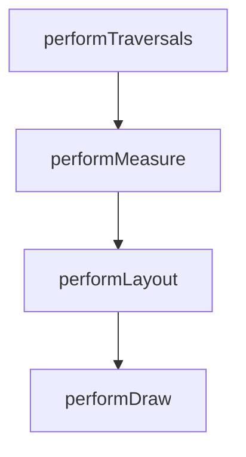

# View 绘制流程详解

> 理解 View 的三大流程（measure / layout / draw）是自定义 View 与性能优化的基础。

## 一、绘制入口

ViewRootImpl 的 `performTraversals()` 是绘制的总入口，按顺序触发三个子流程：



## 二、Measure：测量阶段

**MeasureSpec**：一个 32 位 int，高 2 位为模式，低 30 位为尺寸。三种模式对应不同的触发场景：

| 模式 | 含义 | 触发场景 |
|------|------|----------|
| `UNSPECIFIED` | 不限制 | ScrollView 等 |
| `EXACTLY` | 精确尺寸 | `match_parent` / 固定 dp |
| `AT_MOST` | 最大尺寸 | `wrap_content` |

自定义 View 重写 onMeasure 来决定自己的尺寸：

::: code-tabs

@tab Kotlin

```kotlin
override fun onMeasure(widthMeasureSpec: Int, heightMeasureSpec: Int) {
    // 自定义测量逻辑
    val width = MeasureSpec.getSize(widthMeasureSpec)
    val height = MeasureSpec.getSize(heightMeasureSpec)
    setMeasuredDimension(width, height)
}
```

:::

::: tip 面试考点
`wrap_content` 需要重写 `onMeasure`，否则效果等同 `match_parent`（因为父 View 默认给 AT_MOST 时直接用 spec 尺寸）。
:::

## 三、Layout：布局阶段

ViewGroup 在 onLayout 中为每个子 View 指定位置：

::: code-tabs

@tab:active Java

```java
@Override
protected void onLayout(boolean changed, int l, int t, int r, int b) {
    // 遍历子 View，确定每个子 View 的位置
    for (int i = 0; i < getChildCount(); i++) {
        View child = getChildAt(i);
        child.layout(left, top, right, bottom);
    }
}
```

@tab Kotlin

```kotlin
override fun onLayout(changed: Boolean, l: Int, t: Int, r: Int, b: Int) {
    // 遍历子 View，确定每个子 View 的位置
    for (i in 0 until childCount) {
        val child = getChildAt(i)
        child.layout(left, top, right, bottom)
    }
}
```

:::

## 四、Draw：绘制阶段

绘制顺序（dispatchDraw 之前）按固定次序执行：

1. 绘制背景（`drawBackground`）
2. 绘制自身内容（`onDraw`）
3. 绘制子 View（`dispatchDraw`）
4. 绘制装饰（`onDrawForeground`）

在 onDraw 里用 Canvas 画出自定义内容：

::: code-tabs

@tab:active Java

```java
@Override
protected void onDraw(Canvas canvas) {
    super.onDraw(canvas);
    paint.setColor(Color.RED);
    canvas.drawCircle(getWidth() / 2f, getHeight() / 2f, 50f, paint);
}
```

@tab Kotlin

```kotlin
override fun onDraw(canvas: Canvas) {
    super.onDraw(canvas)
    paint.color = Color.RED
    canvas.drawCircle(width / 2f, height / 2f, 50f, paint)
}
```

:::

## 五、性能优化启示

- **减少层级**：扁平化布局（ConstraintLayout）
- **避免重复测量**：缓存测量结果
- **避免过度绘制**：减少背景重复绘制、使用 `clipRect`
- **使用 `invalidate()` 局部刷新**：仅重绘脏区域

## 六、在 Activity 中获取 View 的宽高

`onCreate` 中 View 尚未完成测量，直接 `getWidth()` 得到 0。以下三种方式可拿到真实宽高：

### 1. onWindowFocusChanged

窗口获得焦点时 View 已完成初始化，可安全读取尺寸：

::: code-tabs

@tab:active Java

```java
// View 已初始化完毕；窗口得到/失去焦点时各回调一次
public void onWindowFocusChanged(boolean hasFocus) {
    super.onWindowFocusChanged(hasFocus);
    if (hasFocus) {
        int width = view.getMeasuredWidth();
        int height = view.getMeasuredHeight();
    }
}
```

@tab Kotlin

```kotlin
// View 已初始化完毕；窗口得到/失去焦点时各回调一次
override fun onWindowFocusChanged(hasFocus: Boolean) {
    super.onWindowFocusChanged(hasFocus)
    if (hasFocus) {
        val width = view.measuredWidth
        val height = view.measuredHeight
    }
}
```

:::

注意：频繁 onResume/onPause 时该方法会被频繁调用。

### 2. view.post(runnable)

把读取操作投递到消息队列，执行时 View 已初始化：

::: code-tabs

@tab:active Java

```java
// runnable 投递到消息队列尾部，Looper 调用时 View 已初始化完成
protected void onStart() {
    super.onStart();
    view.post(new Runnable() {
        @Override
        public void run() {
            int width = view.getMeasuredWidth();
            int height = view.getMeasuredHeight();
        }
    });
}
```

@tab Kotlin

```kotlin
// runnable 投递到消息队列尾部，Looper 调用时 View 已初始化完成
override fun onStart() {
    super.onStart()
    view.post {
        val width = view.measuredWidth
        val height = view.measuredHeight
    }
}
```

:::

### 3. ViewTreeObserver

监听全局布局回调，在布局完成时读取：

::: code-tabs

@tab:active Java

```java
// View 树状态或内部 View 可见性改变时回调
ViewTreeObserver observer = view.getViewTreeObserver();
observer.addOnGlobalLayoutListener(new OnGlobalLayoutListener() {
    @SuppressWarnings("deprecation")
    @Override
    public void onGlobalLayout() {
        view.getViewTreeObserver().removeGlobalOnLayoutListener(this);
        int width = view.getMeasuredWidth();
        int height = view.getMeasuredHeight();
    }
});
```

@tab Kotlin

```kotlin
// View 树状态或内部 View 可见性改变时回调
val observer = view.viewTreeObserver
observer.addOnGlobalLayoutListener(object : OnGlobalLayoutListener {
    @Suppress("DEPRECATION")
    override fun onGlobalLayout() {
        view.viewTreeObserver.removeGlobalOnLayoutListener(this)
        val width = view.measuredWidth
        val height = view.measuredHeight
    }
})
```

:::

::: tip 对比
`onWindowFocusChanged` 简单但触发频繁；`post` 最简洁；`ViewTreeObserver` 精确但需注意移除监听（API 16 后用 `removeOnGlobalLayoutListener`）。
:::

> 进阶阅读：[MeasureSpec 完全解析](measurespec.md) | [布局优化](/ui/layout/) | [自定义 View](/ui/custom-view/)
