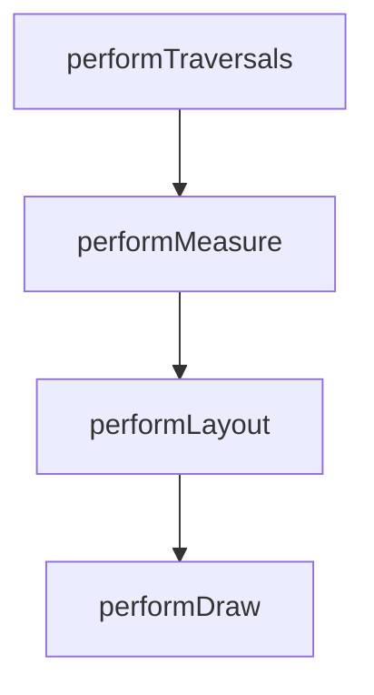

# View 绘制流程详解

> 理解 View 的三大流程（measure / layout / draw）是自定义 View 与性能优化的基础。

## 一、绘制入口

ViewRootImpl 的 `performTraversals()` 是绘制的总入口：



## 二、Measure：测量阶段

**MeasureSpec**：一个 32 位 int，高 2 位为模式，低 30 位为尺寸。

| 模式 | 含义 | 触发场景 |
|------|------|----------|
| `UNSPECIFIED` | 不限制 | ScrollView 等 |
| `EXACTLY` | 精确尺寸 | `match_parent` / 固定 dp |
| `AT_MOST` | 最大尺寸 | `wrap_content` |

```kotlin
override fun onMeasure(widthMeasureSpec: Int, heightMeasureSpec: Int) {
    // 自定义测量逻辑
    val width = MeasureSpec.getSize(widthMeasureSpec)
    val height = MeasureSpec.getSize(heightMeasureSpec)
    setMeasuredDimension(width, height)
}
```

::: tip 面试考点
`wrap_content` 需要重写 `onMeasure`，否则效果等同 `match_parent`（因为父 View 默认给 AT_MOST 时直接用 spec 尺寸）。
:::

## 三、Layout：布局阶段

```kotlin
override fun onLayout(changed: Boolean, l: Int, t: Int, r: Int, b: Int) {
    // 遍历子 View，确定每个子 View 的位置
    for (i in 0 until childCount) {
        val child = getChildAt(i)
        child.layout(left, top, right, bottom)
    }
}
```

## 四、Draw：绘制阶段

绘制顺序（dispatchDraw 之前）：

1. 绘制背景（`drawBackground`）
2. 绘制自身内容（`onDraw`）
3. 绘制子 View（`dispatchDraw`）
4. 绘制装饰（`onDrawForeground`）

```kotlin
override fun onDraw(canvas: Canvas) {
    super.onDraw(canvas)
    paint.color = Color.RED
    canvas.drawCircle(width / 2f, height / 2f, 50f, paint)
}
```

## 五、性能优化启示

- **减少层级**：扁平化布局（ConstraintLayout）
- **避免重复测量**：缓存测量结果
- **避免过度绘制**：减少背景重复绘制、使用 `clipRect`
- **使用 `invalidate()` 局部刷新**：仅重绘脏区域

> 📖 进阶阅读：[MeasureSpec 完全解析](measurespec.md) | [布局优化](/ui/layout/) | [自定义 View](/ui/custom-view/)
