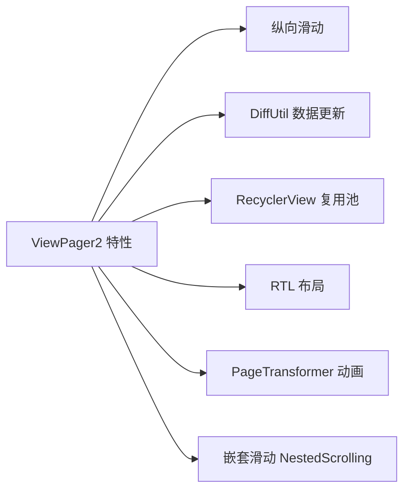
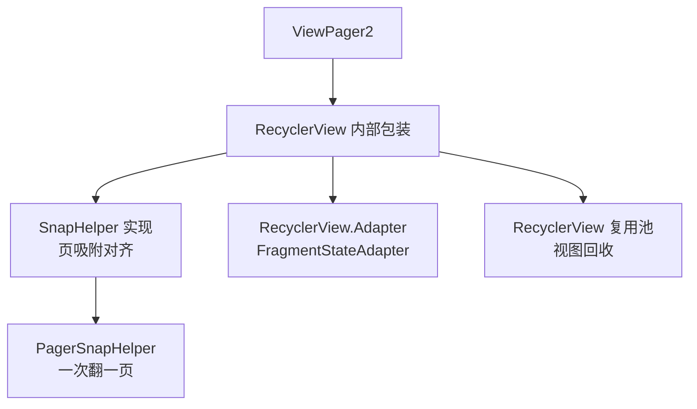

# ViewPager2 使用与源码原理

> 面试高频指数：高 — ViewPager2 基于 RecyclerView 的实现原理、与 ViewPager1 的差异、Fragment 懒加载与嵌套滑动是面试高频组合题。

## 一、ViewPager2 是什么

### 1.1 前世今生

ViewPager2 与 ViewPager 的核心差异先睹为快：

| 维度 | ViewPager | ViewPager2 |
|------|-----------|------------|
| 内核 | 自研 ViewGroup | RecyclerView 封装 |
| 方向 | 仅横向 | 横向 + 纵向 |
| 数据结构 | PagerAdapter（游标式） | RecyclerView.Adapter |
| Diff 更新 | 无 | 支持 DiffUtil |
| RTL 支持 | 部分 | 原生支持 |
| 多页复用 | 内存页缓存 | RecyclerView 复用池 |
| 官方状态 | 维护中 | 新项目推荐 |

### 1.2 基本使用

布局中直接声明 ViewPager2，代码中配置适配器与方向：

```xml
<androidx.viewpager2.widget.ViewPager2
    android:id="@+id/view_pager"
    android:layout_width="match_parent"
    android:layout_height="match_parent" />
```

::: code-tabs

@tab:active Java

```java
// Fragment 适配器
public class HomePagerAdapter extends FragmentStateAdapter {

    public HomePagerAdapter(Fragment fragment) {
        super(fragment);
    }

    @Override
    public int getItemCount() {
        return 3;
    }

    @Override
    public Fragment createFragment(int position) {
        return PageFragment.newInstance(position);
    }
}

// 使用
HomePagerAdapter adapter = new HomePagerAdapter(this);
viewPager.setAdapter(adapter);
viewPager.setOrientation(ViewPager2.ORIENTATION_VERTICAL);  // 支持纵向
viewPager.setOffscreenPageLimit(2);  // 预加载页数
```

@tab Kotlin

```kotlin
// Fragment 适配器
class HomePagerAdapter(fragment: Fragment) :
    FragmentStateAdapter(fragment) {

    override fun getItemCount(): Int = 3

    override fun createFragment(position: Int): Fragment =
        PageFragment.newInstance(position)
}

// 使用
val adapter = HomePagerAdapter(this)
viewPager.adapter = adapter
viewPager.orientation = ViewPager2.ORIENTATION_VERTICAL  // 支持纵向
viewPager.offscreenPageLimit = 2  // 预加载页数
```

:::

## 二、ViewPager2 与 ViewPager 对比

### 2.1 适配器差异

适配器是两者差异最大的地方：

| 维度 | PagerAdapter（ViewPager） | RecyclerView.Adapter（ViewPager2） |
|------|---------------------------|-------------------------------------|
| 更新通知 | notifyDataSetChanged 整体刷新 | 细粒度 notifyItemXxx |
| 数据绑定 | getItem 返回页 | onBindViewHolder 复用 |
| 视图复用 | 需要自己实现 instantiateItem 复用 | RecyclerView 自动回收复用 |
| ViewHolder | 无 | 有，性能更好 |

### 2.2 常用特性对比

ViewPager2 相对 ViewPager 的主要能力增强如下：



> 关键点：ViewPager2 的复用机制天然解决 ViewPager 的"页卡复用难"问题，内存占用更低。

## 三、PageTransformer 页面动画

### 3.1 自定义变换

通过 PageTransformer 实现缩放、视差等联动动画：

::: code-tabs

@tab:active Java

```java
// 缩放 + 透明度联动动画
public class ScaleTransformer implements ViewPager2.PageTransformer {
    @Override
    public void transformPage(View page, float position) {
        // position: 0 为当前页，±1 为相邻页
        float absPos = Math.abs(position);

        // 缩放：中心页 1.0，边缘页 0.8
        page.setScaleX(1f - 0.2f * absPos);
        page.setScaleY(1f - 0.2f * absPos);
        // 透明度
        page.setAlpha(1f - 0.3f * absPos);
        page.setTranslationX(position * -0.3f * page.getWidth());  // 视差效果
    }
}

viewPager.setPageTransformer(new ScaleTransformer());
```

@tab Kotlin

```kotlin
// 缩放 + 透明度联动动画
class ScaleTransformer : ViewPager2.PageTransformer {
    override fun transformPage(page: View, position: Float) {
        // position: 0 为当前页，±1 为相邻页
        val absPos = kotlin.math.abs(position)

        page.apply {
            // 缩放：中心页 1.0，边缘页 0.8
            scaleX = 1f - 0.2f * absPos
            scaleY = 1f - 0.2f * absPos
            // 透明度
            alpha = 1f - 0.3f * absPos
            translationX = position * -0.3f * page.width  // 视差效果
        }
    }
}

viewPager.setPageTransformer(ScaleTransformer())
```

:::

### 3.2 position 含义

transformPage 中 position 的取值含义如下：

| position | 含义 |
|----------|------|
| 0 | 当前完全可见页 |
| -1 / 1 | 左右相邻页（滚动中） |
| 负数 | 左侧页面 |
| 正数 | 右侧页面 |

## 四、Fragment 懒加载

### 4.1 FragmentStateAdapter 的加载时机

Fragment 的加载时机链路如下：


**关键点**：

- ViewPager2 默认预加载相邻页（`offscreenPageLimit` 默认 -1 = 预加载 1 页）
- Fragment 的 `onResume` 不等于"用户真正看到"
- 真正可见用 `setMaxLifecycle` 控制

### 4.2 官方懒加载姿势

官方推荐的两种懒加载姿势如下：

::: code-tabs

@tab:active Java

```java
// 方式一：Fragment 内判断用户可见（配合 onResume）
public class PageFragment extends Fragment {
    private boolean isFirstLoad = true;

    @Override
    public void onResume() {
        super.onResume();
        if (isFirstLoad && isVisible()) {
            loadData();   // 首次真正可见才加载
            isFirstLoad = false;
        }
    }
}

// 方式二：registerOnPageChangeCallback 判断当前页
viewPager.registerOnPageChangeCallback(new ViewPager2.OnPageChangeCallback() {
    @Override
    public void onPageSelected(int position) {
        if (position == 2) {
            loadPageData(position);  // 滑动到该页才加载
        }
    }
});
```

@tab Kotlin

```kotlin
// 方式一：Fragment 内判断用户可见（配合 onResume）
class PageFragment : Fragment() {
    private var isFirstLoad = true

    override fun onResume() {
        super.onResume()
        if (isFirstLoad && isVisible) {
            loadData()   // 首次真正可见才加载
            isFirstLoad = false
        }
    }
}

// 方式二：registerOnPageChangeCallback 判断当前页
viewPager.registerOnPageChangeCallback(object : ViewPager2.OnPageChangeCallback() {
    override fun onPageSelected(position: Int) {
        if (position == 2) {
            loadPageData(position)  // 滑动到该页才加载
        }
    }
})
```

:::

### 4.3 setMaxLifecycle 控制

通过 setMaxLifecycle 把非当前页限制在 STARTED：

::: code-tabs

@tab:active Java

```java
// 只让当前页走到 RESUMED，其他页停在 STARTED（更省资源）
viewPager.setCurrentItem(position);
((FragmentStateAdapter) adapter).setMaxLifecycle(
        fragment,
        Lifecycle.State.RESUMED
);
```

@tab Kotlin

```kotlin
// 只让当前页走到 RESUMED，其他页停在 STARTED（更省资源）
viewPager.setCurrentItem(position)
(adapter as FragmentStateAdapter).setMaxLifecycle(
    fragment,
    Lifecycle.State.RESUMED
)
```

:::

## 五、ViewPager2 源码原理

### 5.1 基于 RecyclerView 的内核

ViewPager2 的内部架构如下：



### 5.2 关键设计

核心组件各自承担的角色如下：

| 组件 | 作用 |
|------|------|
| RecyclerView | 容器 + 布局 + 复用 |
| PagerSnapHelper | 吸附整页，一次滑动一页 |
| FragmentStateAdapter | 用 Fragment 作为 Item（内部用 FragmentManager 管理） |
| CompositeOnPageChangeCallback | 对外分发页面变化回调 |
| PageTransformerAdapter | 把 PageTransformer 转为 RecyclerView 的 ItemDecoration 效果 |

### 5.3 与 ViewPager 的实现差异

- ViewPager：自己管理 View 缓存（destroyItem/instantiateItem），逻辑复杂
- ViewPager2：全部委托 RecyclerView，复用、回收、测量天然具备

## 六、嵌套滑动与常见问题

### 6.1 与 ScrollView 嵌套

与 NestedScrollView 嵌套时需注意高度问题：

```xml
<!-- NestedScrollView 嵌套 ViewPager2 需固定高度 -->
<androidx.core.widget.NestedScrollView>
    <androidx.viewpager2.widget.ViewPager2
        android:layout_height="300dp" />
</androidx.core.widget.NestedScrollView>
```

ViewPager2 原生支持 NestedScrolling，横向滑动不会与外层纵向冲突；但竖向 ViewPager2 与 ScrollView 嵌套需注意方向冲突处理。

### 6.2 常见问题排查

高频问题与解决方案对照如下：

| 问题 | 原因 | 解决 |
|------|------|------|
| 数据不刷新 | 直接改 List 未 notify | notifyDataSetChanged 或 DiffUtil |
| 页面重建 | FragmentStateAdapter 会销毁远页 | 状态用 ViewModel 保存 |
| 高度塌陷 | ViewPager2 高度 wrap_content | 固定高度或自定义测量 |
| 滑动冲突 | 竖向 ViewPager2 嵌套 | 外层 NestedScrollView 或自定义 |

## 七、高频面试题

### Q1：ViewPager2 和 ViewPager 有什么区别？
::: details 查看答案
① 内核：ViewPager2 基于 RecyclerView，ViewPager 是自研 ViewGroup；② 数据：ViewPager2 用 RecyclerView.Adapter 支持 DiffUtil 细粒度更新，ViewPager 用 PagerAdapter 只能整体 notifyDataSetChanged；③ 方向：ViewPager2 支持横向和纵向，ViewPager 仅横向；④ 复用：ViewPager2 天然具备 RecyclerView 复用池，ViewPager 需手动管理页面缓存；⑤ RTL、嵌套滑动、PageTransformer 等特性 ViewPager2 更强。新项目推荐 ViewPager2。
:::

### Q2：ViewPager2 的 Fragment 懒加载怎么实现？
::: details 查看答案
ViewPager2 默认预加载相邻页，Fragment 的 onResume 不代表用户可见。实现方案：① 通过 registerOnPageChangeCallback 的 onPageSelected 判断当前页，滑动到才加载；② Fragment 内用 isVisible + onResume 组合判断（首次可见标记 isFirstLoad）；③ 更精确用 setMaxLifecycle 把非当前页生命周期限制在 STARTED，仅当前页 RESUMED；④ 数据用 ViewModel + onViewCreated 加载并缓存，避免重复加载。
:::

### Q3：ViewPager2 是怎么实现"一次滑一页"的？
::: details 查看答案
ViewPager2 内部使用 PagerSnapHelper（SnapHelper 的子类）：SnapHelper 在 RecyclerView 滑动结束后，根据当前滚动位置计算最近的页中心，调用 smoothScrollToPosition 吸附对齐到整页。PagerSnapHelper 重写了 findSnapView/findTargetSnapPosition 等方法，保证一页一页吸附。这依赖 RecyclerView 的滚动机制，所以 ViewPager2 天然支持 fling 后的页吸附。
:::

### Q4：ViewPager2 嵌套 Fragment 时，如何保存页面状态？
::: details 查看答案
① FragmentStateAdapter 内部用 FragmentManager + Fragment 状态保存，页面数据尽量放在 Fragment 的 ViewModel 中（与 Fragment 同生命周期），页面销毁重建时 ViewModel 自动恢复；② 不要直接持有 View 引用跨页面缓存；③ 列表数据放 ViewModel + LiveData/StateFlow，onViewCreated 中观察；④ 若需保存滚动位置，RecyclerView 的 LayoutManager 已自动保存；⑤ 注意 FragmentStateAdapter 的 getItemId 返回稳定 id 时支持状态复用。
:::

### Q5：ViewPager2 与 RecyclerView 是什么关系？为什么不直接用 RecyclerView？
::: details 查看答案
ViewPager2 内部包装了一个 RecyclerView 作为根容器，自己主要做：① 方向控制与页面边界约束；② 用 PagerSnapHelper 实现整页吸附；③ 用 FragmentStateAdapter 把 Fragment 作为 RecyclerView 的 Item（通过 FragmentManager attach/detach 管理生命周期）；④ 对外封装 registerOnPageChangeCallback 等 API。不直接用 RecyclerView 是因为：页面切换的吸附逻辑、Fragment 生命周期管理、页切换回调等高级语义需要封装，用户直接用 RecyclerView 得自己实现这些。
:::

## 八、小结

ViewPager2 要点：

1. 基于 RecyclerView：复用、Diff、方向都继承自 RecyclerView 能力
2. PagerSnapHelper 实现整页吸附
3. FragmentStateAdapter 管理 Fragment 生命周期
4. 懒加载：onPageSelected + setMaxLifecycle 组合
5. PageTransformer 实现页面联动动画

相关阅读：[RecyclerView 使用指南](/ui/view/recyclerview-guide.md)、[RecyclerView 源码解析](/ui/view/recyclerview-source.md)、[Fragment 生命周期详解](/android/fragment/fragment-basics.md)、[屏幕适配方案](/ui/layout/screen-adaptation.md)。
