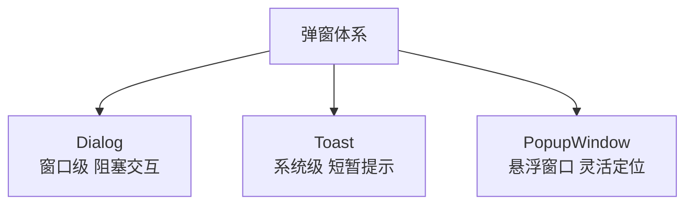
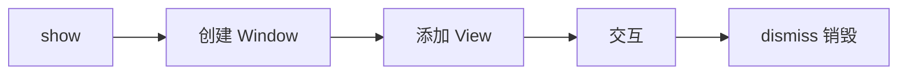
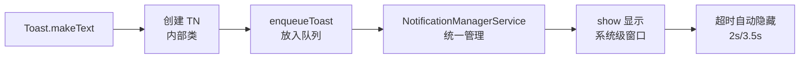
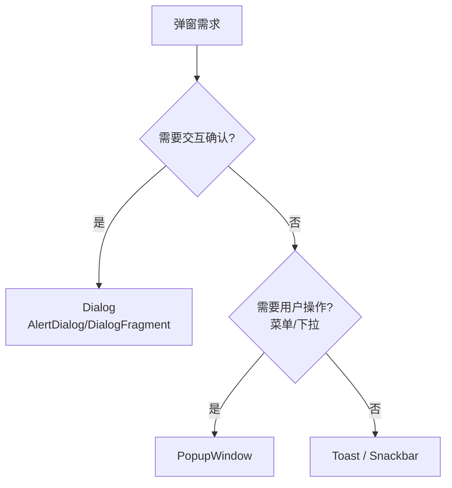

# Dialog、Toast 与 PopupWindow 详解

> 面试高频指数：中 — "Dialog 泄漏怎么避免？Toast 原理是什么？PopupWindow 和 Dialog 怎么选？"是 UI 组件的高频面试题。

## 一、三种弹窗概览



| 维度 | Dialog | Toast | PopupWindow |
|------|--------|-------|-------------|
| 类型 | 独立窗口 | 系统级窗口 | 悬浮窗口 |
| 交互 | 可阻塞 | 不可交互 | 可交互 |
| 生命周期 | 随窗口 | 短暂自动消失 | 手动 dismiss |
| 定位 | 居中/自定义 | 系统位置 | 任意位置 |
| 使用频率 | 确认框/选择 | 轻提示 | 菜单/下拉 |

## 二、Dialog 详解

### 2.1 基本使用

```kotlin
// AlertDialog 标准用法
AlertDialog.Builder(this)
    .setTitle("确认删除")
    .setMessage("删除后无法恢复，确定继续吗？")
    .setPositiveButton("删除") { _, _ ->
        deleteData()
    }
    .setNegativeButton("取消", null)
    .show()

// 自定义 Dialog
class CustomDialog(context: Context) : Dialog(context) {
    init {
        setContentView(R.layout.dialog_custom)
        window?.setGravity(Gravity.BOTTOM)  // 底部弹出
        window?.setLayout(
            ViewGroup.LayoutParams.MATCH_PARENT,
            ViewGroup.LayoutParams.WRAP_CONTENT
        )
    }
}
```

### 2.2 Dialog 生命周期



- Dialog 基于 Window 机制（Dialog 本身是 Window 的封装）
- 关闭需调用 dismiss()，否则泄漏
- Activity 销毁时未 dismiss 的 Dialog 会泄漏（持有 Activity 引用）

### 2.3 内存泄漏问题

| 泄漏场景 | 原因 | 解决 |
|----------|------|------|
| Activity 销毁未 dismiss | Dialog 持有 Context | onDestroy 中 dismiss |
| Dialog 内持有 Activity 引用 | 匿名内部类 | 使用弱引用/生命周期感知 |
| 旋转屏幕 | 旧 Activity 泄漏 | DialogFragment 代替 |

**推荐：DialogFragment 管理 Dialog 生命周期**

```kotlin
class ConfirmDialogFragment : DialogFragment() {

    override fun onCreateDialog(savedInstanceState: Bundle?): Dialog {
        return AlertDialog.Builder(requireContext())
            .setTitle("提示")
            .setMessage("确定操作？")
            .setPositiveButton("确定") { _, _ -> onConfirm() }
            .setNegativeButton("取消", null)
            .create()
    }

    private fun onConfirm() {
        // 业务逻辑
    }
}

// 使用：由 FragmentManager 管理生命周期，自动处理销毁
ConfirmDialogFragment().show(supportFragmentManager, "confirm")
```

## 三、Toast 详解

### 3.1 基本使用与原理

```kotlin
// 标准用法
Toast.makeText(this, "操作成功", Toast.LENGTH_SHORT).show()
```

**Toast 实现原理**：



- Toast 通过 **NotificationManagerService** 跨进程显示
- 显示在**系统级窗口**，不依赖 Activity
- 多个 Toast 排队显示（后到的等待前一个消失）

### 3.2 自定义 Toast

```kotlin
// 自定义布局 Toast
val inflater = layoutInflater
val layout = inflater.inflate(R.layout.view_custom_toast, null)
val textView = layout.findViewById<TextView>(R.id.toast_text)
textView.text = "自定义提示"

Toast(context).apply {
    duration = Toast.LENGTH_SHORT
    view = layout
    setGravity(Gravity.BOTTOM, 0, 100)
    show()
}
```

### 3.3 Toast 的限制

| 限制 | 说明 |
|------|------|
| 不能频繁调用 | 会排队堆积，体验差 |
| Android 11+ 后台限制 | 后台应用不能显示自定义 Toast |
| 无法交互 | 纯展示 |

**替代方案：Snackbar（Material）**

```kotlin
Snackbar.make(view, "操作完成", Snackbar.LENGTH_SHORT)
    .setAction("撤销") { undo() }  // 可交互
    .show()
```

## 四、PopupWindow 详解

### 4.1 基本使用

```kotlin
// 下拉菜单
val contentView = layoutInflater.inflate(R.layout.view_popup_menu, null)
val popupWindow = PopupWindow(
    contentView,
    ViewGroup.LayoutParams.WRAP_CONTENT,
    ViewGroup.LayoutParams.WRAP_CONTENT
).apply {
    isFocusable = true          // 可获取焦点（响应点击）
    isOutsideTouchable = true   // 点击外部关闭
    setBackgroundDrawable(ColorDrawable(Color.TRANSPARENT))  // 必须设置，否则点击外部不消失
}

// 显示在 anchor 下方
popupWindow.showAsDropDown(anchorView, 0, 0)

// 或指定位置
popupWindow.showAtLocation(anchorView, Gravity.CENTER, 0, 0)
```

### 4.2 关键属性

| 属性 | 作用 |
|------|------|
| `isFocusable` | 是否可获取焦点（决定能否响应点击） |
| `isOutsideTouchable` | 点击外部是否关闭 |
| `setBackgroundDrawable` | 必须设置背景（否则点击外部不消失） |
| `animationStyle` | 显示/消失动画 |
| `width/height` | 尺寸（MATCH_PARENT 可做底部弹窗） |

### 4.3 PopupWindow 与 Dialog 对比

| 维度 | PopupWindow | Dialog |
|------|-------------|--------|
| 窗口类型 | 应用窗口 | 应用窗口（有主题） |
| 默认位置 | 可指定 anchor | 居中 |
| 背景遮罩 | 无 | 有 dim 效果 |
| 生命周期 | 手动 dismiss | 手动 dismiss |
| 动画 | animationStyle | 主题动画 |
| 适用 | 菜单、提示、下拉 | 确认框、表单 |

## 五、选型指南



| 场景 | 推荐 | 原因 |
|------|------|------|
| 确认删除 | AlertDialog | 阻塞 + 明确按钮 |
| 表单填写 | DialogFragment | 生命周期安全 |
| 底部菜单 | BottomSheetDialog | Material 标准 |
| 下拉菜单 | PopupWindow | 位置灵活 |
| 操作提示 | Toast/Snackbar | 轻量不打扰 |
| 操作成功+撤销 | Snackbar | 可交互 |

## 六、高频面试题

### Q1：Dialog 会导致内存泄漏吗？怎么避免？
::: details 查看答案
会。Dialog 持有创建它的 Context（Activity），若 Activity 销毁时 Dialog 未 dismiss，Activity 无法被回收。避免方式：① onDestroy 中 dismiss 所有未关闭的 Dialog；② 推荐用 DialogFragment 代替 Dialog，它跟随 Fragment 生命周期，自动销毁；③ Dialog 内部监听器用弱引用或清理；④ 注意自定义 Dialog 中的 Handler/回调持有 Activity 引用；⑤ 使用 LiveData/ViewModel 处理异步回调，避免回调持有 View/Dialog。总结：优先 DialogFragment + 生命周期感知。
:::

### Q2：Toast 的实现原理是什么？为什么是跨进程的？
::: details 查看答案
Toast 的核心是内部类 TN（TransientNotification）：① makeText 创建 Toast 和 TN，通过 IPC（Binder）调用系统服务 NotificationManagerService 的 enqueueToast；② NMS 把 Toast 放入队列统一管理（跨进程排队）；③ 显示时 Toast 以系统级窗口（TYPE_TOAST）添加到 WindowManager，不依赖 Activity；④ 超时（LENGTH_SHORT 约 2s / LONG 约 3.5s）后 NMS 回调 TN.hide 移除窗口。跨进程原因：Toast 需要系统统一调度、应用退出后仍能显示（传统行为）。
:::

### Q3：PopupWindow 和 Dialog 有什么区别？怎么选？
::: details 查看答案
区别：① 定位：PopupWindow 可指定 anchor 任意位置（showAsDropDown/showAtLocation），Dialog 默认居中；② 遮罩：Dialog 有 dim 背景，PopupWindow 无；③ 焦点：PopupWindow 需手动设 isFocusable，Dialog 默认可交互；④ 主题动画：Dialog 走主题样式，PopupWindow 用 animationStyle；⑤ 生命周期：都需手动 dismiss。选型：确认框、表单用 Dialog/DialogFragment；下拉菜单、自定义提示用 PopupWindow；底部操作面板用 BottomSheetDialog。
:::

### Q4：PopupWindow 点击外部不消失是什么原因？
::: details 查看答案
常见原因：① setBackgroundDrawable 未设置：系统通过背景判断点击区域，无背景时点击外部事件不传递，必须 setBackgroundDrawable（透明色也可）；② isOutsideTouchable 为 false：点击外部被拦截不关闭；③ isFocusable 为 false：窗口不获取焦点，外部点击无事件分发；④ 尺寸为 wrap_content 且内容为空：无实际点击区域。标准配置：isFocusable = true + isOutsideTouchable = true + setBackgroundDrawable(透明 ColorDrawable)。
:::

### Q5：Android 11 对 Toast 有什么限制？怎么替代？
::: details 查看答案
Android 11（API 30）起，后台应用（非前台）不能显示自定义 Toast（自定义视图），只能显示系统样式 Toast（文本 + 图标），且高版本系统对 Toast 显示频率和样式有统一控制。替代方案：① 前台场景继续用 Toast 或换 Snackbar（Material，可交互、样式统一）；② 需要用户注意的重要消息用通知（Notification）；③ 应用内全局提示可用自定义的轻提示组件（在应用内实现，不受系统限制）；④ 注意 Android 12+ 对 Toast 的样式统一（系统标准样式）。
:::

## 七、小结

弹窗体系要点：

1. Dialog：窗口级，可阻塞，注意泄漏（用 DialogFragment）
2. Toast：系统级，跨进程排队，纯展示
3. PopupWindow：悬浮窗口，定位灵活，注意焦点与背景
4. Snackbar：可交互的现代替代方案
5. 选型：确认用 Dialog，菜单用 PopupWindow，提示用 Toast/Snackbar

相关阅读：[Window 机制详解](/ui/window/window-mechanism.md)、[WindowManager 深入解析](/ui/window/windowmanager-deep.md)、[主题与样式系统](/android/resource/theme-style.md)、[Activity 生命周期详解](/android/activity/activity-lifecycle.md)。
