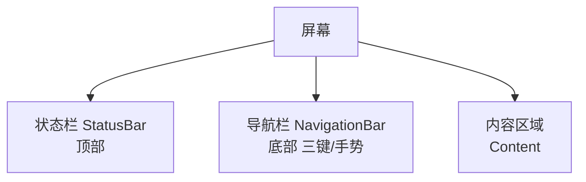
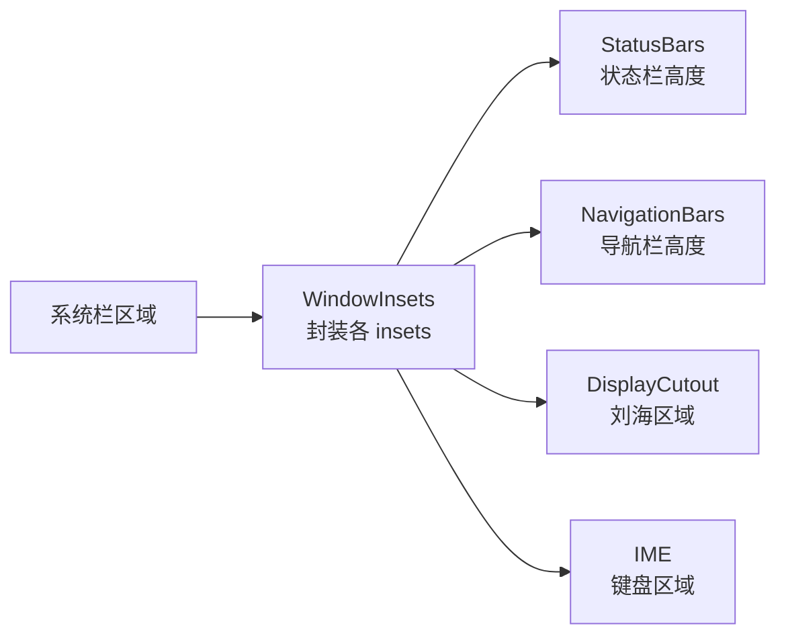

# 系统栏适配与沉浸式

> 面试高频指数：中 — 状态栏高度获取、WindowInsets 处理、沉浸式实现、刘海屏/挖孔屏适配是屏幕适配的高频考点。

## 一、系统栏概述

### 1.1 系统栏组成



| 系统栏 | 位置 | 说明 |
|--------|------|------|
| 状态栏 StatusBar | 顶部 | 时间、电量、通知图标 |
| 导航栏 NavigationBar | 底部 | 返回/Home/最近任务 |
| 刘海/挖孔 | 屏幕内 | 摄像头区域，需避开 |

### 1.2 沉浸式类型

| 类型 | 效果 | 适用 |
|------|------|------|
| 沉浸式状态栏 | 状态栏透明，内容延伸到状态栏下 | 页面顶栏配色统一 |
| 全屏沉浸 | 状态栏 + 导航栏都隐藏 | 视频、游戏 |
| 刘海屏适配 | 内容避开挖孔区域 | 全面屏机型 |

## 二、WindowInsets 详解

### 2.1 什么是 WindowInsets

**WindowInsets** 是系统栏等区域信息的载体，随窗口一起分发：



| Insets 类型 | 含义 |
|-------------|------|
| `systemBars()` | 状态栏 + 导航栏整体 |
| `statusBars()` | 状态栏 |
| `navigationBars()` | 导航栏 |
| `displayCutout()` | 刘海/挖孔区域 |
| `ime()` | 输入法 |
| `safeDrawing()` | 安全绘制区域（API 30+） |

### 2.2 传统获取方式（WindowInsets 前）

```kotlin
// 旧方式：反射获取状态栏高度（不推荐，脆弱）
@Suppress("DEPRECATION")
fun getStatusBarHeight(context: Context): Int {
    var result = 0
    val resourceId = context.resources.getIdentifier(
        "status_bar_height", "dimen", "android")
    if (resourceId > 0) {
        result = context.resources.getDimensionPixelSize(resourceId)
    }
    return result
}
```

### 2.3 现代方式：OnApplyWindowInsetsListener

```kotlin
class InsetsView(context: Context) : View(context) {

    init {
        // 监听系统栏 insets 变化
        setOnApplyWindowInsetsListener { view, insets ->
            val systemBars = insets.systemBars
            // 设置 padding，让内容避开系统栏
            view.setPadding(
                systemBars.left,
                systemBars.top,
                systemBars.right,
                systemBars.bottom
            )
            // 消费掉，防止继续向上传递
            insets.consumeSystemWindowInsets()
        }
    }
}
```

> 关键点：OnApplyWindowInsetsListener 返回时若消费（consume）了 insets，父容器不会再处理；不消费则继续传递，可让根布局统一处理。

## 三、沉浸式实现

### 3.1 状态栏透明 + 深色图标

```kotlin
// 兼容 Android 4.4+
fun setupStatusBar(activity: Activity) {
    activity.window.apply {
        // 透明状态栏（4.4+）
        if (Build.VERSION.SDK_INT >= Build.VERSION_CODES.KITKAT) {
            clearFlags(WindowManager.LayoutParams.FLAG_TRANSLUCENT_STATUS)
            addFlags(WindowManager.LayoutParams.FLAG_DRAWS_SYSTEM_BAR_BACKGROUNDS)
        }
        // 状态栏透明（5.0+）
        if (Build.VERSION.SDK_INT >= Build.VERSION_CODES.LOLLIPOP) {
            statusBarColor = Color.TRANSPARENT
        }
        // 深色图标（6.0+）
        if (Build.VERSION.SDK_INT >= Build.VERSION_CODES.M) {
            decorView.systemUiVisibility =
                View.SYSTEM_UI_FLAG_LIGHT_STATUS_BAR  // 状态栏深色图标
        }
    }
}
```

### 3.2 全屏沉浸（视频/游戏）

```kotlin
// 隐藏系统栏
fun hideSystemBars(activity: Activity) {
    activity.window.decorView.systemUiVisibility =
        (View.SYSTEM_UI_FLAG_FULLSCREEN
            or View.SYSTEM_UI_FLAG_HIDE_NAVIGATION
            or View.SYSTEM_UI_FLAG_IMMERSIVE_STICKY
            or View.SYSTEM_UI_FLAG_LAYOUT_FULLSCREEN
            or View.SYSTEM_UI_FLAG_LAYOUT_HIDE_NAVIGATION)
}

// 显示系统栏
fun showSystemBars(activity: Activity) {
    activity.window.decorView.systemUiVisibility = View.SYSTEM_UI_FLAG_VISIBLE
}
```

| Flag | 作用 |
|------|------|
| `SYSTEM_UI_FLAG_FULLSCREEN` | 隐藏状态栏 |
| `SYSTEM_UI_FLAG_HIDE_NAVIGATION` | 隐藏导航栏 |
| `SYSTEM_UI_FLAG_IMMERSIVE` | 沉浸式（手势滑动短暂显示） |
| `SYSTEM_UI_FLAG_IMMERSIVE_STICKY` | 沉浸式粘滞（自动隐藏） |
| `SYSTEM_UI_FLAG_LIGHT_STATUS_BAR` | 状态栏深色图标 |
| `SYSTEM_UI_FLAG_LIGHT_NAVIGATION_BAR` | 导航栏深色图标 |

### 3.3 新 API：WindowInsetsController（API 30+）

```kotlin
// 现代推荐方式（API 30+）
fun setupImmersive(activity: Activity) {
    activity.window.insetsController?.apply {
        hide(WindowInsets.Type.statusBars() or
             WindowInsets.Type.navigationBars())  // 隐藏
        systemBarsBehavior = WindowInsetsControllerCompat.BEHAVIOR_SHOW_TRANSIENT_BARS_BY_SWIPE
    }
}
```

## 四、刘海屏适配

### 4.1 获取刘海区域

```kotlin
// 监听 cutout 区域
view.setOnApplyWindowInsetsListener { v, insets ->
    val cutout = insets.displayCutout
    if (cutout != null) {
        // 刘海区域：可能在上/下/左/右
        val safeTop = cutout.safeInsetTop
        val safeLeft = cutout.safeInsetLeft
        // 给内容设置 padding 避开
        v.setPadding(safeLeft, safeTop, 0, 0)
    }
    insets.consumeSystemWindowInsets()
}
```

### 4.2 布局适配策略

| 策略 | 做法 |
|------|------|
| 避开模式 | 内容 padding 避开刘海区 |
| 延伸模式 | 背景延伸进刘海，内容避开 |
| 全屏模式 | 视频/游戏全屏，刘海区黑化 |

```xml
<!-- 声明布局不延伸到刘海（API 27+） -->
<activity
    android:name=".MainActivity"
    android:resizeableActivity="true" />
```

## 五、Edge-to-Edge 全面屏适配

### 5.1 概念

**Edge-to-Edge**：内容延伸到整个屏幕（状态栏和导航栏后），系统栏透明或半透明，由应用自己管理避让。

### 5.2 适配要点

```kotlin
// 让内容延伸到系统栏后面
fun enableEdgeToEdge(activity: Activity) {
    activity.window.decorView.systemUiVisibility =
        (View.SYSTEM_UI_FLAG_LAYOUT_FULLSCREEN
            or View.SYSTEM_UI_FLAG_LAYOUT_HIDE_NAVIGATION
            or View.SYSTEM_UI_FLAG_LAYOUT_STABLE)
}
```

适配清单：

- 顶部内容：监听 statusBars insets，给 Toolbar 加 top padding
- 底部内容：监听 navigationBars insets，给底部导航加 bottom padding
- 按钮/输入框：注意 IME 遮挡，用 ime() insets
- 全屏页面：自动隐藏系统栏

### 5.3 常见适配代码

```kotlin
// 通用：根布局统一处理系统栏 insets
class EdgeToEdgeActivity : AppCompatActivity() {

    override fun onCreate(savedInstanceState: Bundle?) {
        super.onCreate(savedInstanceState)
        enableEdgeToEdge(this)
        setContentView(R.layout.activity_main)

        // 根布局统一处理 padding
        findViewById<View>(R.id.root).setOnApplyWindowInsetsListener { v, insets ->
            val bars = insets.systemBars
            v.setPadding(bars.left, bars.top, bars.right, bars.bottom)
            insets.consumeSystemWindowInsets()
        }
    }
}
```

## 六、高频面试题

### Q1：如何获取状态栏高度？
::: details 查看答案
推荐方式：用 WindowInsets，setOnApplyWindowInsetsListener 中取 insets.statusBars.top，这是官方受支持的方式，适配全面屏/刘海屏；旧方式：反射获取系统资源 status_bar_height（getIdentifier），兼容老系统但脆弱（厂商定制可能不准确）；还可通过资源 dimension 获取。注意：全屏/沉浸式时 statusBar 高度为 0，应改用 displayCutout 判断。推荐用 WindowInsetsCompat（兼容库）处理。
:::

### Q2：WindowInsets 是什么？consume 和不 consume 有什么区别？
::: details 查看答案
WindowInsets 是系统栏、刘海、输入法等区域信息的载体，通过 OnApplyWindowInsetsListener 分发。consumeSystemWindowInsets() 表示当前 View 已处理这些 insets，父容器不再收到（避免重复处理）；不 consume 则 insets 继续向父容器传递，由父容器统一处理。设计模式：子 View 处理自己的区域（如 Toolbar 顶部 padding），根容器统一处理剩余区域。API 30+ 推荐用 WindowInsetsCompat 提供的方法处理。
:::

### Q3：沉浸式状态栏怎么实现？有哪些方式？
::: details 查看答案
实现思路：让内容延伸到状态栏区域 + 状态栏透明 + 图标颜色适配。方式：① 传统 flags：window.setStatusBarColor(TRANSPARENT) + decorView.systemUiVisibility 设 SYSTEM_UI_FLAG_LIGHT_STATUS_BAR（深色图标）；② API 30+ 用 WindowInsetsController.hide(statusBars) 和 systemBarsBehavior 控制手势显示；③ 全屏沉浸：SYSTEM_UI_FLAG_FULLSCREEN + HIDE_NAVIGATION + IMMERSIVE_STICKY（手势滑动临时显示，松手自动隐藏）。注意图标颜色：浅色背景用深色图标（LIGHT_STATUS_BAR），深色背景默认浅色图标。
:::

### Q4：刘海屏怎么适配？DisplayCutout 怎么用？
::: details 查看答案
① 在 setOnApplyWindowInsetsListener 中获取 insets.displayCutout，读取 safeInsetTop/Left/Right/Bottom 获取刘海区域；② 内容布局给 padding 避开刘海（safe insets），背景可延伸到刘海区域实现沉浸；③ 视频/游戏全屏时可声明 windowLayoutInDisplayCutoutMode=shortEdges（Android 9+）让内容延伸到刘海两侧；④ 避免关键 UI（标题、按钮）放在刘海区域；⑤ 使用 WindowInsetsCompat.getDisplayCutout() 兼容低版本。注意横竖屏切换时 cutout 区域会变化。
:::

### Q5：Edge-to-Edge（边到边）适配的核心要点是什么？
::: details 查看答案
核心：内容延伸到系统栏后面，应用自己管理避让。要点：① 布局 flags 设置 SYSTEM_UI_FLAG_LAYOUT_FULLSCREEN + LAYOUT_HIDE_NAVIGATION + LAYOUT_STABLE 让内容延伸到系统栏；② 顶部用 statusBars insets 给 Toolbar/标题加 top padding；③ 底部用 navigationBars insets 给底部栏加 bottom padding（三键/手势高度不同）；④ 输入场景处理 IME insets 避免键盘遮挡；⑤ 滚动型页面可用 fitsSystemWindows 或逐层处理；⑥ 图标颜色适配：深色导航栏区用 LIGHT_NAVIGATION_BAR。Android 15 强制 Edge-to-Edge，是未来的标准适配方向。
:::

## 七、小结

系统栏适配要点：

1. 系统栏 = 状态栏 + 导航栏 + 刘海区
2. WindowInsets 是官方推荐的信息通道
3. 沉浸式：透明 + 内容延伸 + 图标颜色
4. 刘海屏用 displayCutout 的 safeInset
5. Edge-to-Edge 是 Android 15+ 强制标准
6. WindowInsetsCompat 兼容低版本

相关阅读：[屏幕适配方案](/ui/layout/screen-adaptation.md)、[Window 机制详解](/ui/window/window-mechanism.md)、[主题与样式系统](/android/resource/theme-style.md)、[资源限定符与多屏幕适配](/android/resource/resource-qualifiers.md)。
