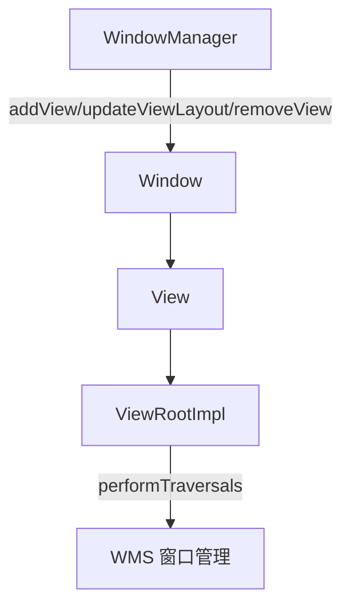
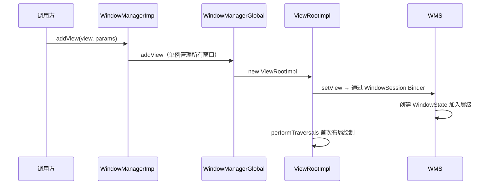
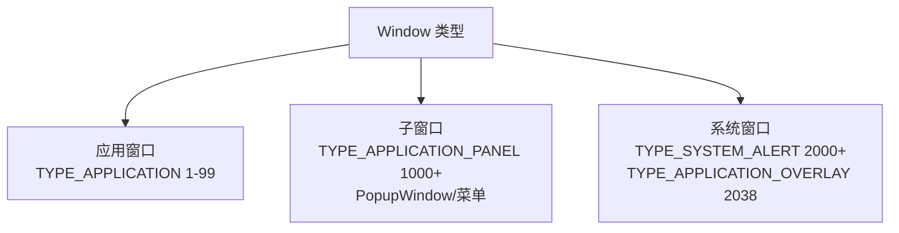

# WindowManager 深入与悬浮窗

> WindowManager 是连接 View 与 Window 的桥梁。理解 Window 类型、`addView` 流程与悬浮窗（TYPE_APPLICATION_OVERLAY）实现，是高级 UI 开发与系统级功能（悬浮球、录屏、来电显示）的必修课。

## 一、Window / WindowManager / View 的关系



| 概念 | 说明 |
|------|------|
| **Window** | 抽象概念，表示一个窗口（不是类） |
| **WindowManager** | 窗口管理器接口，负责增删改 Window |
| **View** | Window 的内容载体（setContentView 的 View） |
| **ViewRootImpl** | Window 与 View 树之间的桥梁（内部持有 WindowSession） |
| **WMS** | 系统侧窗口管理服务，真正管理窗口层级 |

> 一句话理解：**WindowManager.addView(view, params) 把 View 装进一个 Window，通过 Binder 通知 WMS 在屏幕上开一个窗口**。

## 二、WindowManager 核心方法

::: code-tabs

@tab:active Java

```java
WindowManager wm = (WindowManager) getSystemService(Context.WINDOW_SERVICE);

// 1. 添加 Window
wm.addView(view, params);

// 2. 更新 Window（改位置/大小/透明度）
wm.updateViewLayout(view, params);

// 3. 移除 Window
wm.removeView(view);
```

@tab Kotlin

```kotlin
val wm = getSystemService(Context.WINDOW_SERVICE) as WindowManager

// 1. 添加 Window
wm.addView(view, params)

// 2. 更新 Window（改位置/大小/透明度）
wm.updateViewLayout(view, params)

// 3. 移除 Window
wm.removeView(view)
```

:::

### 添加流程源码链



> 深入可参考：[WMS 窗口管理](/system/ams-wms/wms-principle.md)（系统原理板块）

## 三、Window 类型与层级



| 类型 | type 值 | 说明 |
|------|---------|------|
| 应用窗口 | 1-99 | Activity 的 Window |
| 子窗口 | 1000-1999 | 依附于父窗口（PopupWindow、Dialog 内部） |
| 系统窗口 | 2000-2999 | 状态栏、来电、悬浮窗等 |

>  **type 值越大层级越高**（越靠上层）。z-order 由 type 决定，同 type 按添加顺序。

## 四、悬浮窗实现（TYPE_APPLICATION_OVERLAY）

Android 8.0（API 26）开始，悬浮窗必须使用 `TYPE_APPLICATION_OVERLAY`。

### 4.1 权限声明

```xml
<!-- AndroidManifest.xml -->
<uses-permission android:name="android.permission.SYSTEM_ALERT_WINDOW" />
```

::: code-tabs

@tab:active Java

```java
// 动态申请：跳转设置页
if (!Settings.canDrawOverlays(this)) {
    startActivity(new Intent(Settings.ACTION_MANAGE_OVERLAY_PERMISSION,
            Uri.parse("package:" + getPackageName())));
}
```

@tab Kotlin

```kotlin
// 动态申请：跳转设置页
if (!Settings.canDrawOverlays(this)) {
    startActivity(Intent(Settings.ACTION_MANAGE_OVERLAY_PERMISSION,
        Uri.parse("package:$packageName")))
}
```

:::

### 4.2 创建悬浮窗

::: code-tabs

@tab:active Java

```java
public class FloatWindowManager {

    private final Context context;
    private View floatView;
    private WindowManager.LayoutParams params;
    private final WindowManager wm =
            (WindowManager) context.getSystemService(Context.WINDOW_SERVICE);

    public FloatWindowManager(Context context) {
        this.context = context;
    }

    public void show() {
        if (floatView != null) return;
        LayoutInflater inflater = LayoutInflater.from(context);
        floatView = inflater.inflate(R.layout.float_window, null);

        params = new WindowManager.LayoutParams(
                WindowManager.LayoutParams.WRAP_CONTENT,
                WindowManager.LayoutParams.WRAP_CONTENT,
                WindowManager.LayoutParams.TYPE_APPLICATION_OVERLAY,  // 8.0+ 悬浮窗类型
                WindowManager.LayoutParams.FLAG_NOT_FOCUSABLE |
                        WindowManager.LayoutParams.FLAG_NOT_TOUCH_MODAL,
                PixelFormat.TRANSLUCENT
        );
        params.gravity = Gravity.TOP | Gravity.START;
        params.x = 100;   // 初始位置
        params.y = 300;
        wm.addView(floatView, params);
    }

    public void updatePosition(int x, int y) {
        if (params != null) {
            params.x = x;
            params.y = y;
            wm.updateViewLayout(floatView, params);
        }
    }

    public void dismiss() {
        if (floatView != null) {
            try { wm.removeView(floatView); } catch (Exception e) { /* 已移除 */ }
        }
        floatView = null;
    }
}
```

@tab Kotlin

```kotlin
class FloatWindowManager(private val context: Context) {

    private var floatView: View? = null
    private var params: WindowManager.LayoutParams? = null
    private val wm = context.getSystemService(Context.WINDOW_SERVICE) as WindowManager

    fun show() {
        if (floatView != null) return
        val inflater = LayoutInflater.from(context)
        floatView = inflater.inflate(R.layout.float_window, null)

        params = WindowManager.LayoutParams(
            WindowManager.LayoutParams.WRAP_CONTENT,
            WindowManager.LayoutParams.WRAP_CONTENT,
            WindowManager.LayoutParams.TYPE_APPLICATION_OVERLAY,  // 8.0+ 悬浮窗类型
            WindowManager.LayoutParams.FLAG_NOT_FOCUSABLE or
                    WindowManager.LayoutParams.FLAG_NOT_TOUCH_MODAL,
            PixelFormat.TRANSLUCENT
        ).apply {
            gravity = Gravity.TOP or Gravity.START
            x = 100   // 初始位置
            y = 300
        }
        wm.addView(floatView, params)
    }

    fun updatePosition(x: Int, y: Int) {
        params?.let {
            it.x = x
            it.y = y
            wm.updateViewLayout(floatView, it)
        }
    }

    fun dismiss() {
        floatView?.let {
            try { wm.removeView(it) } catch (e: Exception) { /* 已移除 */ }
        }
        floatView = null
    }
}
```

:::

### 4.3 关键 FLAG 说明

| FLAG | 作用 |
|------|------|
| `FLAG_NOT_FOCUSABLE` | 不获取焦点（不弹出软键盘、不拦截按键） |
| `FLAG_NOT_TOUCH_MODAL` | 窗口外区域触摸事件传递给下层 |
| `FLAG_KEEP_SCREEN_ON` | 屏幕常亮 |
| `FLAG_FULLSCREEN` | 全屏显示 |
| `FLAG_LAYOUT_NO_LIMITS` | 布局不受屏幕边界限制 |

### 4.4 拖动与触摸监听

::: code-tabs

@tab:active Java

```java
floatView.setOnTouchListener((v, event) -> {
    switch (event.getAction()) {
        case MotionEvent.ACTION_DOWN:
            startX = event.getRawX(); startY = event.getRawY();
            startWmX = params.x; startWmY = params.y;
            break;
        case MotionEvent.ACTION_MOVE:
            updatePosition(
                    (int) (startWmX + (event.getRawX() - startX)),
                    (int) (startWmY + (event.getRawY() - startY))
            );
            break;
    }
    return true;
});
```

@tab Kotlin

```kotlin
floatView?.setOnTouchListener { v, event ->
    when (event.action) {
        MotionEvent.ACTION_DOWN -> {
            startX = event.rawX; startY = event.rawY
            startWmX = params!!.x; startWmY = params!!.y
        }
        MotionEvent.ACTION_MOVE -> {
            updatePosition(
                (startWmX + (event.rawX - startX)).toInt(),
                (startWmY + (event.rawY - startY)).toInt()
            )
        }
    }
    true
}
```

:::

## 五、悬浮窗版本适配

| 版本 | 要求 |
|------|------|
| Android 8.0 (API 26) | 必须用 `TYPE_APPLICATION_OVERLAY`，`TYPE_PHONE` 报错 |
| Android 10 (API 29) | 后台启动 Activity 受限，悬浮窗需前台服务配合 |
| Android 11 (API 30) | 部分设备需应用在"正在运行"才能创建 |
| Android 13 (API 33) | 通知权限与悬浮窗权限分离 |

>  **悬浮窗是高风险功能**：各大应用市场对悬浮窗审核严格，滥用会被下架。真实场景多用于"视频小窗、来电提醒、全局球"等刚需功能。

## 六、悬浮窗 vs 其他窗口技术

| 技术 | 适用场景 | 限制 |
|------|---------|------|
| 悬浮窗 TYPE_APPLICATION_OVERLAY | 全局悬浮球、视频小窗 | 需 SYSTEM_ALERT_WINDOW 权限，审核严 |
| PopupWindow | 页面内浮层 | 依附 Window，离开页面消失 |
| Dialog | 弹窗交互 | 模态、阻塞底层 |
| Toast | 轻提示 | 无法交互、自动消失 |
| Snackbar | 页面内提示 | 随页面 |

## 七、高频面试题

### Q1：Window、WindowManager、View 三者关系？
::: details 查看答案
Window 是抽象概念（屏幕上的窗口），View 是 Window 的内容；WindowManager 负责创建/更新/删除 Window（addView/updateViewLayout/removeView）。实际实现：WindowManagerImpl → WindowManagerGlobal（进程级单例，管理所有 ViewRootImpl）→ ViewRootImpl 通过 WindowSession（Binder）与系统侧 WMS 通信，WMS 维护窗口层级并决定谁可见。
:::

### Q2：Activity 的 Window 是怎么创建的？
::: details 查看答案
Activity 启动时在 `attach()` 中创建 `PhoneWindow`（`mWindow = new PhoneWindow(this)`），`setContentView` 时 PhoneWindow 将布局 inflate 到 `mDecor`（DecorView），随后 WindowManager.addView(decorView, layoutParams) 把 DecorView 加入窗口，创建 ViewRootImpl 并与 WMS 建立连接，触发首次 performTraversals 完成测量布局绘制。
:::

### Q3：实现一个可拖动的悬浮窗需要哪些步骤？
::: details 查看答案
① 声明 SYSTEM_ALERT_WINDOW 权限；② 检查并引导用户到设置页开启悬浮窗权限（Settings.canDrawOverlays）；③ inflate 悬浮 View；④ 用 TYPE_APPLICATION_OVERLAY 类型 + FLAG_NOT_FOCUSABLE 等标志 addView；⑤ 在 onTouchListener 中根据 rawX/rawY 变化 updateViewLayout 实现拖动；⑥ 页面销毁时 removeView 防止泄漏。注意 8.0+ 类型限制与前台服务配合。
:::

### Q4：窗口的层级（z-order）是怎么决定的？
::: details 查看答案
窗口层级主要由 **type 值**决定：应用窗口（1-99）< 子窗口（1000-1999）< 系统窗口（2000+），type 越大越靠上。同 type 窗口按添加顺序（WindowState 的 token 顺序）叠加。WMS 通过 WindowManagerPolicy 的窗口比较器排序维护窗口层级。特殊窗口（IME 输入法、壁纸）有独立层级策略。
:::

### Q5：为什么 8.0 之后 TYPE_PHONE 创建悬浮窗会崩溃？
::: details 查看答案
Android 8.0 (API 26) 起，`TYPE_PHONE` 等"普通系统窗口"类型不允许应用使用（BadTokenException），原因是这些类型层级过高可覆盖系统 UI，存在恶意应用风险。统一改用 `TYPE_APPLICATION_OVERLAY`，系统会适当限制其层级与权限，并且该类型窗口默认不可聚焦，需要交互需加 FLAG。
:::

## 小结

- Window 是抽象窗口，View 是内容，WindowManager 是增删改的入口
- 实现链路：WindowManagerImpl → WindowManagerGlobal → ViewRootImpl → WMS（Binder）
- 窗口类型分应用/子/系统三层，type 决定 z-order
- 悬浮窗：TYPE_APPLICATION_OVERLAY + SYSTEM_ALERT_WINDOW 权限 + 动态拖动
- 版本适配注意 8.0 类型变更、10.0 后台限制、13.0 权限拆分

> 进阶阅读：[WMS 窗口管理](/system/ams-wms/wms-principle.md) | [渲染原理与硬件加速](/ui/render/render-principle.md) | [View 绘制流程详解](/ui/view/view-draw-process.md)
